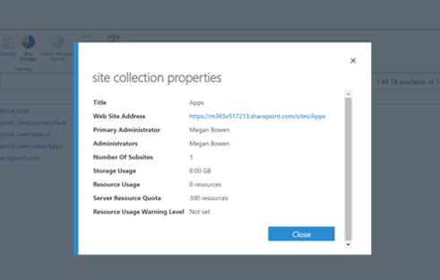

# Просмотр и Добавление администратора в каталог приложений SharePoint Online

Для успешной установки CLO365 пользователь, выполняющий подготовку решения, должен быть указан в списке администратором каталога приложений клиента.

1. На портале администрирования Office 365 перейдите в центр администрирования SharePoint Online.
1. **Выберите** URL-адрес каталога приложений из списка семейство веб-сайтов 
1. Убедитесь, что установщик CLO365 указан как один из администраторов каталога приложений.

Если имя пользователя указано в списке, вы можете вернуться к подготовке настраиваемого сайта обучения.  Если не выполнить дальнейшие действия. 

## Добавление администратора

1. В центре администрирования SharePoint установите флажок рядом с URL-адресом каталога приложений и выберите раскрывающийся список владельцы.

1. В раскрывающемся меню выберите пункт Управление администраторами 
1. Добавьте правильного пользователя в качестве администратора семейства веб-сайтов и нажмите кнопку ОК, чтобы сохранить изменения.

### Дальнейшие действия — [Подготовка сайта](installsitepackage.md)
