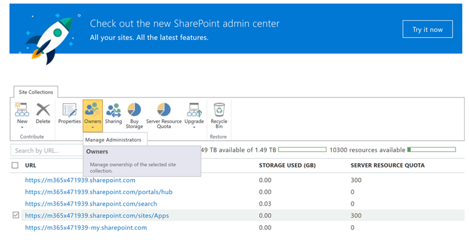

# Просмотр и Добавление администратора в каталог приложений SharePoint OnlineView or Add an Administrator to your SharePoint Online App Catalog

Для успешной установки CLO365 пользователь, выполняющий подготовку решения, должен быть указан в списке администратором каталога приложений клиента.To successfully install CLO365, the person doing the provisioning of the solution needs to be listed as an administrator of the tenant app catalog.

1. На портале администрирования Office 365 перейдите в центр администрирования SharePoint Online.From the Office 365 Administration portal go to the SharePoint Online Admin Center
1. **Выберите** URL-адрес каталога приложений в списке **Select** the App Catalog URL from the site collection list 
1. Убедитесь, что установщик CLO365 указан как один из администраторов каталога приложений.Confirm that the CLO365 installer is listed as one of the app catalog administrators.

Если имя пользователя указано в списке, вы можете вернуться к подготовке настраиваемого сайта обучения.If your user name is listed you can return to provisioning the Custom Learning site.  Если не выполнить дальнейшие действия.If not complete the next steps. 

## Добавление администратораAdd an Administrator

1. В центре администрирования SharePoint установите флажок рядом с URL-АДРЕСом каталога приложений и выберите раскрывающийся список владельцы.From the SharePoint Admin Center select the checkbox next to the app catalog URL and select the Owners drop-down box.

1. Выберите пункт Управление администраторами в раскрывающемся Select Manage Administrators from the drop down menu 
1. Добавьте правильного пользователя в качестве администратора семейства веб-сайтов и нажмите кнопку ОК, чтобы сохранить изменения.Add the correct individual as a Site Collection Administrator and click OK to save your changes.

### Дальнейшие действия — [Подготовка сайта](installsitepackage.md)Next Steps - [Site Provisioning](installsitepackage.md)
