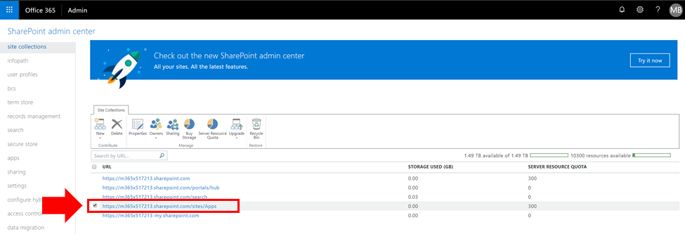

# Просмотр или Добавление администратора в вашей сети каталог приложений SharePoint

Для успешной установки CLO365, пользователь, выполняющий подготовки решения должно быть указано как администратор клиента каталога приложений.

1. Администрирования Office 365 portal перейдите в центр администрирования SharePoint Online
1. **Выберите** URL-адрес каталога приложения из списка семейство сайтов 
1. Убедитесь, что установщик CLO365 указано как один из администраторам каталога приложения. 

Если имя пользователя в списке вы можете вернуться к подготовки сайта Custom обучения.  В противном случае выполните следующие действия. 

## Добавление администратора

1. Из центра администрирования SharePoint установите флажок рядом с URL-адрес каталога приложения и выберите список владельцев. 
1. Выберите в раскрывающемся меню администраторам управлять 
1. Добавьте правильный отдельные как администратора семейства сайтов и нажмите кнопку ОК, чтобы сохранить изменения.

### Дальнейшие действия - [подготовки сайта](installsitepackage.md)
