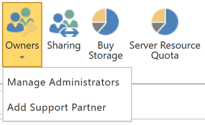

# Просмотр или Добавление администратора в вашей сети каталог приложений SharePointView or Add an Administrator to your SharePoint Online App Catalog

Для успешной установки CLO365, пользователь, выполняющий подготовки решения должно быть указано как администратор клиента каталога приложений.To successfully install CLO365, the person doing the provisioning of the solution needs to be listed as an administrator of the tenant app catalog.

1. Администрирования Office 365 portal перейдите в центр администрирования SharePoint OnlineFrom the Office 365 Administration portal go to the SharePoint Online Admin Center
1. **Выберите** URL-адрес каталога приложения из списка семейство сайтов **Select** the App Catalog URL from the site collection list 
1. Убедитесь, что установщик CLO365 указано как один из администраторам каталога приложения. Confirm that the CLO365 installer is listed as one of the app catalog administrators. 

Если имя пользователя в списке вы можете вернуться к подготовки сайта Custom обучения.  В противном случае выполните следующие действия.If your user name is listed you can return to provisioning the Custom Learning site.  If not complete the next steps. 

## Добавление администратораAdd an Administrator

1. Из центра администрирования SharePoint установите флажок рядом с URL-адрес каталога приложения и выберите список владельцев. From the SharePoint Admin Center select the checkbox next to the app catalog URL and select the Owners drop-down box. 
1. Выберите в раскрывающемся меню администраторам управлять Select Manage Administrators from the drop down menu 
1. Добавьте правильный отдельные как администратора семейства сайтов и нажмите кнопку ОК, чтобы сохранить изменения.Add the correct individual as a Site Collection Administrator and click OK to save your changes.

### Дальнейшие действия - [подготовки сайта](installsitepackage.md)Next Steps - [Site Provisioning](installsitepackage.md)
