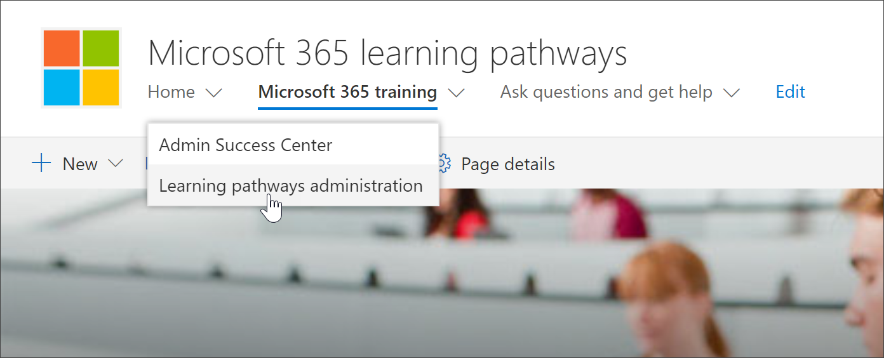

# Доступ к настраиваемой странице администрирования обученияAccess the Custom Learning Administration page

Настраиваемая страница администрирования обучения — это центральная точка управления для администрирования настраиваемой веб-части обучения. Настраиваемая страница администрирования обучения доступна только для администраторов SharePoint. Пользователи с правами участников, посещающих сайт, не увидят параметр " **Администрирование списка** ". Кроме того, только администраторы могут открыть страницу настраиваемого администрирования с помощью элемента меню "Домашняя страница \*\*\*\* " SharePoint.The Custom Learning Administration page is the central controlling point for administration of the Custom Learning web part. The Custom Learning Administration page is only available to SharePoint Administrators. Users with member privileges visiting the site will not see the **Administer Playlist** option. In addition, only Administrators will have the ability to open the Custom Learning Administration page from the SharePoint **Home** menu item.  

> [!IMPORTANT]
> Изменения, внесенные на странице "пользовательское администрирование обучения", такие как скрытие подкатегории продукта или списка воспроизведения, будут отражены во всех экземплярах веб-части. Кроме того, только один администратор рекомендуется вносить изменения на странице "настраиваемый администратор обучения", так как пользовательское обучение не обеспечивает обнаружение столкновений, если несколько пользователей одновременно используют пользовательское администрирование обучения.Changes made on the Custom Learning Administration page, such as hiding a product subcategory or playlist, will be reflected in all instances of the Web part. In addition, it’s recommended that only one administrator at time make changes on the Custom Learning Administrator page, since Custom Learning does not provide collision detection if multiple people are using the Custom Learning Administration at the same time.  

## Доступ из настраиваемой веб-части "обучение" — предпочтительный методAccess from the Custom Learning Web part - preferred method
Как мы покажем вам в этом примере, предпочтительным способом является открытие страницы "пользовательское администрирование обучения" из веб-части, так как она открывает страницу администрирования в новом окне браузера. С помощью этого метода можно легко перевернуть страницы с вкладками, чтобы проверить или изменить свою работу.As we'll show you in this example, opening the Custom Learning Administration page from the web part is the preferred method since it opens the Admin page in a new browser window. With this method, it's easy to flip back and forth between the tabbed pages to check or modify your work.  

1. На настраиваемой домашней странице обучения щелкните плитку **обучение Office 365** .From the Custom Learning Home page, click the **Office 365 training** tile.
2. В меню **настраиваемОй системы обучения** выберите пункт **Администрирование списка воспроизведения**.Click the **Custom Learning System** menu, then click **Administer Playlist**. 

## Доступ из элемента настраиваемого меню "обучение"Access from the Custom Learning menu item
Вместо того чтобы переходить к странице с веб-частью, администраторы могут получить доступ к странице настраиваемого учебного администрирования из пункта меню SharePoint **Home** .Rather than navigate to a page with a Web part, administrators can access the Custom Learning Adminstration page from the SharePoint **Home** menu item. 

- На настраиваемой домашней странице обучения откройте меню **Главная** и выберите пункт пользовательское **Администрирование обучения**.From the Custom Learning Home page, click the **Home** menu, then click **Custom Learning Administration**.

