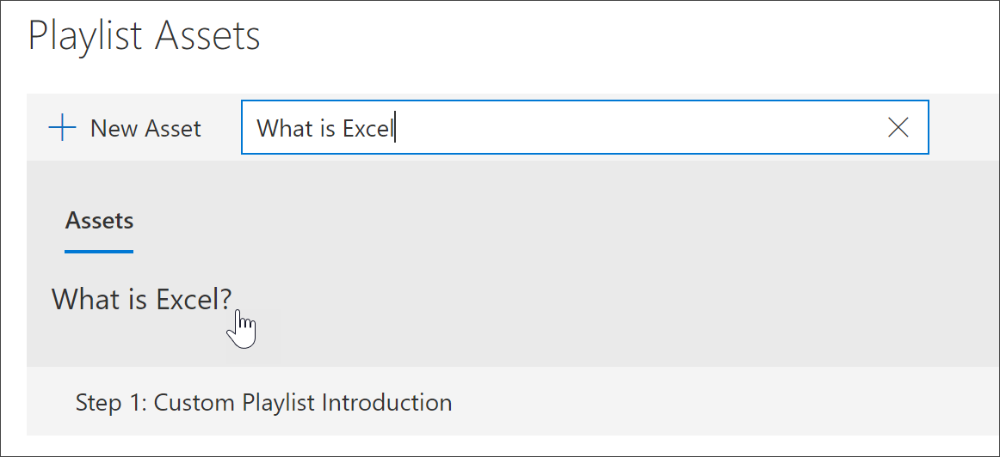

# Добавление активов в настраиваемый список воспроизведения

С помощью путей обучения можно добавить в список воспроизведения следующие активы:

- Существующие активы путей обучения Microsoft **365** — это активы, которые являются частью онлайн-каталога Microsoft или активов, которые ваша организация уже добавила в пути обучения.
- **Новые активы** — это активы, которые добавляются в пути обучения, построенные на страницах SharePoint, которые вы создаете, или ресурсы SharePoint, которые уже доступны на сайте SharePoint в вашей организации. 

> [!TIP]
> Если актив плейлиста Майкрософт не отвечает вашим потребностям, создайте новый плейлист, а затем добавьте активы Майкрософт и все вновь созданные активы в плейлист, чтобы создать необходимый опыт. Вы не можете изменить списки воспроизведения путей обучения, предоставленные Корпорацией Майкрософт, но вы можете добавить ресурсы, предоставленные путями обучения, в настраиваемый плейлист.   

## Создание нового актива для списка воспроизведения

Существует два варианта добавления нового актива в плейлист.

- **Создание страницы активов** — с помощью этого параметра пути обучения создадут для вас новую пустую страницу SharePoint и добавят ее в плейлист. Затем можно добавить содержимое на страницу и сохранить его.  
- **Введите URL-адрес** — с помощью этого параметра вы создайте страницу заранее или уже имеете доступную страницу и укажите URL-адрес, чтобы добавить страницу в список воспроизведения.

### Создание страницы активов 
С помощью **параметра Создать страницу** активов вы предоставляете заголовок для актива, а затем щелкните страницу Создание активов, чтобы создать и открыть новую страницу SharePoint для редактирования. 

1.  Если список воспроизведения еще не открыт для редактирования, на странице Настраиваемый администрирование обучения щелкните список воспроизведения, который необходимо изменить.  
2. Чтобы добавить новый актив в плейлист, нажмите **кнопку New Asset**. 
3. Введите название. В этом примере введите "Добавление активов в плейлист", а затем нажмите **кнопку Создать страницу активов**.

4. Нажмите **кнопку Открыть страницу**.
5. Щелкните **значок Изменить** и нажмите **кнопку Изменить веб-часть в** области Title.
6. В **макете** нажмите **кнопку Plain**. 
7. Добавьте новый раздел с одним столбцом, а затем добавьте на страницу пример текста, чтобы он выглядел как следующий пример. 

7. Нажмите кнопку **Опубликовать**.
8. Вернись на **страницу Администрирование пользовательского** обучения. 
9. Заполните оставшиеся свойства для актива и нажмите кнопку **Сохранить актив.**

### Ввод URL-адреса
С помощью **параметра Введите** URL-адрес, вы предоставите название для актива, а затем нажмите кнопку **Введите** URL-адрес, чтобы указать страницу SharePoint, которая необходимо добавить в список воспроизведения. 

1.  Если список воспроизведения не открыт для редактирования, на странице Настраиваемый администрирование обучения щелкните список воспроизведения, который необходимо изменить.  
2. Чтобы добавить новый актив в плейлист, нажмите **кнопку New Asset**. 
3. Введите название. В этом примере введите "Введение пользовательского списка воспроизведения", а затем нажмите **кнопку Введите URL-адрес**. 

4. Введите URL-адрес страницы SharePoint, созданной в предыдущем разделе Создание страниц [SharePoint ](custom_createnewpage.md) для настраиваемого раздела плейлистов, а затем заполните остальные поля, как показано на следующем рисунке.

5. Нажмите **кнопку Сохранить актив**. 

## Добавление существующего актива в плейлист

Существующие активы состоят из активов или активов, уже добавленных в пути обучения вашей организацией, предоставляемыми Корпорацией Майкрософт. 

- В поле **Поиск** введите фразу Поиск, а затем выберите актив из результатов поиска. В этом примере введите "Что такое Excel?" добавить в список воспроизведения тему интро Excel.

## Изменение, перемещение и удаление активов
Вы можете изменить настраиваемые активы, которые вы создаете, но не активы из Microsoft. Однако вы можете удалить все активы из списка воспроизведения и изменить активы заказа. 

### Изменение актива
- Нажмите кнопку Изменить для актива, измените актив и нажмите кнопку Сохранить актив. 

### Перемещение актива в списке воспроизведения
- Щелкните стрелку вверх или вниз справа от актива, чтобы переместить порядок актива в плейлисте

### Удаление актива из списка воспроизведения
- Нажмите кнопку Удалить из значка Playlist X для актива. 

## Просмотр списка воспроизведения в действии
Теперь, когда вы добавили активы в список воспроизведения, давайте закроем список воспроизведения и увидим его в действии. 

1. Нажмите **кнопку Закрыть список воспроизведения**.
2. Щелкните вкладку на странице **подготовки Office 365.**
3. Обновите страницу и нажмите **кнопку Первые дни в** **статье Начало работы.**
4. Нажмите **кнопку Starter Kit** путей обучения, чтобы просмотреть первый список воспроизведения в действии. 

