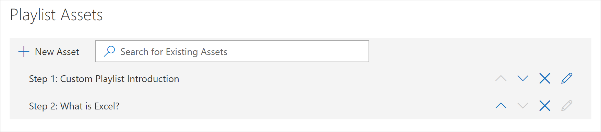

# Добавление активов в настраиваемый список воспроизведенияAdd Assets to a Custom Playlist

С помощью путей обучения можно добавить в список воспроизведения следующие активы:With learning pathways, you can add the following assets to a playlist:

- **Существующие Microsoft 365** пути обучения — это активы, которые являются частью онлайн-каталога Microsoft или активов, которые ваша организация уже добавила в пути обучения.**Existing Microsoft 365 learning pathways assets** - these are assets that are part of the Microsoft online catalog or assets that your organization has already added to learning pathways.
- **Новые активы** — это активы, которые добавляются в пути обучения, которые создаются на SharePoint страниц, которые вы создаете или SharePoint, которые уже доступны на SharePoint сайте в организации.**New assets** - these are assets that you add to learning pathways that are built from SharePoint pages that you create or SharePoint assets that are already available on a SharePoint site in your organization. 

> [!TIP]
> Если актив плейлиста Майкрософт не отвечает вашим потребностям, создайте новый плейлист, а затем добавьте активы Майкрософт и все вновь созданные активы в плейлист, чтобы создать необходимый опыт.If a Microsoft playlist asset doesn't meet your needs, create a new playlist and then add the Microsoft assets and any newly created assets to the playlist to build the experience you want. Вы не можете изменить списки воспроизведения путей обучения, предоставленные Корпорацией Майкрософт, но вы можете добавить ресурсы, предоставленные путями обучения, в настраиваемый плейлист.You can't modify learning pathways playlists supplied by Microsoft, but you can add learning pathways-supplied assets to a custom playlist.   

## Создание нового актива для списка воспроизведенияCreate a new asset for a playlist

Существует два варианта добавления нового актива в плейлист.There are two options for adding a new asset to a playlist.

- **Создание страницы активов** — с помощью этого параметра пути обучения создадут новую пустую страницу SharePoint для вас и добавят ее в список воспроизведения.**Create Asset Page** - with this option, learning pathways will generate a new,  blank SharePoint page for you and add it to the playlist. Затем можно добавить содержимое на страницу и сохранить его.You can then add content to the page and save it.  
- **Введите URL-адрес** — с помощью этого параметра вы создайте страницу заранее или уже имеете доступную страницу и укажите URL-адрес, чтобы добавить страницу в список воспроизведения.**Enter the URL** - with this option, you build the page in advance or you already have the page available and you specify the URL to add the page to the playlist.

### Создание страницы активовCreate Asset Page 
С помощью **параметра Create Asset Page** вы предоставляете название для актива, а затем щелкните страницу Create Asset, чтобы создать и открыть новую страницу SharePoint для редактирования.With the **Create Asset Page** option, you provide a title for the Asset, then click Create Asset page to create and open a new SharePoint page for editing. 

1.  Если список воспроизведения еще не открыт для редактирования, на странице Настраиваемый администрирование обучения щелкните список воспроизведения, который необходимо изменить. If the playlist isn't already open for editing, from the **Custom Learning Administration** page, click the playlist you wish to edit. 
2. Чтобы добавить новый актив в плейлист, нажмите **кнопку New Asset**.To add a new asset to a playlist, click **New Asset**. 
3. Введите название.Enter a title. В этом примере введите "Добавление активов в плейлист", а затем нажмите **кнопку Создать страницу активов**.In this example enter “Add Assets to a Playlist”, and then click **Create Asset Page**.

   

4. Нажмите **кнопку Открыть страницу**.Click **Open Page**.
5. Щелкните **значок Изменить** и нажмите **кнопку Изменить веб-часть в** области Title.Click the **Edit** icon, and then click **Edit Web part** in the Title area.
6. В **макете** нажмите **кнопку Plain**.Under **Layout**, click **Plain**. 
7. Добавьте новый раздел с одним столбцом, а затем добавьте на страницу пример текста, чтобы он выглядел как следующий пример.Add a new one-column section, and then add some sample text to the page so it looks like the following example. 

   

7. Нажмите кнопку **Опубликовать**.Click **Publish**.
8. Вернись на **страницу Администрирование пользовательского** обучения.Return to the **Custom Learning Administration** page. 
9. Заполните оставшиеся свойства для актива и нажмите кнопку **Сохранить актив.**Fill out the remainder of the properties for the asset, and then click **Save Asset.**

### Ввод URL-адресаEnter the URL
С помощью **параметра Ввод URL-адреса** вы предоставляете  заголовок для актива, а затем щелкните Введите URL-адрес, чтобы указать страницу SharePoint, которая будет добавлена в список воспроизведения.With the **Enter the URL** option, you provide a title for the Asset, then click **Enter the URL** to specify the SharePoint page you want to add to the playlist. 

1.  Если список воспроизведения не открыт для редактирования, на странице Настраиваемый администрирование обучения щелкните список воспроизведения, который необходимо изменить. If the playlist isn't open for editing, from the **Custom Learning Administration** page, click the playlist you wish to edit. 
2. Чтобы добавить новый актив в плейлист, нажмите **кнопку New Asset**.To add a new asset to a playlist, click **New Asset**. 
3. Введите название.Enter a title. В этом примере введите "Введение пользовательского списка воспроизведения", а затем нажмите **кнопку Введите URL-адрес**.In this example, enter “Custom Playlist Introduction”, and then click **Enter URL**. 

   

4. Введите URL-адрес страницы SharePoint, созданной в предыдущем разделе Create SharePoint для настраиваемого раздела [плейлистов,](custom_createnewpage.md) а затем заполните оставшиеся поля, как показано на следующем рисунке.Enter the URL of the SharePoint page you created in a previous [Create SharePoint pages for custom playlists ](custom_createnewpage.md) section, and then fill out the remainder of the fields, as shown in the following illustration.

   

5. Нажмите **кнопку Сохранить актив**.Click **Save Asset**. 

## Добавление существующего актива в плейлистAdd an existing asset to a playlist

Существующие активы состоят из активов или активов, уже добавленных в пути обучения вашей организацией, предоставляемыми Корпорацией Майкрософт.Existing assets consist of Microsoft-provided learning pathways assets or assets that have already been added to learning pathways by your organization. 

- В поле **Поиск** введите фразу Поиск, а затем выберите актив из результатов поиска.In the **Search** box, enter a Search phrase, and then select an asset from the Search results. В этом примере введите "Что Excel?"In this example, enter “What is Excel?” добавление темы Excel в список воспроизведения.to add an Excel intro topic to the playlist.

## Изменение, перемещение и удаление активовEdit, move, and delete assets
Вы можете изменить настраиваемые активы, которые вы создаете, но не активы из Microsoft.You can edit custom assets that you create, but not assets from Microsoft. Однако вы можете удалить все активы из списка воспроизведения и изменить активы заказа.However, you can remove all assets from a playlist and change the order assets. 

### Изменение активаEdit an asset
- Нажмите кнопку Изменить для актива, измените актив и нажмите кнопку Сохранить актив.Click the Edit button for an asset, modify the asset, and then click Save Asset. 

### Перемещение актива в списке воспроизведенияMove an asset in a playlist
- Щелкните стрелку вверх или вниз справа от актива, чтобы переместить порядок актива в плейлистеClick the up or down arrow to the right of the asset to move the asset order in the playlist

### Удаление актива из списка воспроизведенияRemove an asset from a playlist
- Нажмите кнопку Удалить из значка Playlist X для актива.Click the Remove from Playlist X icon for the asset. 

## Просмотр списка воспроизведения в действииView the playlist in Action
Теперь, когда вы добавили активы в список воспроизведения, давайте закроем список воспроизведения и увидим его в действии.Now that you've added assets to a playlist, let's close the playlist and see it in action. 

1. Нажмите **кнопку Закрыть список воспроизведения**.Click **Close Playlist**.
2. Щелкните вкладку на **странице Office 365 подготовки.**Click the tab with the **Office 365 training** page.
3. Обновите страницу и нажмите **кнопку Первые дни** **в Начало работы.**Refresh the page, and then click **First Days** under **Get Started**.
4. Нажмите **кнопку Starter Kit** путей обучения, чтобы просмотреть первый список воспроизведения в действии.Click **Learning Pathways Starter Kit** to view your first playlist in action. 

