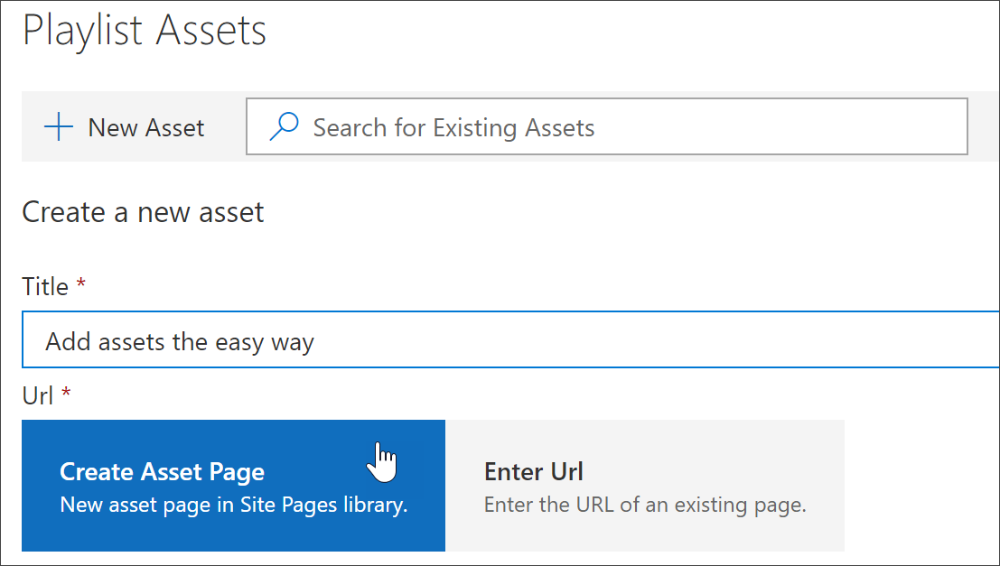

# Добавление ресурсов в настраиваемый список воспроизведения

С помощью путей обучения вы можете добавить следующие ресурсы в список воспроизведения:

- **Существующие ресурсы для учебных заучений Microsoft 365** — это ресурсы, которые входят в каталог Microsoft Online или ресурсы, которые ваша организация уже добавила в пути для обучения.
- **Новые активы** — это ресурсы, которые вы добавляете в пути для обучения, созданные на страницах SharePoint, которые вы создаете, или ресурсы SharePoint, которые уже доступны на сайте SharePoint в Организации. 

> [!TIP]
> Если ресурс списка воспроизведения Microsoft не отвечает вашим потребностям, создайте новый список воспроизведения, а затем добавьте ресурсы Майкрософт и все новые ресурсы в список воспроизведения для создания нужного интерфейса. Вы не можете изменять списки воспроизведения путей обучения, предоставляемые корпорацией Майкрософт, но вы можете добавить ресурсы, предоставленные для обучения, в настраиваемый список воспроизведения.   

## Создание нового актива для списка воспроизведения

Существует два способа добавления нового актива в список воспроизведения.

- **Создать страницу актива** — с помощью этого параметра пути обучения будут создавать новую пустую страницу SharePoint и добавлять ее в список воспроизведения. Затем вы можете добавить контент на страницу и сохранить его.  
- **Введите URL-адрес** — с помощью этого параметра вы можете создать страницу заранее или у вас уже есть доступ к странице, а также указать URL-адрес, чтобы добавить страницу в список воспроизведения.

### Создание страницы актива 
С помощью параметра **создать страницу ресурса** вы можете указать название актива, а затем щелкнуть Создать страницу ресурса, чтобы создать и открыть новую страницу SharePoint для редактирования. 

1.  Если список воспроизведения еще не открыт для редактирования, на странице **настраиваемого администрирования обучения** щелкните список воспроизведения, который требуется изменить. 
2. Чтобы добавить новый ресурс в список воспроизведения, нажмите кнопку **создать ресурс**. 
3. Введите название. В этом примере введите "добавить ресурсы в список воспроизведения", а затем щелкните **создать страницу ресурса**.

4. Нажмите кнопку **открыть страницу**.
5. Щелкните значок **редактирования** , а затем выберите команду **Изменить веб-часть** в области заголовка.
6. В разделе **Макет**выберите **простой**. 
7. Добавьте новый раздел из одного столбца, а затем добавьте на страницу некоторый образец текста, чтобы он выглядел так, как показано в следующем примере. 

7. Нажмите кнопку **Опубликовать**.
8. Вернитесь на страницу **настраиваемого администрирования обучения** . 
9. Заполните оставшиеся свойства актива и нажмите кнопку **сохранить актив.**

### Введите URL-адрес
С помощью параметра **введите URL-адрес** укажите название актива, а затем нажмите **ввести URL-адрес** , чтобы указать страницу SharePoint, которую нужно добавить в список воспроизведения. 

1.  Если список воспроизведения не открыт для редактирования, на странице " **настраиваемое администрирование обучения** " щелкните список воспроизведения, который требуется изменить. 
2. Чтобы добавить новый ресурс в список воспроизведения, нажмите кнопку **создать ресурс**. 
3. Введите название. В этом примере введите "Введение в пользовательский список воспроизведения", а затем нажмите **ввести URL-адрес**. 

4. Введите URL-адрес страницы SharePoint, созданной в предыдущем разделе [Создание страниц SharePoint для настраиваемых списков воспроизведения ](custom_createnewpage.md) , а затем заполните оставшиеся поля, как показано на следующем рисунке.

5. Нажмите кнопку **сохранить ресурс**. 

## Добавление существующего актива в список воспроизведения

Существующие ресурсы состоят из материалов, предоставленных корпорацией Майкрософт, или активов, которые уже добавлены в обучающие пути вашей организацией. 

- В поле **поиска** введите фразу для поиска, а затем выберите ресурс из результатов поиска. В этом примере введите "что такое Excel?" , чтобы добавить в список воспроизведения вводный раздел Excel.

## Редактирование, перемещение и удаление активов
Вы можете редактировать настраиваемые активы, которые вы создаете, но не активы корпорации Майкрософт. Однако вы можете удалить все ресурсы из списка воспроизведения и изменить ресурсы заказа. 

### Изменение актива
- Нажмите кнопку изменить для актива, измените ресурс, а затем щелкните сохранить ресурс. 

### Перемещение актива в списке воспроизведения
- Нажмите стрелку вверх или вниз справа от ресурса, чтобы переместить заказ на ресурсы в списке воспроизведения.

### Удаление ресурса из списка воспроизведения
- Щелкните значок Удалить из списка воспроизведения X для актива. 

## Просмотр списка воспроизведения в действии
Теперь, когда вы добавили ресурсы в список воспроизведения, закрывайте его и проверим в действии. 

1. Нажмите кнопку **Закрыть список воспроизведения**.
2. Перейдите на вкладку с помощью **учебной страницы Office 365** .
3. Обновите страницу, а затем щелкните **первые дни** в разделе Начало **работы**.
4. Щелкните **стартовые пути, стартовый комплект** для просмотра первого списка воспроизведения в действии. 

