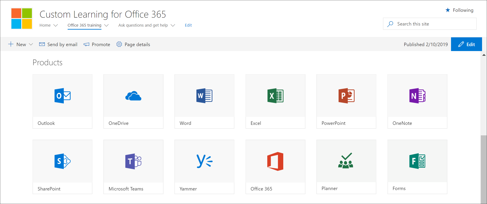

# Добавление настраиваемого сайта обучения владельцев

Пользовательский обучающий сайт для Office 365 размещен в вашем клиенте Office 365, поэтому вам потребуется войти в Office 365, если вы еще не вошли в систему, чтобы перейти на сайт. 

## Sign in to Office 365 

1.  Откройте веб-браузер и перейдите на сайт office.com или на страницу входа вашей организации. 
2.  Войдите, указав имя пользователя и пароль.
3.  Перейдите к расположению сайта. Если у вас его нет в наличии, его можно найти в почте, полученной от службы подготовки PnP. Выберите SharePoint на домашней странице Office 365, а затем выберите **настраиваемый сайт обучения office 365** . Возможно, вы изменили имя. 
5. Щелкните плитку **учебного обучения Office 365** , чтобы просмотреть полный набор обучающих списков воспроизведения с пользовательским обучением и проверить, работает ли настраиваемое обучение должным образом. 

## Просмотр всех настраиваемых обучающих материалов
На странице учебного заработка Office 365 размещается настраиваемая веб-часть Learning, настроенная для отображения всех учебных курсов, доступных для обучения. 

1. Прокрутите страницу вниз, чтобы просмотреть все категории и подкатегории.
2. Припустите бит. Щелкните несколько подкатегорий, а затем выберите несколько списков воспроизведения, чтобы узнать, как организуется настраиваемый обучающий контент. 

## Добавление владельцев для сайта
Как администратор клиента, маловероятно, чтобы пользователь настраивает сайт, поэтому необходимо назначить сайт нескольким владельцам. Владельцы имеют административные права на сайте, чтобы они могли изменять страницы сайта и изменять фирменный стиль сайта. Они также могут скрывать и показывать контент, доставленный через пользовательскую веб-часть обучения. Они также смогут создавать настраиваемые списки воспроизведения и назначать их настраиваемым подкатегориям.  

1. В меню **Параметры** SharePoint выберите разрешения для **сайта**.
2. Нажмите кнопку **Дополнительные параметры разрешений**.
3. Щелкните **пользовательское обучение для владельцев Office 365**.
4. Нажмите кнопку **создать**  >  ,**чтобы добавить пользователей в эту группу**, добавьте пользователей, которых вы хотите добавить в группу, а затем нажмите кнопку **общий доступ**.

