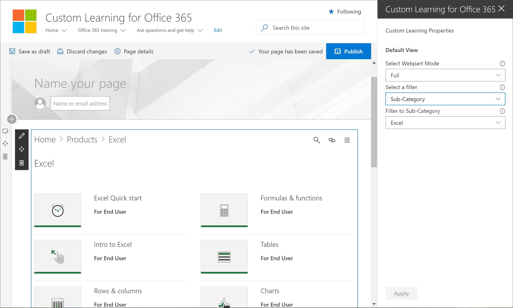

# Добавление и изменение настраиваемой веб-части обученияAdd and Edit the Custom Learning web part

Пользовательское обучение позволяет добавить настраиваемую веб-часть обучения на страницу SharePoint, а затем отфильтровать содержимое веб-части в соответствии с целями обучения для этой страницы. Например, вы можете создать страницу "выполнить переход на OneDrive", а затем добавить веб-часть и настроить ее для отображения настраиваемых списков воспроизведения для миграции OneDrive, созданных специально для вашей организации.Custom Learning gives you the flexibility to add the Custom Learning Web part to a SharePoint page, and then filter the contents of the Web part to meet the learning objectives for the page. For example, you could create a "Make the Switch to OneDrive" page, then add the Web part and configure it to show custom OneDrive migration playlists created especially for your organization.

1.  Щелкните значок шестеренки SharePoint и выберите команду **Добавить страницу**.Click the SharePoint Gear icon, and then click **Add a page**.
2.  Щелкните **Добавить новый раздел (+)** в левой части страницы, а затем щелкните **один столбец**.Click **Add a new section (+)** on the left-hand side of the page, and then click **One Column**.
3.  Щелкните **+**, а затем выберите Пользовательская веб-часть **Learning для Office 365** .Click **+**, then select **Custom Learning for Office 365** web part. 

## Изменение настраиваемой веб-части обученияEdit the Custom Learning web part
Вы можете изменить пользовательскую веб-часть "обучение", чтобы показать все доступные настраиваемые обучающие материалы или определенную категорию, подкатегорию, список воспроизведения или актив.You can the edit Custom Learning Web part to show all the available Custom Learning content or a specific category, subcategory, playlist, or asset. 

1.  Щелкните **Изменить веб-часть**.Click **Edit web part**.

2. В области настраиваемые свойства обучения отфильтруйте веб-часть следующим.In the Custom Learning Properties pane, filter the Web part for the following. 

- Режим WebPart: FullWebpart Mode: Full
- Фильтр: ПодкатегорияFilter: Subcategory
- Подкатегория: ExcelSubcategory: Excel

3. Теперь страница должна выглядеть примерно так, как показано на рисунке ниже.Your page should now look something like the following image: 

## Добавление заголовка и публикация страницыAdd a title and publish the page
1. В области заголовка страницы введите "Создание собственного интерфейса".In the title area of the page, type "Create your own experience".
2. Щелкните значок **Изменить веб-часть** в области заголовка, выберите пункт **обычный** под \*\*\*\* разметкой, а затем закройте область **Свойства** .Click the **Edit web part** icon in the Title area, select **Plain** under **Layout**, and then close the **Properties** pane.
3. Нажмите кнопку **опубликовать**.Click **Publish**.
