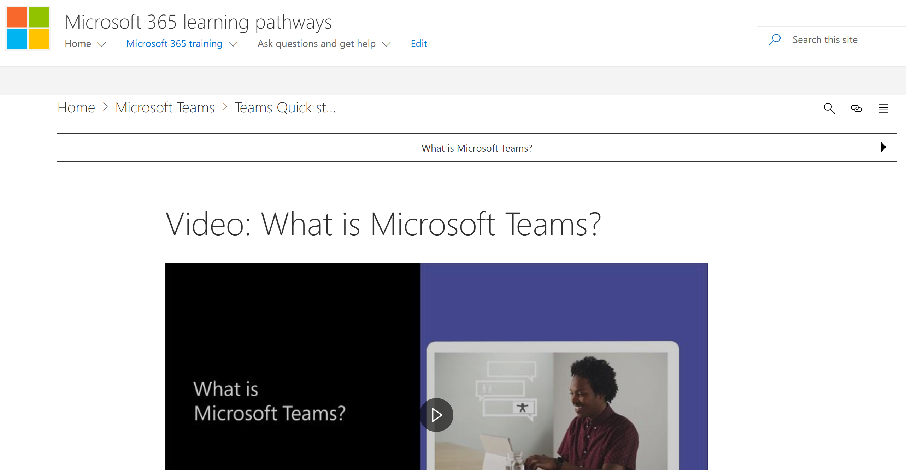

# Знакомство со страницами приложений в SharePointGet to know the SharePoint Application pages

Пути обучения предоставляют две страницы приложения SharePoint, о чем следует знать как администратор.Learning pathways provides two SharePoint Application pages that you should know about as an administrator. Эти две страницы не являются редактируемыми и не должны удаляться.These two pages are non-editable and should not be deleted. 

- CustomLearningAdmin.aspxCustomLearningAdmin.aspx
- CustomLearningViewer.aspxCustomLearningViewer.aspx

## CustomLearningAdmin.aspxCustomLearningAdmin.aspx

Страница CustomLearningAdmin.aspx содержит административные функции для путей обучения, включая сокрытие и отображение контента, а также создание и редактирование подкатегорий и списков воспроизведения.The CustomLearningAdmin.aspx page provides Administrative features for learning pathways, including hiding and showing content and creating and editing subcategories and playlists. В более поздних разделах мы подробно окроем эту страницу и ее функциональные возможности.We’ll cover this page and its functionality in more detail in later sections.

### Просмотр CustomLearningAdmin.aspxView CustomLearningAdmin.aspx

1. Щелкните значок **Параметры** SharePoint, а затем щелкните **страницы** сайтов  >  **содержимого сайта.**Click the SharePoint **Settings** icon, and then click **Site Contents** > **Site Pages**. 
2. Щелкните **CustomLearningAdmin.aspx**.Click **CustomLearningAdmin.aspx**. 

## CustomLearningViewer.aspxCustomLearningViewer.aspx
Страница CustomLearningViewer.aspx предоставляет зрителю возможность отображения содержимого путей обучения в веб-части.The CustomLearningViewer.aspx page provides a viewer for displaying learning pathways contents in the web part. Например, если вы скопируете ссылку Playlist и поделитесь ее с коллегой, ссылка при нажатии на нее отберет пользователя на страницу Viewer и отображает связанное содержимое.For example, if you copy a Playlist link and share it with a co-worker, the link, when clicked, takes the user to the Viewer page and displays the linked content. 

### Просмотр CustomLearningViewer.aspxView CustomLearningViewer.aspx

1. Щелкните значок **Параметры** SharePoint, а затем щелкните **страницы** сайтов  >  **содержимого сайта.**Click the SharePoint **Settings** icon, and then click **Site Contents** > **Site Pages**. 
2. Щелкните **CustomLearningViewer.aspx**.Click **CustomLearningViewer.aspx**. 

