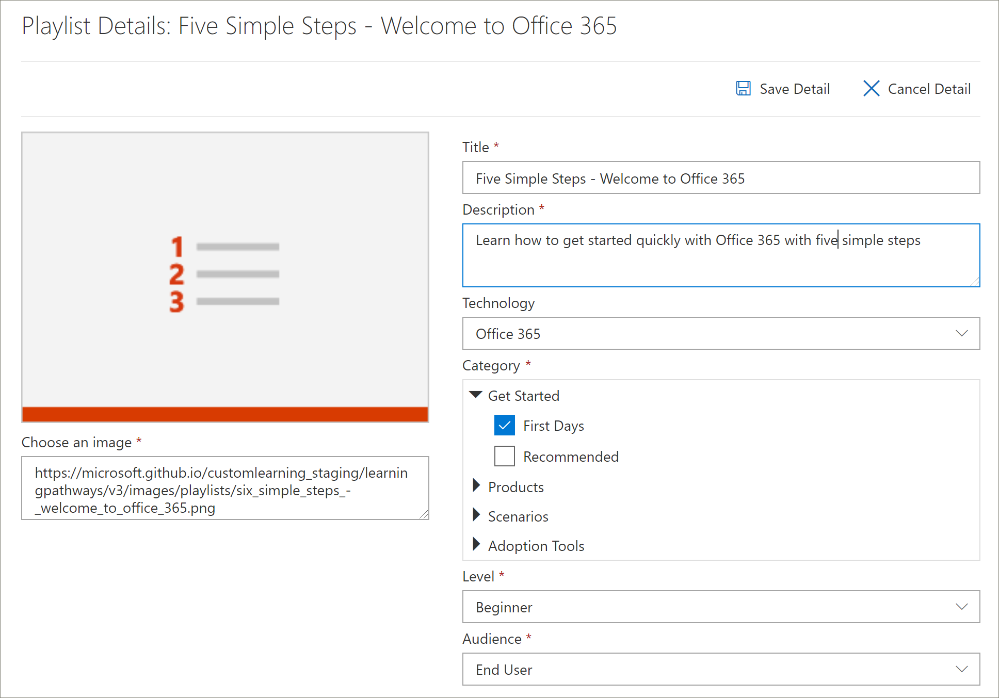

# Копирование списка воспроизведенияCopy a Playlist
Часто организациям необходимо изменить предоставленный Майкрософт список воспроизведения, удалив или заменив ресурс с активом, созданным Организацией.Quite often, organizations need to modify a Microsoft-supplied playlist by removing or replacing an asset with an asset created by the organization. Например, вы можете удалить шаг из списка "начать с шести простых шагов".For example, you might want to remove a step from the Start with Six Simple Steps playlist. Теперь вы можете использовать функцию "Копирование списка обучающих путей", чтобы легко скопировать список "шесть простых шагов" и просто удалить актив, заменить актив или добавить новые ресурсы.Now you can use the learning pathways Copy Playlist feature to easily copy the Six Simple Steps playlist and simply remove an asset, replace an asset, or add new assets. 

## Копирование списка воспроизведенияTo copy a playlist

1. На **домашней** странице Microsoft 365 Learning путей выберите пункт обучение по **Office 365**.From the Microsoft 365 learning pathways **Home** page, click **Office 365 training**.
2. Щелкните значок **Администрирование** .Click the **Administration** icon.
3. В разделе **первые дни**щелкните **шесть простых действий — Добро пожаловать в список воспроизведения Office 365** , а затем щелкните **Копировать список воспроизведения**.Under **First Days**, click the **Six Simple Steps - Welcome to Office 365** playlist, and then click **Copy Playlist**. 
4. Нажмите кнопку **изменить сведения**, а затем заполните поля **название** и **Описание** , как показано в следующем примере, а затем нажмите кнопку **сохранить сведения**.Click **Edit Detail**, and then fill in the **Title** and **Description** fields as shown in the following example, then click **Save Detail**.  
 

## Добавление и удаление ресурсов из списка воспроизведенияAdd or remove assets from a playlist
С помощью настраиваемых списков воспроизведения можно выполнить указанные ниже действия.With custom playlists, you can:
- Добавление и удаление ресурсов Майкрософт, но не изменение ресурсов в Майкрософтadd and remove Microsoft assets, but not edit the assets from Microsoft
- Добавление, удаление и редактирование пользовательских ресурсов SharePoint из вашей организации или ресурсов SharePoint, которые вы создаете.add, remove, and edit custom existing SharePoint assets from your organization or SharePoint assets that you create. 

### Удаление ресурса из списка воспроизведенияRemove an asset from a playlist
- Прокрутите страницу " **Администрирование** ", а затем в разделе **ресурсы списка воспроизведения** щелкните значок удаления для **шага 5. Настройка мобильных приложений**.Scroll down the **Administration** page, and then under **Playlist Assets** click the delete icon for **Step 5. Set up mobile apps**. 

## Проверка того, что актив удален из списка воспроизведенияVerify the asset is removed from the playlist
1. Вернитесь на вкладку с помощью **учебной страницы Microsoft 365** .Return to the tab with the **Microsoft 365 training** page.
2. Щелкните **первые дни**, а затем выберите **пять простых шагов — Добро пожаловать в список воспроизведения Office 365** .Click **First Days**, then click the **Five Simple Steps - Welcome to Office 365** playlist. 
3. Щелкните список воспроизведения, чтобы убедиться, что актив удален.Click through the playlist to verify that the asset has been removed.

