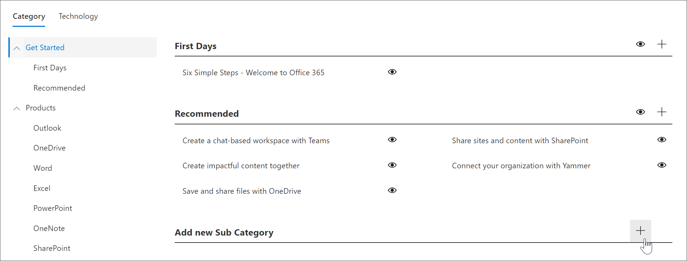

# Создание подкатегорииCreate a Subcategory 
В некоторых случаях необходимо создать новую подкатегорию.In some cases, you’ll want to create a new Subcategory. Например, если подкатегория "первые дни" не подходит для вашей организации, можно создать новую подкатегорию и добавить к ней списки воспроизведения для удовлетворения потребностей Организации.For example, if the First Days subcategory doesn’t work for you organization, you can create a new subcategory and then add playlists to it to meet the needs of your organization. 

1. На настраиваемой **домашней** странице обучения щелкните **Office 365 Training**, выберите **системное** меню из веб-части, а затем щелкните **Администрирование списка воспроизведения**.From the Custom Learning **Home** page, click **Office 365 training**, click the **System** menu from the Web part, and then click **Administer Playlist**. 
2. Выберите **категорию**.Select a **Category**. В этом примере выберите приСтупить к **работе**.In this example, select **Get Started**.  
3. ПроКрутите страницу вниз,Scroll down the page, 
3. Щелкните значок **Добавить новую подкатегорию и** значок.Click the **Add new Subcategory +** icon.  

> [!TIP]
> Подкатегории, предоставленные корпорацией Майкрософт, могут быть скрыты, но не изменены или удалены.Microsoft-provided subcategories can be hidden, but not edited or deleted. 

## Изменение подкатегорииEdit a subcategory
- Выберите значок **изменить** для подкатегории, внесите изменения в заголовок подкатегории, а затем нажмите кнопку **сохранить**.Select the **Edit** icon for subcategory, make edits to the Subcategory title, and then click **Save**.

## Скрытие подкатегорииHide a subcategory
- Выберите подкатегорию эйебалл, чтобы скрыть ее.Select the eyeball for subcategory to hide it. 

## Удаление подкатегорииDelete a subcategory
- Выберите значок **изменить** для подкатегории, а затем нажмите кнопку **Удалить.**Select the **Edit** icon for subcategory, then select **Delete.** 
