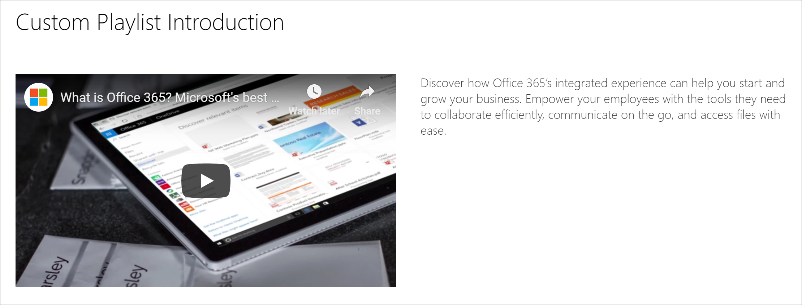

# Создание страниц SharePoint для настраиваемых списков воспроизведения

Одной из уникальных функций путей обучения является возможность создавать списки воспроизведения, собранные из ресурсов Майкрософт и из ресурсов SharePoint, которые вы создаете. В этом примере мы создадим страницу SharePoint предварительно, чтобы создать список воспроизведения. Возможность создавать списки воспроизведения из страниц SharePoint предоставляет разнообразные возможности для создания страниц с помощью веб-частей, доступных от Майкрософт или организации. Например, в список воспроизведения можно добавить страницу SharePoint с внедренными видеороликами YouTube или форму, созданную на основе форм Office 365, или встроенный отчет Power BI. В этом примере мы покажем, как создать страницу с веб-частью embed и текстовой веб-частью.  

## Создание страницы SharePoint для настраиваемого списка воспроизведения

1. Щелкните значок **шестеренки** SharePoint и выберите команду **Добавить страницу**.
2. Щелкните **Добавить новый раздел (+)** в левой части страницы, а затем выберите **два столбца** для макета раздела.
3. В левом столбце нажмите кнопку + и выберите веб-часть **внедрить** . 
4. В правом столбце щелкните +, а затем щелкните веб-часть " **текст** ". Страница должна выглядеть так, как показано ниже.

### Добавление видео и текста из YouTube

1. В браузере откройте YouTube. В этом примере выполните поиск по запросу "что такое Office 365 — лучшие приложения Майкрософт".
2. Щелкните видео, чтобы его запустить, затем Приостановите его, а затем щелкните правой кнопкой мыши. 
3. Нажмите кнопку **Копировать код внедрения**, а затем вернитесь на страницу SharePoint. 
4. Щелкните **добавить код внедрения** в веб-части **внедрить** , а затем добавьте код из YouTube Video.
5. Вернитесь на страницу YouTube и скопируйте текст **описания** для видеоролика. 
6. Вернитесь на страницу SharePoint, выберите веб-часть **текст** , а затем скопируйте текст из YouTube видео на YouTube.
7. Выберите значок **Изменить веб-часть** в области заголовка страницы SharePoint, а затем назовите страницу "пользовательское представление списка". 
8. В **раскладке**выберите **простой**, а затем закройте область свойства **области заголовка** . Теперь страница должна выглядеть примерно так, как показано ниже. 

### Публикация страницы

- Нажмите кнопку **опубликовать** . Теперь вы готовы добавить эту страницу SharePoint к настраиваемому списку воспроизведения. 