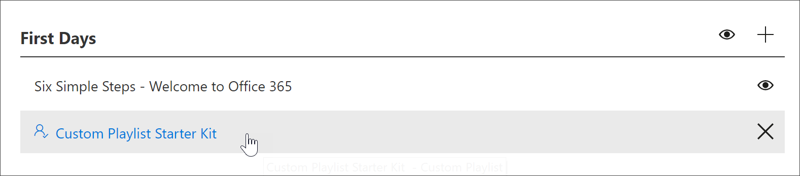

# Создание настраиваемого списка воспроизведенияCreate a Custom Playlist

С помощью путей обучения Microsoft 365 вы можете создавать настраиваемые списки воспроизведения с нуля, соответствующие потребностям вашей организации.With Microsoft 365 learning pathways, you can create custom playlists from scratch that are tailored to the unique needs of your organization. Например, создайте список воспроизведения для входящей миграции новых сотрудников в Microsoft Teams.For example, create a playlist for onboarding new hires to Microsoft Teams. Или создавать списки воспроизведения для администраторов, имеющих сведения, соответствующие их уникальной роли.Or create playlists for executive administrators with information suited to their unique role. Или создайте первый день для списка воспроизведения Microsoft 365 с тремя простыми действиями, а не шестью.Or create a First Day for Microsoft 365 playlist that has three simple steps instead of six. Вы можете добавить настраиваемый список воспроизведения в любую подкатегорию.You can add a custom playlist to any subcategory. Например, " **первые дни**", Подкатегория **продукта** , например **Excel**, или даже подкатегорию, которую вы создаете.For example, **First Days**, a **Product** subcategory like **Excel**, or even a subcategory that you create. В этом разделе мы расскажем, как создать список воспроизведения и попытаться добавить ресурсы в список воспроизведения в следующем разделе, [Добавить ресурсы в настраиваемый список воспроизведения](custom_addassets.md).In this section, we’ll cover how to create a playlist, and then cover adding assets to a playlist in the following section, [Add assets to a custom playlist](custom_addassets.md).

## Создание списка воспроизведенияCreate a playlist 

1. На **домашней** странице Microsoft 365 Learning путей выберите пункт **обучение Office 365**, а затем выберите значок **Администрирование** в веб-части.From the Microsoft 365 learning pathways **Home** page, click **Office 365 training**, and then select the **Administer** icon from the Web part. 
2. Выберите подкатегорию значок **Администрирование**.Select the **Administer**" icon  subcategory. В этом примере выберите **первые дни**.In this example, select **First Days**.  
3. Нажмите значок "+".Click the + icon.  

4.  Заполните поля в списке воспроизведения, как показано в следующем примере.Fill out the fields in the playlist as shown in the following example. В этом примере можно оставить значок по умолчанию.You can leave the default icon for this example. 

5.  Закончив, нажмите кнопку **сохранить сведения**.When you are done, select **Save Detail**. 

## Изменение списка воспроизведенияEdit a playlist

- На странице **настраиваемого администрирования обучения** щелкните список воспроизведения и выберите команду **изменить сведения**.From the **Custom Learning Administration** page, click the playlist, and then click **Edit Detail**.  

### Удаление списка воспроизведенияDelete a playlist

- На странице "пользовательское администрирование обучения" щелкните значок **удаления** для списка воспроизведения.From the Custom Learning Administration page, click the **Delete** icon for the playlist.  

