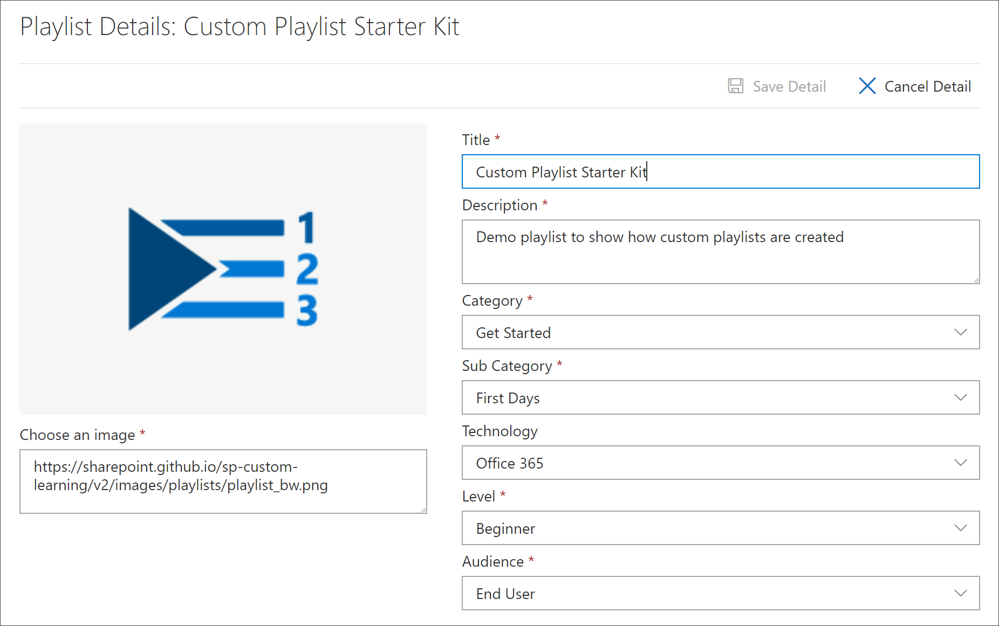

# Создание настраиваемого списка воспроизведения

При создании списка воспроизведения сначала необходимо создать список воспроизведения со сведениями о нем, а затем добавить ресурсы в список. Вы можете добавить список воспроизведения в любую подкатегорию. Например, вы можете добавить список воспроизведения в подкатегорию " **первые дни** " или подкатегорию **продукта** , например **Excel**. В этом разделе мы расскажем, как создать список воспроизведения и попытаться добавить ресурсы в список воспроизведения в следующем разделе, [Добавить ресурсы в настраиваемый список воспроизведения](custom_addassets.md).

## Создание списка воспроизведения 

1. На настраиваемой **домашней** странице обучения щелкните **Office 365 Training**, выберите пункт меню система в веб-части, а затем выберите пункт **Администрирование списка воспроизведения**. 
2. Выберите подкатегорию. В этом примере выберите **первые дни**.  
3. Нажмите значок "+".  

4.  ЗаПолните поля в списке воспроизведения, как показано в следующем примере. В этом примере можно оставить значок по умолчанию. 

5.  Закончив, нажмите кнопку **сохранить сведения**. 

## Изменение списка воспроизведения

- На странице **настраиваемОго администрирования обучения** щелкните список воспроизведения и выберите команду **изменить сведения**.  

### Удаление списка воспроизведения

- На странице "пользовательское администрирование обучения" щелкните значок **удаления** для списка воспроизведения.  

