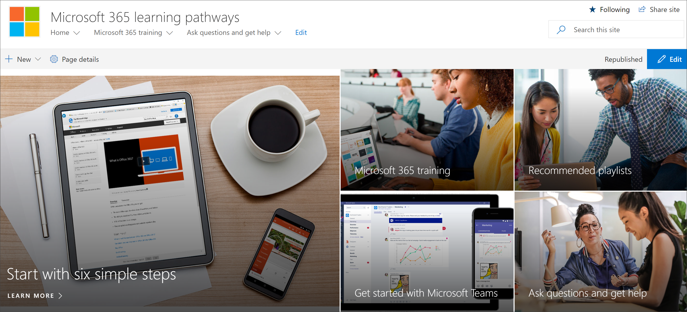

# Переход на настраиваемый сайт обученияGo to the Custom Learning site

Пользовательское обучение для Office 365 размещено в вашем клиенте Office 365, поэтому вам потребуется войти в Office 365, чтобы перейти на сайт.The Custom Learning for Office 365 site is hosted in your Office 365 tenant, so you'll need to sign in to Office 365 to get to the site. Если вы еще не выполнили вход в Office 365, войдите в систему.If you haven’t already signed into Office 365, sign in now. 

## Sign in to Office 365Sign in to Office 365 

1.  Откройте веб-браузер и перейдите в office.com или расположение для входа в организацию.Open your Web browser and navigate to office.com or your organization’s sign-in location. 
2.  Войдите с помощью имени пользователя и пароля.Sign in with your user name and password.
3.  Перейдите к расположению сайта, используя URL-адрес, предоставленный администратором клиента, или выберите SharePoint на домашней странице Office 365, а затем выберите **настраиваемый сайт обучения office 365** .Navigate to the location of the site using the URL supplied by your tenant administrator or select SharePoint from the Office 365 Home page, and then select the **Custom Learning for Office 365** site. 
5. Щелкните плитку Learning **Office 365** , чтобы просмотреть полный набор обучающих списков, доступных для индивидуального изучения.Click the **Office 365 training** tile to see the full suite of training playlist available with Custom Learning. 

## Просмотр всех настраиваемых обучающих материаловView all the Custom Learning content
На странице учебного заработка Office 365 размещается настраиваемая веб-часть Learning, настроенная для отображения всех учебных курсов, доступных для обучения.The Office 365 training page hosts the Custom Learning Web part configured to show all the training available for Custom Learning. 

1. ПроКрутите страницу вниз, чтобы просмотреть все категории и подкатегории.Scroll down the page to view all the categories and subcategories.
2. ПриПустите бит.Kick the tires a bit. Щелкните несколько подкатегорий, а затем выберите несколько списков воспроизведения, чтобы узнать, как организуется настраиваемый обучающий контент.Click a few subcategories, and then click a few playlists to get a feel for how Custom Learning content is organized. 

