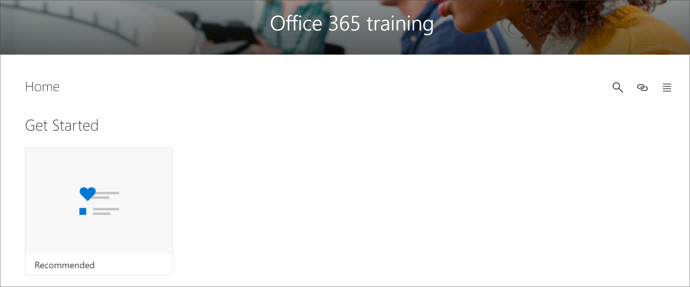

# Скрытие и отображение списков воспроизведения

Для настройки путей обучения для вашей среды можно скрыть списки воспроизведения, предоставляемые корпорацией Майкрософт. 

- Вы можете скрыть список воспроизведения, как начать с шести простых шагов, и заменить его на настраиваемый список воспроизведения, созданный для вашей организации.
- Вы можете скрыть список воспроизведения для продукта, если он охватывает функции, не поддерживаемые в вашей организации. Например, если Microsoft Teams не настроен для звонков или собраний, можно скрыть список " **начать беседы, звонки и собрания** ". 

## Скрытие списка воспроизведения

1. На **домашней** странице путей обучения щелкните плитку **обучение Office 365** .
2. В веб-части "пути для обучения" выберите значок **Администрирование** . 
3. В левой области страницы **администрирования** выберите подкатегорию, а затем выберите эйебалл для списка воспроизведения, чтобы скрыть его. В этом примере выберите подкатегорию **Microsoft Teams** , а затем скройте список воспроизведения * * * * начать сеансы разговора, звонки и собрания * *.  

### Проверка скрытости списка воспроизведения
- Чтобы проверить, скрыт ли список воспроизведения, перейдите на вкладку браузер с загруженной странице **Начало работы с Office 365** и обновите страницу. Выберите Microsoft Teams. Теперь вы должны увидеть подкатегорию " **начать беседы, звонки и собрания** ". 

## Отображение списка воспроизведения

- На странице **кадминистратион** выберите подкатегорию, выберите список воспроизведения, а затем выберите эйебалл для скрытого списка воспроизведения, чтобы отобразить его. В этом примере раскрытие списка "**начать беседы, звонки и собрания** " Microsoft Teams.   

