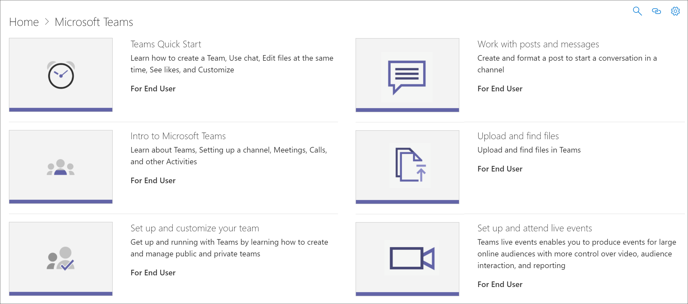

# Скрытие и отображение списков воспроизведения

Чтобы адаптировать пути обучения для среды, можно скрыть списки воспроизведения, предоставляемые Корпорацией Майкрософт. 

- Можно скрыть список воспроизведения, например "Начните с шести простых шагов" и заменить его пользовательским списком воспроизведения, созданным для организации.
- Список воспроизведения для продукта можно скрыть, если список воспроизведения охватывает функции, не поддерживаемые в организации. Например, если Microsoft Teams не настроена для звонков или собраний, можно скрыть список воспроизведения **чаты,** вызовы и собрания. 

## Скрыть список воспроизведения

1. На домашней странице **"Пути обучения"** щелкните плитку **подготовки Office 365.**
2. Из веб-части пути обучения выберите значок **Администрирование.** 
3. Слева на странице **Администрирование** выберите подкатегорию, а затем выберите глазное яблоко для списка воспроизведения, чтобы скрыть его. В этом примере щелкните подкатегорию **Microsoft Teams,** а затем скройте чаты, вызовы и собрания** плейлист *.  

### Проверка скрытого списка воспроизведения
- Чтобы убедиться, что список воспроизведения скрыт, выберите вкладку браузера с загруженной **страницей Office 365** и обновите страницу. Выберите Microsoft Teams. Теперь вы должны увидеть **скрытые чаты, вызовы** и подкатегория собраний. 

## Unhide a playlist

- На странице **CAdministration** выберите подкатегорию, выберите список воспроизведения, а затем выберите глазное яблоко для скрытого списка воспроизведения, чтобы оторвать его. В этом примере отойте список воспроизведения Microsoft Teams **_Запуск чатов, звонков и_* собраний.   

