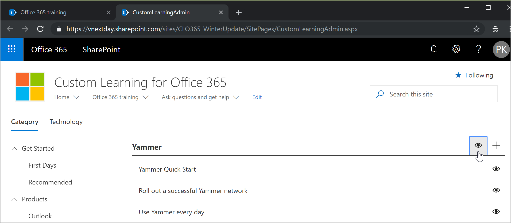
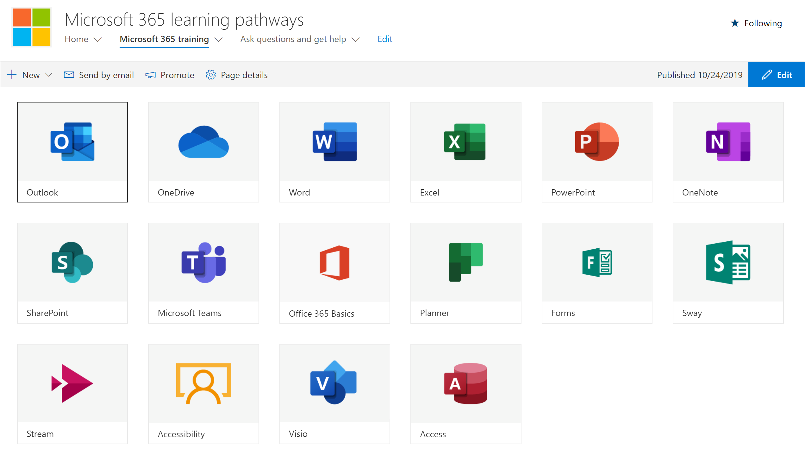

# Скрытие и отображение подкатегорийHide and show Subcategories

На странице администрирования путей обучения можно скрыть и показать подкатегории контента.With the learning pathways administration page, you can hide and show subcategories of content. Например, компании, которые не выкатывают Yammer, могут скрыть подкатегорию Yammer, поэтому контент Yammer не будет виден пользователям.For example, companies that don’t roll out Yammer can hide the Yammer subcategory, so Yammer content won't be visible to users. Это предотвращает нежелательные вызовы поддержки от пользователей, которые в противном случае могут видеть сведения, связанные с службами, недоступными в вашей организации.This prevents unwanted support calls from users who might otherwise see information related to services that aren't available in your organization.

## Скрыть подкатегориюHide a subcategory 

1. На домашней странице "Пути обучения Microsoft 365" щелкните плитку обучения Microsoft 365.From the Microsoft 365 learning pathways Home page, click the Microsoft 365 training tile.
2. В веб-части "Пути обучения Microsoft 365" щелкните значок Администрирование.From the Microsoft 365 learning pathways Web part, click the Administration icon. 
3. В левой области страницы выберите подкатегорию, а затем выберите глазное яблоко для подкатегории, чтобы скрыть его.In the left pane of the page, select a subcategory, and then select the eyeball for the subcategory to hide it. В этом примере скроем подкатегорию **Yammer.**For this example, hide the **Yammer** subcategory.  

### Проверка скрытия подкатегорииVerify the subcategory is hidden
- Чтобы убедиться, что подкатегория скрыта, выберите вкладку браузера с загруженной **страницей Microsoft 365** и обновите страницу.To verify the subcategory is hidden, select the browser tab with the **Get Started with Microsoft 365** page loaded, and then refresh the page. Теперь необходимо увидеть подкатегорию Yammer, скрытую в категории Products.You should now see the Yammer subcategory hidden in the Products category. 

## Unhide a subcategoryUnhide a subcategory 

- На странице **Администрирование** выберите подкатегорию, а затем выберите глазное яблоко для скрытой подкатегории, чтобы отопрятить его.From the **Administration** page, select a subcategory, and then select the eyeball for the hidden subcategory to unhide it. В этом примере отбрасываю подкатегорию Yammer.For this example, unhide the Yammer subcategory.