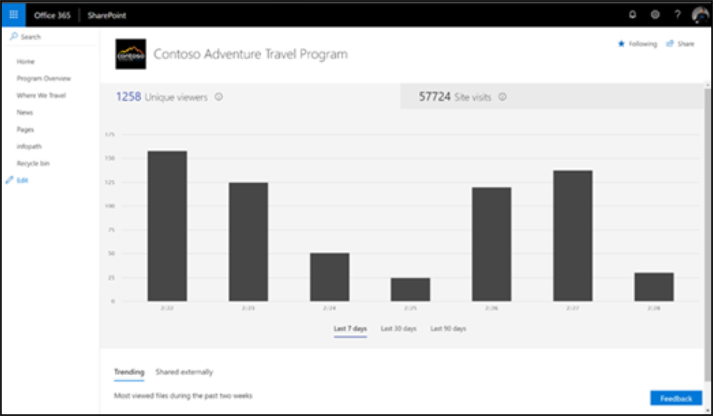

# Измерение влияния Microsoft 365 путей обучения

Администраторы должны использовать SharePoint встроенные возможности отчетов об использовании сайтов для измерения влияния организации на Microsoft 365 пути обучения. Существует два основных сценария измерения воздействия: 
- Влияние уровня сайта — просмотр данных об использовании для настраиваемого обучения для Office 365 определенного сайта 
- Влияние уровня организации — понимание использования Office 365 для всех других сайтов в организации

## Влияние на уровне сайта

В качестве SharePoint веб-сайта можно просматривать сведения, которые показывают, как пользователи взаимодействуют с вашим сайтом. Например, вы можете узнать, сколько пользователей посетили сайт, сколько раз пользователи посетили сайт и какие файлы просматривались чаще всего. Сведения [о отчете.](https://support.office.com/article/view-usage-data-for-your-sharepoint-site-2fa8ddc2-c4b3-4268-8d26-a772dc55779e) 

## Влияние на уровне организации
Отчет Office 365 центра администрирования SharePoint позволяет администраторам получать высокоуровневые представления о значении, которое вы получаете от сайта Custom Learning для Office 365 относительно всех других SharePoint сайтов. Сведения [о отчете.](/office365/admin/activity-reports/sharepoint-site-usage)
 
Следуйте ссылке на статью: 
1. Узнайте, как добраться до отчета об использовании SharePoint сайта 
2. Интерпретация сведений SharePoint об использовании сайта. Сортировать на поле URL-адрес сайта, чтобы легче определить Microsoft 365 пути обучения. 
3. Используйте функции экспорта отчетов для более продвинутого анализа данных или если в организации более 2000 сайтов. 

## Reporting

На сегодняшний день отчетность ограничивается уровнем SharePoint сайта. Одалживите свой голос нашему [форуму голосовых](https://go.microsoft.com/fwlink/?linkid=2109552) пользователей, чтобы помочь уравнять приоритеты запросов на расширенные функциональные возможности отчетности.
