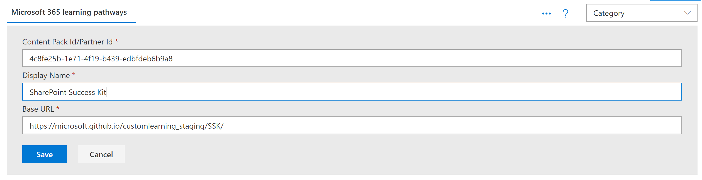
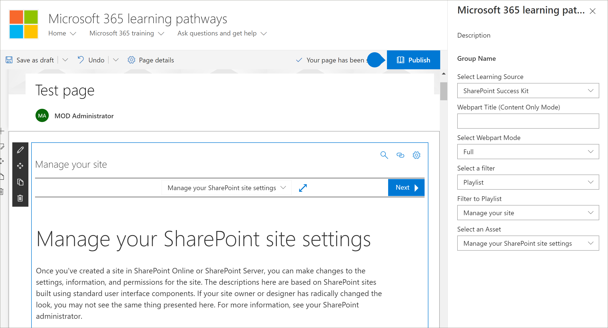

# Модели интеграции партнеровPartner integration models
Несмотря на то, что корпорация Microsoft 365 Learning не может передавать содержимое прямо из поля службы подготовки SharePoint Online, существует несколько моделей интеграции, которые партнеры могут использовать для создания выровненного значения — Добавление службы предложения.While it’s not possible to supplement the Microsoft 365 learning pathways content directly ‘out of the box’ from the SharePoint Online Provisioning service, there are several integration models that partners can leverage to create aligned value-add service offerings. Приведенные выше модели интеграции с партнерами представлены в порядке возрастания сложности и уровней инвестиций.The partner integration models above are presented in order of ascending complexity and levels of investment. Поэтому наши рекомендации — это создание опыта и выпускников для более сложных уровней в соответствии с бизнес-моделями.Hence our guidance is to build your expertise and graduate to more advanced levels based on your business models.

 

## Как начать?How should I get started? 
Чтобы приступить к работе, ознакомьтесь с приведенными ниже рекомендациями.To get started, here are some best practices to follow.     

### 1. Начните с создания эксперта в качестве специалиста.1. Begin with building expertise as an Enabler. 
Вы можете помочь в процентах от своей клиентской базы, дополнив учебный портал "пути для обучения" и выполнив целевую куратион контента Майкрософт.You can help a percentage of your customer base right away by enabling their learning pathways training portal and performing targeted Microsoft content curation. Инструкции по подготовке путей обучения приведены в разделе https://docs.microsoft.com/en-us/office365/customlearning/custom_provision.For instructions on provisioning learning pathways, see https://docs.microsoft.com/en-us/office365/customlearning/custom_provision.  

### 2. Затем Расширьте службы как интегратор2. Then extend your services as an Integrator
Выполняете автоматизацию возврата инвестиций в зависимости от количества потребностей по интеграции контента и служб.Perform an automation return on investment analysis - depending on the quantity of your content and/or services integration needs. Например, это может быть нецелесообразно для разработки и эксплуатационных затрат, связанных с нашими рекомендациями по интеграции контента, если вы можете быстро вручную создать целевой список воспроизведения, указывающий на вашу подписку или ссылку на службы.For example, it may not make sense to take on the development and operational costs with respect to our content integration guidelines if you can quickly manually create a targeted custom playlist(s) pointing to your for-pay content or reference your services.

### 3. когда отрентабельность инвестиций имеет смысл — рассмотрите перераспределение3. When the return on investment makes sense – consider Redistribution 
Если рентабельность инвестиций имеет смысл, рассмотрите возможность перераспределения (или работа со связанными партнерами по обучающим курсам) для создания переупакованных решений.When the return on investment makes sense – consider Redistribution (or working with related learning pathways partners) to build repackaged solutions. Они основаны на шаблонах SharePoint и среде практики, которые предоставляют решения для извлечения настраиваемых сайтов и последующего развертывания в средах клиентов.These are based on the SharePoint Patterns and Practice framework which provides solutions to extract customized sites and then deploy into customer environments 

## Рекомендации по интеграции контента, предоставленного партнеромPartner-provided content integration guidelines
Содержимое для путей обучения Microsoft 365 определяется набором файлов JSON, которые действуют как манифесты контента для вашего пакета обучения.Content for Microsoft 365 learning pathways is driven by a set of JSON files that act as content manifests for your learning package. Существует три файла: Metadata. JSON, reсписки. JSON и Assets. JSON.There are three files: metadata.json, playlists.json, and assets.json. Эти файлы должны быть структурированы для согласования с моделями, которые веб-часть распознает и размещает из сети доставки содержимого (CDN), позволяя веб-части загружать их.These files need to be structured to match the models the web part recognizes and then hosted from a content delivery network (CDN) to allow the web part to load them. Корпорация Майкрософт предоставит стартовые шаблоны этих файлов, чтобы приступить к работе.Microsoft will provide starter templates of these files to get you started.  

**Заявление об отказе:** структура файлов JSON может изменяться в зависимости от предстоящей работы решения.**Disclaimer:** the JSON file structure is subject to change based on upcoming solution work. В программе обучения Microsoft 365 Learning Partner (возможно, на самом ранних стадиях) будет сообщено об изменениях, ожидающих этой природы.The Microsoft 365 learning pathways partner Early Adopter Program (EAP) will be informed of any impending changes of this nature. Наряду с любыми рекомендациями по обратной совместимости и перехода клиентов.Along with any customer backwards compatibility and/or transition guidance. 

### Скачайте решение Microsoft 365 Learning путейDownload the Microsoft 365 learning pathways solution
Вы можете скачать решение Microsoft 365 Learning, а также файлы JSON из репозитория GitHub: https://github.com/pnp/custom-learning-office-365.You can download the Microsoft 365 learning pathways solution, along with the JSON files, from the GitHub repository: https://github.com/pnp/custom-learning-office-365. Обратите внимание, что в настоящее время корпорация Майкрософт не получает запрос на получение GitHub по запросу.Note that at this time, Microsoft is not taking GitHub pull request on the solution. Но вы можете использовать файлы GitHub в качестве отправной точки для создания собственного пользовательского пакета содержимого.But you can use the GitHub files as a starting point for creating your own custom content pack. 

## Структура Metadata. JSONMetadata.json Structure
Этот файл можно рассматривать как браинс меню и структуры.You can think of this file as the brains of the menus and structure. Он содержит всю структуру навигации, а также списки выбора для данных в двух других файлах.It contains all the navigation structure as well as pick lists for data in the other two files. 

|              ИмяName        |                     ОписаниеDescription                                                               | 
|:-----------------------------|-------------------------------------------------------------------------------------------|
|**Технологически****Technologies**              |Содержимое размечено тегами и может быть скрыто в зависимости от назначенной им технологии.Content is tagged and can be hidden based on the Technology it’s assigned.                 |  
|&nbsp;&nbsp;Кодов&nbsp;&nbsp;Id                |GUID, представляющий технологиюGUID representing the technology                                                           |  
|&nbsp;&nbsp;Расширением&nbsp;&nbsp;Name              |Отображаемое имя технологииDisplay name of the technology                                                             |
|&nbsp;&nbsp;*Subjects []*&nbsp;&nbsp;*Subjects[ ]*     |Массив субъектов, которые являются подмножеством технологииAn array of subjects that are a subset of the technology                                   | 
|&nbsp;&nbsp;&nbsp;&nbsp;Кодов&nbsp;&nbsp;&nbsp;&nbsp;Id    |GUID, представляющий темуGUID representing the subject                                                              |
|&nbsp;&nbsp;&nbsp;&nbsp;Расширением&nbsp;&nbsp;&nbsp;&nbsp;Name  |Отображаемое имя темыDisplay name of the subject                                                                |
|**Категории []****Categories [ ]**             |Категории информируют навигацию по веб-части.Categories inform the navigation of the webpart. Каждая категория представляет верхний уровень структуры навигацииEach category represents a top level of the navigation                                                                                                                 |
|&nbsp;&nbsp;Кодов&nbsp;&nbsp;Id                |GUID, представляющий категорию или подкатегориюGUID representing the category/subcategory                                                 |
|&nbsp;&nbsp;Расширением&nbsp;&nbsp;Name              |Отображаемое имя категории или подкатегорииDisplay name for the category/subcategory                                                  |
|&nbsp;&nbsp;Образ&nbsp;&nbsp;Image             |URL-адрес изображения, которое должно отображаться в UX (относительно базы CDN)URL for the image that should be displayed in the UX (relative to the CDN base)            |
|&nbsp;&nbsp;течнологид&nbsp;&nbsp;TechnologyId      |GUID технологии, к которой относится это содержимое (необязательный параметр — пустая строка)The GUID of the Technology this content is related to (optional – empty string)            |
|&nbsp;&nbsp;субжектид&nbsp;&nbsp;SubjectId         |GUID субъекта, с которым связан этот контент (необязательный параметр — пустая строка)The GUID of the Subject this content is related to (optional – empty string)               |
|&nbsp;&nbsp;Source&nbsp;&nbsp;Source            |В исходном массиве, который не используется в UX, Кроме настраиваемых данных, добавленных пользователем, отмечается как "клиент", а область "Администратор UX" запрещает редактирование любых элементов, не помеченных как "клиент".From Source array, not specifically used in UX other than custom data added by the user is marked as “Tenant” and the UX admin area does not allow editing of anything not marked “Tenant”.                           |
|&nbsp;&nbsp;*Подкатегории []*&nbsp;&nbsp;*Subcategories[ ]*|По сути, подкатегории — это уровень навигации на уровне 2 вниз.Sub-Categories are basically the nav level from level 2 down. Структура — это то же самое, что и вложенная Категория.The structure is the same as a Category just nested.          |
|**Аудитории []****Audiences [ ]**             |Если списки воспроизведения, связанные с категорией или подкатегорией, имеют различные метки аудиторий, будет доступен селектор для отображения доступных аудиторий.When playlists associated with a category/subcategory are various audiences tagged, a selector will be available to show the available audiences. |         
|&nbsp;&nbsp;Кодов&nbsp;&nbsp;Id                |GUID аудиторииGUID of the audience                                                                       |  
|&nbsp;&nbsp;Расширением&nbsp;&nbsp;Name              |Отображаемое имя аудиторииDisplay name of the audience                                                               |       
|**Sources []****Sources [ ]**               |Массив строк, которые отмечают контент с исходным кодом, а не специально используются в UX, Кроме настраиваемых данных, добавленных пользователем, помечены как "клиент", а область "Администратор UX" не позволяет редактировать все, что не помечено как "клиент".Array of strings that tag content with its source, not specifically used in UX other than custom data added by the user is marked as “Tenant” and the UX admin area does not allow editing of anything not marked “Tenant”.                                                   |  
|**Levels []****Levels  [ ]**               |Если списки воспроизведения, связанные с категорией/подкатегорией, имеют различные уровни с тегами, селектор будет доступен для отображения доступных уровней.When playlists associated with a category/subcategory are various levels tagged, a selector will be available to show the available levels.             |  
|&nbsp;&nbsp;Кодов&nbsp;&nbsp;Id                |GUID уровняGUID of the Level                                                                          |  
|&nbsp;&nbsp;Расширением&nbsp;&nbsp;Name              |Отображаемое имя уровняDisplay name of the Level                                                                  | 
|**Статустаг []****StatusTag  [ ]**           |Тег Status определяет содержимое с различным состоянием, которое будет доступно в пользовательском интерфейсе.Status tag is to identify content with various status that will be exposed in the UX. Некоторые из этих флагов будут показываться потребителю и только администратору.Some of these flags will be show to the consumer and some only to the admin.                                                   |  
|&nbsp;&nbsp;Кодов&nbsp;&nbsp;Id                |GUID объекта СтатугтагGUID of the StatugTag                                                                      |  
|&nbsp;&nbsp;Расширением&nbsp;&nbsp;Name              |Отображаемое имя СтатустагDisplay name of the StatusTag                                                              | 
|**Телеметрии []****Telemetry  [ ]**            |                                                                                           |  
|&nbsp;&nbsp;аппинсигхтскэй&nbsp;&nbsp;AppInsightsKey    |GUID ключа Application Insights, который настроен для отслеживания загрузки веб-части средства просмотра.GUID of the app insights key that you have set up to track the loading of the viewer web part. Отслеживание может быть отключено администратором для всего клиента, но отправляемые данные анонимно принадлежат пользователю с идентификатором клиента. Дополнительные сведения можно найти в этом разделе.https://github.com/pnp/custom-learning-office-365#disabling-telemetry-collectionTracking can be turned off by an administrator for the entire tenant, but the information sent is anonymized user with the tenant id. Please see this section for more information https://github.com/pnp/custom-learning-office-365#disabling-telemetry-collection               |  
|**Версия****Version**                   |Сведения о версии используются решением, чтобы указать администраторам, что веб-часть обновлена, и разрешить веб-части самостоятельно обновлять Настраиваемый контент до последней версии манифеста в случае внесения значительных изменений.Version information is used by the solution to indicate to administrators that the webpart has updated and also allow the webpart to self-update custom content to the latest version of the manifest if significant changes have been made.         | 
|&nbsp;&nbsp;Явление&nbsp;&nbsp;Manifest          |Версия манифестаThe version of the manifest                                               |
|&nbsp;&nbsp;манифестминвебпарт&nbsp;&nbsp;ManifestMinWebPart|Минимальная версия веб-части, которая работает с версией манифестаThe minimum version of the webpart that works with the version of the manifest             |
|&nbsp;&nbsp;куррентвебпарт&nbsp;&nbsp;CurrentWebPart    |URL-адрес изображения, которое должно отображаться в UX (относительно базы CDN)URL for the image that should be displayed in the UX (relative to the CDN base)            |
|&nbsp;&nbsp;Перебетонирование&nbsp;&nbsp;RepoURL           |URL-адрес репозитория, в котором находятся инструкции по обновлению веб-части.The url of the repository where the updating web part instructions are.                    |
|**Пакеты содержимого****Content Packs**             |В настоящее время пакеты содержимого для дополнительной сети CDN не поддерживаются.At this time content packs for additional CDN’s is not supported. Пакеты содержимого позволяют корпорации Майкрософт предлагать другие решения Майкрософт, которые можно подготовить к работе с помощью службы подготовки, использующей M365LP для доставки контента и самих пользовательских сети CDN.Content packs allow Microsoft to suggest other Microsoft created solutions that can be provisioned via the Provisioning service that leverage M365LP to deliver content and are in and of themselves custom CDNs.       | 
|&nbsp;&nbsp;Кодов&nbsp;&nbsp;Id                |GUID пакета содержимого/CDNGUID of the content pack/CDN                                                              |
|&nbsp;&nbsp;Расширением&nbsp;&nbsp;Name              |Отображаемое имя сети CDNDisplay name of the CDN                                                                   |
|&nbsp;&nbsp;Обзор&nbsp;&nbsp;Description       |Описание, отображаемое в пользовательском интерфейсе для добавления пакета содержимогоDescription to be displayed in UI for adding a content pack                               |
|&nbsp;&nbsp;Образ&nbsp;&nbsp;Image             |Изображение, отображаемое в пользовательском интерфейсе для добавления пакета содержимогоImage to be displayed in UI for adding a content pack                                     |
|&nbsp;&nbsp;провисионурл&nbsp;&nbsp;ProvisionURL      |URL-адрес пакета службы подготовки для создания семейства веб-сайтов пакета содержимогоThe URL to the provisioning service package to create the content pack’s site collection  |
|&nbsp;&nbsp;кднбасе&nbsp;&nbsp;CDNbase           |Базовый URL-адрес для манифестов для пакета содержимогоThe Base URL for the manifests for the content pack                                       |
|ассеторигинсAssetOrigins                  |Массив источника URL-адресов, используемый в файле Asset. JSON, который описывается далее.An array of URL origin’s utilized in the assets.json file described later. Если URL-адрес источника поддерживает его, help_getClientHeight будет отправлено сообщение POST.If the origin URL supports it, a post message will be sent to help_getClientHeight. Ответ в свойстве Data объекта: "help_getClientHeight = {Height Content}" (например, "help_getClientHeight = 5769") позволяет изменить размер iFrame до соответствующей высоты фреймового содержимого.A response in the data property of: "help_getClientHeight={height of content}" (for example "help_getClientHeight=5769") will allow the iFrame to be resized to the appropriate height of the framed content.         |

## Структура списков воспроизведения. JSONPlaylists.json Structure
списки воспроизведения. JSON — это массив объектов, описывающих метаданные для списка воспроизведения и ресурсы, включенные в список воспроизведения.playlists.json – The playlists manifest is an array of objects that describe the metadata about a playlist and the assets that are included in the playlist.

|              ИмяName        |                     ОписаниеDescription                                                               | 
|:-----------------------------|-------------------------------------------------------------------------------------------|
|IdId                            |GUID, представляющий список воспроизведенияGUID representing the playlist                                                             |  
|НазваниеTitle                         |Отображаемое имя списка воспроизведенияDisplay name of the playlist                                                               |
|ИзображениеImage                         |Относительный URL-адрес (из сети CDN) к изображению для отображения списка воспроизведенияRelative URL (from CDN) to an image to visualize the playlist                              |                      
|левелидLevelId                       |Связанный уровеньAssociated level                                                                           |
|аудиенцеидAudienceId                   |Связанная аудиторияAssociated audience                                                                        |
|течнологидTechnologyId                 |Связанная технологияAssociated technology                                                                      |
|субжектидSubjectId                    |Отображаемое имя категории или подкатегорииDisplay name for the category/subcategory                                                  |
|ИсточникSource                        |В исходном массиве, который не используется в UX, Кроме настраиваемых данных, добавленных пользователем, отмечается как "клиент", а область "Администратор UX" не позволяет редактировать все, что не помечено как "клиент".From the source array, not specifically used in UX other than custom data added by the user is marked as “Tenant” and the UX admin area does not allow editing of anything not marked “Tenant”.                                              |
|ИдентификаторCatId                         |Идентификатор категории или подкатегории, представляющий контейнер, в котором должен отображаться список воспроизведения.The Category or SubCategory ID that represents the container the playlist should be shown in. В настоящее время манифест не поддерживает выбор категории или подкатегории в качестве контейнера, если у него также есть дочерние категории.Currently the manifest does not support selecting a Category or SubCategory as the container if it also has SubCategory children.        |
|ОписаниеDescription                   |Описание, которое отображалось для каждого списка воспроизведения в UXA description showed for each playlist in the UX                                           |
|статустагидStatusTagId                   |Связанный тег состоянияAssociated status tag                                                                      |
|статуснотеStatusNote                    |Заметки о контенте, отображаемом для администраторовNotes about content displayed to administrators                                            |
|*Активы []**Assets[]*                        |Массив GUID для ресурсов, входящих в этот список, в порядке отображения.An array of GUID’s for the assets that are part of this playlist, in display order.        |         

## Структура Asset. JSONAsset.json Structure
списки воспроизведения. JSON — это массив объектов, описывающих метаданные для списка воспроизведения и ресурсы, включенные в список воспроизведения.playlists.json – The playlists manifest is an array of objects that describe the metadata about a playlist and the assets that are included in the playlist.

|              ИмяName        |                     ОписаниеDescription                                                               | 
|:-----------------------------|-------------------------------------------------------------------------------------------|
|IdId                            |GUID, представляющий список воспроизведенияGUID representing the playlist                                                             |  
|НазваниеTitle                         |Отображаемое имя списка воспроизведенияDisplay name of the playlist                                                               |
|ОписаниеDescription                   |---                                                                                           |                      
|URL-адресURL                           |URL-адрес источника актива, который будет применен к iFrameThe source url for the asset, to be applied to the iFrame                                  |
|течнологидTechnologyId                  |Связанная технологияAssociated technology                                                                      |
|субжектидSubjectId                     |Связанная темаAssociated subject                                                                         |
|ИсточникSource                        |Отображаемое имя категории или подкатегорииDisplay name for the category/subcategory                                                  |
|статустагидStatusTagId                   |Связанный тег состоянияAssociated status tag                                                                      |
|статуснотеStatusNote                    |Заметки о контенте, отображаемом для администраторов.Notes about content displayed to administrators.                                           |

## КэшированиеCaching
В текущей версии веб-части средства просмотра используется кэшированная версия файлов манифеста в течение 24 часов.The current version of the viewer web part utilizes a cached version of the manifest files for 24 hours. Через 24 часа первый пользователь, который попадет в веб-часть, предпринимает снижение производительности, чтобы обновить кэш, загрузив манифесты из исходной сети CDN и объединять эти сведения с скрытыми технологиями и списками воспроизведения, а также объединять в настраиваемые подкатегории. списки воспроизведения и ресурсы.After 24 hours, the first user that hit’s the webpart takes the performance hit to refresh the cache by downloading the manifests from the source CDN and merge that information with hidden technologies and playlists as well as merging in custom sub-categories, playlists, and assets. Альтернативная веб-часть администрирования всегда загружает содержимое из манифестов и объединяет их в кэш и обновляет.Alternately the admin web part always downloads the content from the manifests and merges them in and updates the cache.  Другими словами, администратор может принудительно обновить кэш в любое время, загрузив веб-часть "Администратор", используя веб-часть "Администрирование".So, in other words, the administrator can force a cache update at any time by loading the admin web part, aka going to the Administration page.

## Рекомендации по использованию пакетов содержимогоContent Pack Guidelines
Функция пакета содержимого разблокирует следующие сценарии:The Content Pack feature unlocks the following scenarios:
- Возможность партнеров для распространения настраиваемого обучающего контента, настроенного в среде клиентовThe ability for partners to redistribute value-added custom learning content custom tailored to customers’ environment
- Возможность организации со строгой учебной группой и поддержкой ИТ для создания настраиваемого обучающих материалов, направленных на собственные внутренние системы и управлениеThe ability for organizations with a strong training team and IT support to build custom learning content directed at their own internal systems and governance
- Возможность Майкрософт предоставлять дополнительные обучающие пути в будущем, к которым клиенты могут отказатьсяThe ability for Microsoft to deliver additional learning pathways in the future that customers can opt into

Этот текущий набор документации намеренно ориентирован на партнеров из-за сложности функции.This current documentation set is intentionally targeted for Partners due to the feature’s complexity. Группа обслуживания активно работает с целью улучшения поддержки и включения сценариев #2 в будущем.The service team is actively working to better support and enable scenario #2, in the future. 

## Принципы работы пакетов содержимогоHow Content Packs work
Майкрософт использует страницы GitHub в качестве источника сети доставки содержимого (CDN) для файлов манифеста и изображений.Microsoft utilizes GitHub pages as a Content Delivery Network (CDN) source for its manifest files and images. У нас есть папка "документы" в корне нашего репозитория GitHub, которая содержит вложенные папки для каждой версии файлов манифеста.We have a docs folder at the root of our GitHub repository that includes sub folders for each version of the manifest files. Внутри каждой папки существует три файла манифеста, а также папка изображений для хранения всех категорий, подкатегорий и изображений списков воспроизведения.Inside each folder there are three manifest files, plus an images folder to store all the category, subcategory, and playlist images. 

Важно поддерживать ту же структуру управления версиями, которую корпорация Майкрософт должна использовать для расширения решения "обучающие пути" с помощью собственного пакета содержимого.It is important that you maintain the same versioning structure that Microsoft does should you choose to extend the learning pathways solution with your own content pack. Конечная точка CDN не должна содержать папку Version, так как версия манифеста, поддерживаемая веб-частью, бакед в нее и автоматически добавляется к URL-адресу CDN.Your CDN endpoint should not include the version folder, as the manifest version the web part supports is baked into it and is automatically appended to the CDN url. Очевидно, что мы предоставим вам время для создания новых экземпляров файлов манифеста во время их изменения.We will obviously give you time to create new instances of your manifest files any time we revision it.

 

Для получения дополнительных сведений об использовании страниц GitHub в качестве источника сети CDN обратитесь к следующей справочной документации [https://help.github.com/en/articles/configuring-a-publishing-source-for-github-pages](https://help.github.com/en/articles/configuring-a-publishing-source-for-github-pages):.For more information about utilizing GitHub pages as your CDN source please see the following help documentation: [https://help.github.com/en/articles/configuring-a-publishing-source-for-github-pages](https://help.github.com/en/articles/configuring-a-publishing-source-for-github-pages).

Решение корпорации Майкрософт предоставляет сведения о ресурсах, открытых в общедоступном виде, без защиты пользователей, у которых есть доступ к этим файлам.Microsoft’s solution makes the information about the assets open to the public as there is no security around who has access to these files. Мы считаем, что должен быть бесплатный слой контента для потребителя, который сказал, что у вас есть потребность в оплате за некоторые или все содержимое, вам потребуется реализовать это по-разному в технических ограничениях решения и использовании страниц GitHub без среднего значения s — требование.We believe that there should be a free layer of content for a consumer, that said if you have a need for pay wall for some or all of your content you will need to implement this differently within the technical limitations of the solution and using GitHub pages is by no means a requirement. Любой поставщик CDN, который вы хотите использовать, прекрасно подходит, если вы настроили структуру нумерации версий, которую мы выстроили.Any CDN provider you would like to use is fine if you maintain the version numbering structure we’ve outlined. Как отмечалось выше, версия структуры манифеста, поддерживаемая веб-частью, бакед в код и автоматически добавляется к URL-адресу CDN.As stated previously, the version of the manifest structure the web part supports is baked into the code and is automatically appended to the CDN URL. 

## Руководство по интеграции пакета содержимогоContent Pack Integration Guidance 
Веб-части "Администратор" и "Просмотр" были расширены, чтобы позволить потребителю настраивать дополнительные конечные точки CDN в клиенте, что позволит веб-части средства просмотра выбрать, какие сети CDN будут источником отображаемых данных.The admin and viewer web parts have been extended to allow the consumer to configure additional CDN endpoints in their tenant which will then allow the viewer web part to select which CDN they should source the data they display. 

Основные варианты кадров, которые необходимо учитывать для этой функции:Key framing to keep in mind for this feature: 
- Это основной вариант, который применяется для сценариев перераспределения партнеров, в которых Настройка неручного воспроизведения выполняется слишком громоздкимиThis is primary applicable for partner redistribution scenarios – where manual playlist configuration is too cumbersome 
- Настраиваемые пакеты содержимого являются дополнительным компонентом и должны использоваться только партнерами, имеющими возможности администрирования веб-контента.Custom Content Packs are an advanced feature and should only be used by Partners with experience administrating web content. Ненадежные источники контента могут привести к небезопасному контенту сайта.Untrustworthy content sources may introduce unsafe content into your site. Следует добавлять только те источники, которым вы доверяете.You should only add sources that you trust.

> **Важно!** Перед добавлением настраиваемого пакета содержимого необходимо подготовить подготовленные к работе Microsoft 365 обучающие пути 3,0 или более поздние версии.**IMPORTANT** Before adding a Custom Content Pack, you must have provisioned Microsoft 365 learning pathways 3.0 or later. Для информатаион о подготовке путей обучения Microsoft 365 вы найдете в [статье Подготовка путей обучения microsoft 365](https://docs.microsoft.com/en-us/office365/customlearning/custom_provision).For informataion about provisioning Microsoft 365 learning pathways, see [Provision Microsoft 365 learning pathways](https://docs.microsoft.com/en-us/office365/customlearning/custom_provision).

## Вхителистинг контентаContent Whitelisting
В качестве партнера вы обязаны помочь своим клиентам убедиться в том, что ваш контент внесены в своей среде.As a partner it’s your responsibility to assist your consumers in making sure your content is whitelisted in their environment. Мы рекомендуем создать тестовый сценарий в своей среде, чтобы убедиться в том, что контент может быть iFrame в страницу SharePoint в своем брандмауэре.We suggest you create a test scenario in their environment to validate that your content can be iFrame’d into a SharePoint page inside of their firewall. Следуйте инструкциям в статье [Создание страниц SharePoint для настраиваемых списков воспроизведения](https://docs.microsoft.com/en-us/office365/customlearning/custom_createnewpage) , чтобы убедиться, что это так.Follow the [Create SharePoint pages for Custom Playlists](https://docs.microsoft.com/en-us/office365/customlearning/custom_createnewpage) instructions to confirm this is the case.

## Добавление пакета содержимого для изучения путейAdd a Content Pack to Learning Pathways
После создания измененного формата JSON и определения сети CDN можно добавить пакет контактных данных для изучения путей.Once you've created modified the JSON and defined your CDN, you can add the Contact Pack to learning pathways. 

1. На **домашней** странице сайта пути для обучения наведите указатель на пункт **Домашняя** и щелкните **обучение администрирование**.From the learning pathways site **Home** page, point to **Home** and then click **Learning pathways administration**. 
2. На странице " **Администрирование** " нажмите кнопку **... Добавьте пакет содержимого** в правом верхнем углу страницы.From the **Administration** page, click the **... Add Content Pack** in the upper-right corner of the page.
3. Щелкните настраиваемый пакет содержимого, а затем введите имя пакета содержимого, а затем укажите сеть CDN, в которой расположены файлы JSON.Click Custom Content Pack, and then enter a name of the Content Pack and then specify the CDN where the JSON files are located.

4. Нажмите кнопку **Сохранить**.Click **Save**. Контент из настраиваемого пакета содержимого теперь должен появиться на странице администрирования.The content from your Custom Content Pack should now appear in the Administration page. Пример:Here is an example. 

## Фильтрация пакета содержимого в веб-частиFilter to the Content Pack in the web part
С помощью путей обучения можно добавить на страницу веб-часть "пути для обучения", отфильтровать веб-часть, чтобы она ссылалась на настраиваемый источник содержимого, а затем отфильтровать веб-часть по нужной категории, подкатегории, списку воспроизведения и активу.With learning pathways, you can add the learning pathways web part to a page, filter the web part to point to the Custom Content Pack source, and then filter the web part to the category, subcategory, playlist, and asset that you want. 

1. На сайте пути для обучения щелкните **создать**, а затем **страница**.From the learning pathways site, click **New**, and then **Page**.
2. Нажмите кнопку **пусто**, а затем — **создать страницу**.Click **Blank**, and then **Create Page**.
3. Присвойте странице имя.Give the page a name. 
4. Нажмите кнопку **+ Добавить новый раздел** в левой части страницы.Click **+ Add a new section** on the left side of the page.
5. Щелкните **+** в верхней части нового раздела и добавьте веб-часть " **пути для обучения Microsoft 365** ".Click **+** in the top-middle of the new section, and then add the **Microsoft 365 learning pathways** web part.
6. Щелкните веб-часть, а затем щелкните значок **редактирования** .Click the Web part, and then click the **Edit** icon.
7. В поле **выберите источник обучения** выберите настраиваемый пакет содержимого, а затем отфильтруйте веб-часть в нужном контенте.In the **Select the Learning Source** box, select your Custom Content Pack, and and then filter the web part to the content you want. Ниже приведен пример веб-части, отфильтрованной в списке воспроизведения из настраиваемого пакета содержимого.The following provides an example of the Web part filtered to a playlist from a Custom Content Pack.

  

