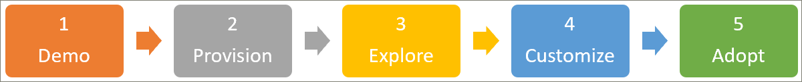

# Знакомство с решениемGet familiar with the solution 
Начните работу с путей обучения, выполнив три действия, описанные ниже.Get started with learning pathways by following the three steps outlined below. С помощью трех шагов вы можете создать привлекательную демонстрацию, которую можно использовать для привлекательных презентаций с клиентами.With the three steps, you can build a compelling demo that you can use for engaging presentations with customers. 

## 1. Создание демонстрационной среды Microsoft 3651. Create a Microsoft 365 demonstration environment
Вы можете использовать demos.microsoft.com для создания демонстрационной среды, в которой можно подготовить службу, проверить ее и использовать для представления путей для обучения клиентам.You can use demos.microsoft.com to create a demo environment where you can provision the service, validate it, and use it for presenting learning pathways to customers. Все партнеры имеют доступ к https://demos.microsoft.com этим целям.All partners have access to https://demos.microsoft.com for these purposes. Вы можете использовать руководство по **началу работы** с Demos.Microsoft.com, если вы впервые используете демонстрационную среду.You can use the demos.microsoft.com **Getting Started Guide** if you are new to tthe demo environment.

## 2. Подготовка путей для обучения Microsoft 3652. Provision Microsoft 365 learning pathways
Вы можете подготовить пути для обучения с помощью службы подготовки SharePoint Online.You can provision learning pathways with the SharePoint Online Provisioning Service.
- Чтобы подготовить пути для обучения, перейдите на страницу решения [Microsoft 365 Learning путей](https://provisioning.sharepointpnp.com/details/3df8bd55-b872-4c9d-88e3-6b2f05344239) .To provision learning pathways, go to the [Microsoft 365 learning pathways](https://provisioning.sharepointpnp.com/details/3df8bd55-b872-4c9d-88e3-6b2f05344239) solution page. — Просмотрите [Параметры установки "пути для обучения](https://docs.microsoft.com/en-us/office365/customlearning/custom_setupoptions)".- - Review the [Learning pathways setup options](https://docs.microsoft.com/en-us/office365/customlearning/custom_setupoptions). 
- Ознакомьтесь с [требованиями к решению](https://docs.microsoft.com/en-us/office365/customlearning/custom_provision) , так как это распространенные препятствия для новых клиентов SharePoint, которые могут не иметь все необходимые разрешения или конфигурацию среды, например каталог приложений клиента.Review the [Solution Prerequisites](https://docs.microsoft.com/en-us/office365/customlearning/custom_provision) – as these are common impediments for customer new to SharePoint who may not have all the correct permissions or necessary environment configuration in place, such as a tenant app catalog.
- Попытайтесь развернуть решение с помощью роли, не являющейся администратором, чтобы ознакомиться со службой подготовки и обработки ошибок службы подготовки.Try to deploy the solution via a non-Administrator role – to familiarize yourself with the provisioning service error-handling and email service.

## 3. Изучите свой новый сайт путей обучения, чтобы ознакомиться со своими возможностями3. Explore your newly provisioned learning pathways site to get familiar with its capabilities
- Откройте [центр администрирования "Администратор"](https://docs.microsoft.com/en-us/office365/customlearning/custom_successcenter) или в решении или в Интернете.Go to the [Admin Success Center](https://docs.microsoft.com/en-us/office365/customlearning/custom_successcenter) - either in the solution or online. Кроме изучения обновлений контента и компонентов, вы можете найти рекомендации по планированию, настройке, внедрению и измерению влияния.In addition to learning about content and feature updates, you'll find planning, customization, adoption, and measuring impact guidance.
- Для настройки сайта используйте руководство по [настройке путей обучения](https://docs.microsoft.com/en-us/office365/customlearning/custom_overview) в центре успешности администрирования.Use the [Customizing learning pathways](https://docs.microsoft.com/en-us/office365/customlearning/custom_overview) guidance in the Admin Success Center to customize the site. Вы хотите узнать о возможностях настройки, чтобы можно было их использовать для клиентов.You'll want to understand the customization capabilities so you can demo them for customers. Например, "скрыть подкатегории и списки воспроизведения".For example, hide subcategories and playlists. Создавать настраиваемые списки воспроизведения или создавать целевые страницы с помощью фильтрованной веб-части обучающих путей для проведения обучающих кампаний.Create custom playlists, or create landing pages with a filtered learning pathways web part to drive a learning campaigns. 
- Создайте примерную кампанию для общения с обучающими материалами на основе [загружаемого комплекта для перехода](https://teamworktools.azurewebsites.net/m365lp/m365lpadoptionkit.zip).Create a sample learning pathways communication campaign based on the [downloadable Adoption Kit](https://teamworktools.azurewebsites.net/m365lp/m365lpadoptionkit.zip). Вы можете выделить созданное вами созданное вами вами содержимое и показано, как оно связывается с обучающими кампаниями, которые применяют внедрение.You can highlight the custom content you've created and demostrate how it ties into a learning campaign that drives adoption. 

