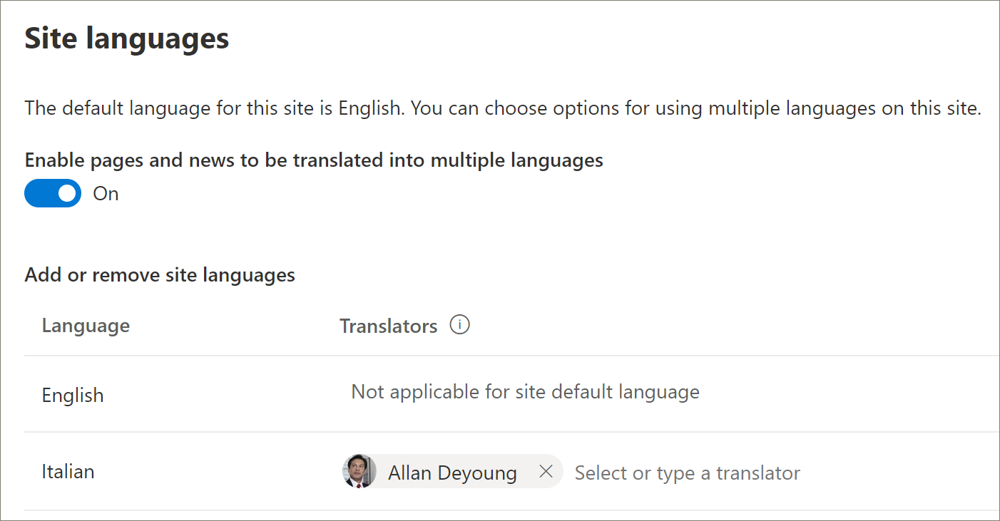

# Подготовка нового решения для образовательных путей 
Организации, у которых нет путей обучения, подготовленных в клиенте, могут использовать службу книги поиска SharePoint, чтобы добавить решение многоязычных путей обучения. При использовании этого параметра шаблон "обучающие пути SharePoint" преобразуется на девять языков и может использоваться с минимальным количеством изменений. 

> [!IMPORTANT]
> Если у вас уже есть пути обучения, подготовленные в вашем клиенте, рекомендуется [Обновить](custom_update.md) пути для обучения. Если вы устанавливаете новый экземпляр путей обучения, вам потребуется вручную перенести все настройки из существующего сайта на новый сайт. 

## Предварительные требования для многоязычной поддержки
 
Для успешной настройки Microsoft 365 обучающие пути со службой "Поиск книг" пользователь, выполняющий подготовку, должен удовлетворять следующим предварительным требованиям:   
 
- В качестве путей обучения для подготовки пользователей необходимо быть администратором клиента клиента, на котором будут подготавливаться пути обучения.  
- Каталог приложений клиента должен быть доступен в параметрах приложений центра администрирования SharePoint. Если в вашей организации нет каталога приложений клиента SharePoint, обратитесь к [документации SharePoint Online](https://docs.microsoft.com/sharepoint/use-app-catalog) , чтобы создать ее. Необходимо подождать по крайней мере два часа после создания каталога приложений перед предоставлением путей для обучения.  
- В качестве путей обучения для подготовки пользователей необходимо быть владельцем семейства веб-сайтов в каталоге приложений клиента. Если учетные данные подготовки пользователей не являются владельцами семейства веб-сайтов каталога приложений, [выполните эти инструкции](addappadmin.md) и продолжайте. 

## Убедитесь, что для учетной записи администратора клиента не выбран язык.
Прежде чем приступать к подготовке путей обучения, убедитесь, что для учетной записи администратора клиента не выбран язык. Ниже показано, как проверить, не выбран ли язык для учетной записи администратора. 
1.  В профиле пограничного администратора выберите office.com.
2.  Введите учетные данные пользователя (при необходимости).
3.  В Microsoft 365 щелкните **все приложения** > delve. 
4.  Щелкните **Me**  >  **Обновление профиля**.
5.  Прокрутите страницу вниз и щелкните **как можно изменить язык и региональные параметры**.
6.  Щелкните **здесь**, а затем нажмите кнопку с многоточием **..**..
7.  В разделе **Мои языки отображения** **не выбран ни один язык**. Если выбран язык, отмените его выбор.

### Подготовка путей для обучения

1. Перейдите на [страницу решения Microsoft 365 Learnings](https://lookbook.microsoft.com/details/3df8bd55-b872-4c9d-88e3-6b2f05344239).
2. Нажмите кнопку **Добавить в клиент**. Если вы не вошли в клиент, служба подготовки запросит учетные данные администратора клиента. 
3. В диалоговом окне запрошенные разрешения выберите **согласие от имени вашей организации** , а затем нажмите кнопку **принять**.

Служба поиска книг требует от этих разрешений для создания каталога приложений клиента, установки приложения в каталог приложений клиента и подготовки шаблона сайта. В клиенте нет общих последствий. Эти разрешения явно используются в целях установки решения. Для продолжения установки необходимо принять эти разрешения.

4. Заполните поля на странице сведения о подготовке в соответствии с требованиями вашей установки. Как минимум введите адрес электронной почты, на который вы хотите получать уведомления о процессе подготовки, и конечный URL-адрес сайта, на котором будет выполняться подготовка.  
> [!NOTE]
> Сделайте конечный URL-адрес сайта понятным для ваших сотрудников, например "/СИТЕС/митраининг" или "/teams/LearnMicrosoft365".

6. Нажмите кнопку **подготовить** , когда будете готовы к установке обучающих путей в среду клиента.  Процесс подготовки может занять до 15 минут. Вы получите уведомление по электронной почте, когда сайт будет готов. 

> [!IMPORTANT]
> Администратор клиента, который подготавливает сайт путей обучения, должен перейти на сайт, а затем открыть **кустомлеарнингадмин. aspx** для инициализации свойств администрирования путей обучения. В настоящее время Администратор клиента также должен назначить владельцами сайт. 

## Проверка успешности подготовки и инициализация списка Кустомконфиг

После завершения подготовки администратор клиента, который подготавливает сайт, получает электронное письмо от службы "Просмотр книги". Сообщение содержит ссылку на сайт. На этом шаге администратор клиента должен перейти на сайт, используя ссылку, приведенную в сообщении электронной почты, и настроить сайт для первого использования:

- Перейдите на сайт `<YOUR-SITE-COLLECTION-URL>sites/<YOUR-SITE-NAME>/SitePages/CustomLearningAdmin.aspx`. При открытии **кустомлеарнингадмин. aspx** инициализируется элемент списка **кустомконфиг** , который настраивает пути для обучения для первого использования. Должна отобразиться страница, которая выглядит следующим образом:

## Добавление владельцев для сайта
Как администратор клиента, маловероятно, чтобы пользователь настраивает сайт, поэтому необходимо назначить сайт нескольким владельцам. Владельцы имеют административные права на сайте, чтобы они могли изменять страницы сайта и изменять фирменный стиль сайта. Они также могут скрывать и показывать контент, а также создавать настраиваемые списки воспроизведения и подкатегории.  

1. В меню **Параметры** SharePoint выберите разрешения для **сайта**.
2. Нажмите кнопку **Дополнительные параметры разрешений**.
3. Выберите **Microsoft 365 Learnings Owners Owners**.
4. Нажмите кнопку **создать**  >  ,**чтобы добавить пользователей в эту группу**, а затем добавьте пользователей, которых вы хотите сделать владельцами. 
5. Добавьте ссылку для [просмотра сайта](custom_exploresite.md) в сообщении общего доступа, а затем щелкните **общий доступ**.

## Добавление переводчиков на сайт
Если вы будете использовать переводчиков для сайта, вы можете назначить им соответствующие разрешения. Переводчикам требуются разрешения участника или более высокий уровень. 

## Выбор параметров для использования нескольких языков на сайте
Служба книги поиска SharePoint создает сайт путей обучения на девяти языках. Применяются следующие рекомендации.
- Отключение языков, которые не будут поддерживаться
- Если вы не поддерживаете многоязычный сайт, отключите поддержку многоязычной поддержки. Далее в этой статье описывается раздел "Отключение многоязыковой поддержки".

### Удаление языков, которые не требуется поддерживать
В организациях, в которых поддерживается только один язык, а не на английский язык по умолчанию, рекомендуется удалять языки, которые не поддерживаются. 
1. На сайте пути для обучения выберите **Параметры** в правом верхнем углу страницы, а затем выберите **сведения о сайте**.
2. В нижней части области сведений о сайте выберите **Просмотреть все параметры сайта**.
3. В разделе **Администрирование сайта**выберите **Параметры языка**.
4. В разделе **разрешить перевод страниц и новостей на несколько языков**установите переключатель в значение **вкл**. Он должен быть включен по умолчанию.
5. В разделе Добавление или удаление языков сайта нажмите кнопку **Удалить** , чтобы удалить ненужные языки для сайта. Ниже показан пример страницы Языковые параметры для отображения поддержки на итальянском языке для сайта в дополнение к английскому языку по умолчанию.

> [!NOTE]
> При удалении языков невозможно удалить английский язык по умолчанию. 

### Назначение переводчиков
Если вы собираетесь переводить страницы, при необходимости можно назначить один или несколько переводчиков для каждого языка (кроме языка сайта по умолчанию). 
- В столбце **переводчик** Начните вводить имя человека, которого хотите переводчик, и выберите имя из списка. 

> [!NOTE]
> Любой пользователь в Active Directory вашей организации может быть назначен в качестве переводчика. Пользователям, назначенным как переводчикам, автоматически не предоставляются соответствующие разрешения. Когда пользователь, не имеющий разрешения на изменение сайта, пытается получить доступ к сайту, он будет перенаправлен на веб-страницу, на которой они могут запрашивать доступ.

## Отключение многоязыковой поддержки
Если вы не хотите использовать многоязычный сайт (например, нужен только английский сайт), рекомендуем отключить многоязычный компонент. 

1. На сайте пути для обучения выберите **Параметры** в правом верхнем углу страницы, а затем выберите **сведения о сайте**.
2. В нижней части области сведений о сайте выберите **Просмотреть все параметры сайта**.
3. В разделе **Администрирование сайта**выберите **Параметры языка**.
4. В разделе **разрешить перевод страниц и новостей на несколько языков**установите переключатель в значение **вкл**. Он должен быть включен по умолчанию.
- В разделе **Включение перевода страниц и новостей**выберите **Отключить**. 

### Добавление языков
Обучающие пути поддерживают 9 языков, но рекомендуется добавлять только те языки, которые необходимы для сайта обучающих путей. Вы можете добавить лангаужес в любое время. 
- В разделе **Добавление или удаление языков сайта**начните ввод названия языка в поле **Выбор или введите язык**или выберите язык из раскрывающегося списка. Вы можете повторить этот шаг, чтобы добавить несколько языков. На эту страницу вы можете добавить или удалить языки на сайте в любое время.
