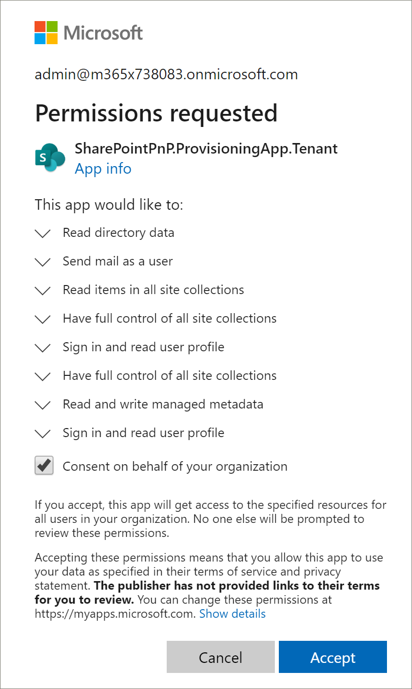

# Подготовка путей обучения Microsoft 365

С помощью службы подготовки SharePoint Online администратор клиента Office 365 может начать процесс подготовки с помощью нескольких простых щелчков мыши. Служба подготовки является рекомендуемым способом подготовки путей обучения. Она быстро, легко и занимает несколько минут, чтобы начать процесс. Тем не менее, прежде чем приступить к работе со службой подготовки, убедитесь, что выполнены необходимые условия для подготовки.

> [!IMPORTANT]
> По отношению к 5/21/2019 Корпорация Майкрософт 365 представляет собой новое имя решения, которое ранее называлось "пользовательское обучение для Office 365". Если вы уже предстроили пользовательское обучение для Office 365 в вашей организации и хотите обновить решение, следуйте инструкциям в статье "Обновление решения" в [файле readme путей обучения Microsoft 365](https://github.com/pnp/custom-learning-office-365). Если вы впервые готовите планы обучения корпорации Майкрософт 365, ознакомьтесь с [инструкциями по подготовке путей обучения microsoft 365]( https://docs.microsoft.com/en-us/office365/customlearning/custom_provision) в документации по Microsoft 365 Learnings.  

## Необходимые условия
 
Чтобы успешно настроить пути обучения Microsoft 365 с помощью службы подготовки, пользователь, выполняющий подготовку, должен удовлетворять следующим предварительным требованиям: 
 
- В качестве путей обучения для подготовки пользователей необходимо быть администратором клиента клиента, на котором будут подготавливаться пути обучения.  
- Каталог приложений клиента должен быть доступен в параметрах приложений центра администрирования SharePoint. Если в вашей организации нет каталога приложений клиента SharePoint, обратитесь к [документации SharePoint Online](https://docs.microsoft.com/en-us/sharepoint/use-app-catalog) , чтобы создать ее.  
- В качестве путей обучения для подготовки пользователей необходимо быть владельцем семейства веб-сайтов в каталоге приложений клиента. Если подготовка учетных данных для обучения сотрудника не является владельцем семейства веб-сайтов каталога приложений, [выполните эти инструкции](addappadmin.md) и продолжайте. 

### Подготовка путей для обучения

1. Перейдите к http://provisioning.sharepointpnp.com верхнему правому углу домашней страницы и **Войдите в** него.  Войдите с учетными данными целевого клиента, на котором планируется установить шаблон сайта.

2. Отмените **согласие от имени вашей организации** и нажмите кнопку **принять**.

Для службы подготовки необходимы эти разрешения для создания каталога приложений клиента, установки приложения в каталог приложений клиента и подготовки шаблона сайта. В клиенте нет общего влияния, и эти разрешения явно используются в целях установки решения. Для продолжения установки необходимо принять эти разрешения.

3. Прокрутите страницу вниз, перейдите на вкладку **решения** , а затем выберите пункт **пути для обучения для Office 365**. 

4. Выберите **Добавить в клиент**

5. Заполните поля на странице сведения о подготовке в соответствии с требованиями вашей установки. Как минимум введите адрес электронной почты, на который вы хотите получать уведомления о процессе подготовки, и конечный URL-адрес сайта, на который будет выполняться подготовка.  
> [!NOTE]
> Сделайте конечный URL-адрес сайта понятным для ваших сотрудников, например "/СИТЕС/митраининг" или "/teams/LearnMicrosoft365".

6. Выберите **подготовить** , когда вы будете готовы к установке обучающих путей в среду клиента.  Процесс подготовки займет до 15 минут. Вы получите уведомление по электронной почте (на адрес электронной почты с уведомлением, введенный на странице подготовки), когда сайт будет готов к доступу. 

> [!IMPORTANT]
> Администратор клиента, который подготавливает сайт путей обучения, должен перейти на сайт, а затем открыть **кустомлеарнингадмин. aspx** для инициализации свойств администрирования путей обучения. В настоящее время Администратор клиента также должен назначить владельцами сайт. 

## Проверка успешности подготовки и инициализация списка Кустомконфиг

По завершении подготовки администратор клиента, который подготавливает сайт, получает электронное письмо от службы подготовки PnP. Сообщение содержит ссылку на сайт. На этом шаге администратор клиента должен перейти на сайт, используя ссылку, приведенную в сообщении электронной почты, и настроить сайт для первого использования:

- Перейдите по ссылке `<YOUR-SITE-COLLECTION-URL>sites/<YOUR-SITE-NAME>/SitePages/CustomLearningAdmin.aspx`. При открытии **кустомлеарнингадмин. aspx** инициализируется элемент списка **кустомконфиг** , который настраивает пути для обучения для первого использования. Должна отобразиться страница, которая выглядит следующим образом:

## Добавление владельцев для сайта
Как администратор клиента, маловероятно, чтобы пользователь настраивает сайт, поэтому необходимо назначить сайт нескольким владельцам. Владельцы имеют административные права на сайте, чтобы они могли изменять страницы сайта и изменять фирменный стиль сайта. Они также могут скрывать и показывать контент, доставленный через веб-часть "пути для обучения". Кроме того, они могут создавать настраиваемые списки воспроизведения и назначать их настраиваемым подкатегориям.  

1. В меню **Параметры** SharePoint выберите разрешения для **сайта**.
2. Нажмите кнопку **Дополнительные параметры разрешений**.
3. Выберите **Microsoft 365 Learnings Owners Owners**.
4. Нажмите кнопку **создать** > ,**чтобы добавить пользователей в эту группу**, а затем добавьте пользователей, которых вы хотите сделать владельцами. 
5. Добавьте ссылку для [просмотра сайта](custom_exploresite.md) в сообщении общего доступа, а затем щелкните **общий доступ**.

### Дальнейшие действия
- Изучите [контент по умолчанию](custom_exploresite.md) , указанный на сайте и веб-части.
