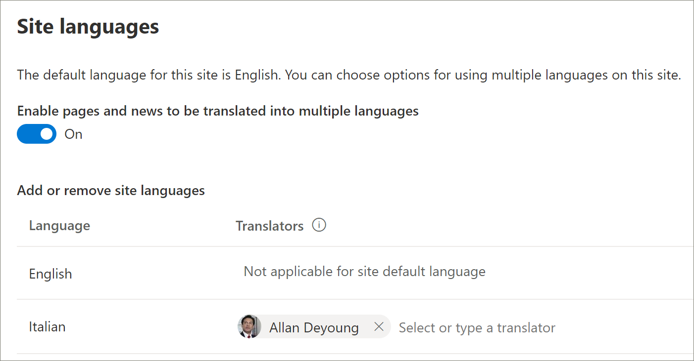

# Предоставление нового многоязычного решения для обучения
Организации, у них нет путей обучения, которые предусмотрены в клиенте, могут использовать службу предварительного обеспечения SharePoint для добавления решения многоязычных путей обучения. С помощью этого параметра шаблон путей обучения SharePoint переведен на девять языков и может использоваться с минимальным изменением. 

> [!IMPORTANT]
> Если у вас уже есть пути обучения в клиенте, рекомендуется следовать пути обновления [для](custom_update_ml.md) путей обучения. При установке путей обучения над существующим экземпляром в клиенте могут быть потеряны все изменения, внесенные в шаблон сайта или плейлисты путей обучения.

## Необходимые условия для многоязычной поддержки
 
Чтобы успешно настроить пути обучения Microsoft 365 в службе подготовки, лицо, занимаемое подготовкой, должно выполнить следующие предварительные требования: 
 
- Лицо, подготовка путей обучения должно быть администратором клиента клиента, где будут предусмотрены пути обучения.  
- Каталог приложений клиента должен быть доступен в параметре Apps Центра администрирования SharePoint. Если в организации нет каталога приложений для клиента SharePoint, обратитесь к документации [SharePoint Online,](/sharepoint/use-app-catalog) чтобы создать ее. Необходимо подождать по крайней мере два часа после создания каталога приложений перед подготовкаю путей обучения.  
- Лицо, которое должно проецизировать пути обучения, должно быть владельцем коллекции сайтов каталога приложений клиента. Если лицо, которое составляет пути обучения, не является владельцем коллекции сайтов каталога приложений, выполните эти [инструкции](addappadmin.md) и продолжайте. 

## Убедитесь, что учетная запись администратора клиента не имеет выбранного языка
Перед предоставлением путей обучения убедитесь, что учетная запись администратора для клиента не имеет выбранного языка. Вот как проверить, нет ли у учетной записи администратора выбранного языка. 
1.  В профиле edge Admin перейдите в office.com.
2.  Введите учетные данные пользователя (при необходимости).
3.  В Microsoft 365 нажмите **кнопку Все приложения >** Delve. 
4.  Нажмите   >  **кнопку Me Update Profile**.
5.  Прокрутите страницу и нажмите **кнопку Как изменить языковые и региональные параметры.**
6.  Нажмите **здесь,** а затем нажмите **эллипсы ...**.
7.  В **статье Языки отображения** отображаются без **выбранных языков.** Если выбран язык, отклонь его.

### Подготовка путей обучения

1. Перейдите на страницу решения для путей обучения Microsoft [365](https://provisioning.sharepointpnp.com/details/3df8bd55-b872-4c9d-88e3-6b2f05344239).
2. Нажмите **кнопку Добавить к вашему клиенту**. Если вы не подписаны на клиента, служба подготовка запросит учетные данные администратора клиента. 
3. В диалоговом окне Разрешения выберите **Согласие** от имени организации и выберите **Accept**.

Служба подготовка требует этих разрешений для создания каталога приложений клиента, установки приложения в каталог приложений клиента и предоставления шаблона сайта. Общее влияние на клиента не оказывает. Эти разрешения явно используются для установки решения. Чтобы продолжить установку, необходимо принять эти разрешения.

4. Заполните поля на странице информации о подготовке в соответствии с выполняемой установкой. Как минимум введите адрес электронной почты для получения уведомлений о процессе подготовки и URL-адрес назначения, по которому будет предоставляться доступ к вашему сайту.  
> [!NOTE]
> Сделайте так, чтобы URL-адрес назначения для вашего сайта был понятен вашим сотрудникам, например "/sites/MyTraining" или "/teams/LearnMicrosoft365".

6. Щелкните **Provision,** когда вы готовы установить пути обучения в среде клиента.  Процесс подготовки займет до 15 минут. Вы будете уведомлены по электронной почте, когда сайт будет готов. 

> [!IMPORTANT]
> Администратор клиента, который содержит сайт путей обучения, должен перейти на сайт, а затем открыть **CustomLearningAdmin.aspx** для инициализации свойств администрирования путей обучения. В это время администратор клиента также должен назначить владельцев на сайт. 

## Проверка успешности разработки и инициализация списка CustomConfig

Когда подготовка завершена, администратор клиента, который настоял на этом сайте, получает сообщение электронной почты от службы обеспечения PnP. Электронная почта содержит ссылку на сайт. На этом этапе администратор клиента должен перейти на сайт по ссылке, предоставленной в электронной почте, и настроить сайт для первого использования:

- Перейдите на сайт `<YOUR-SITE-COLLECTION-URL>sites/<YOUR-SITE-NAME>/SitePages/CustomLearningAdmin.aspx`. При открытии **CustomLearningAdmin.aspx** инициализируется элемент списка **CustomConfig**, который настраивает пути обучения для первого использования. Вы должны увидеть страницу, которая выглядит так:

## Добавление владельцев на сайт
В качестве администратора клиента маловероятно, что вы будете настраивать сайт, поэтому вам потребуется назначить несколько владельцев на сайт. Владельцы имеют административные привилегии на сайте, чтобы они могли изменять страницы сайтов и ребрендинг сайта. Они также имеют возможность скрывать и показывать контент и создавать настраиваемые списки воспроизведения и подкатегории.  

1. В меню **Параметры** SharePoint нажмите **кнопку Разрешения сайта**.
2. Щелкните **Параметры расширенных разрешений**.
3. Щелкните **Microsoft 365 пути обучения Владельцы**.
4. Нажмите **кнопку** Добавить пользователей в эту группу, а затем добавьте  >  людей, которых вы хотите быть владельцами. 
5. Добавьте ссылку на [изучение сайта в](custom_exploresite.md) сообщении Share и нажмите кнопку **Share**.

## Добавление переводчиков на сайт
Если вы будете использовать переводчиков для сайта, вы можете назначить им разрешения. Переводчикам требуются разрешения членов или более высокие. 

## Выбор вариантов использования нескольких языков на сайте
Служба подготовка SharePoint создает сайт "Пути обучения" на девяти языках. Применяются следующие рекомендации:
- Отключите языки, которые не нужно поддерживать
- Если вы не поддерживаете многоязычный сайт, отключите многоязычную функцию. Далее в этом разделе см. раздел "Отключение многоязычной поддержки".

### Удаление языков, которые не нужно поддерживать
Для организаций, которые предпочитают поддерживать только один язык, в дополнение к английскому языку по умолчанию, мы рекомендуем удалить языки, которые не поддерживаются. 
1. На сайте Learning Pathways выберите **Параметры** справа от страницы, а затем выберите **сведения о сайте.**
2. В нижней части области сведений о сайте выберите **Просмотр всех параметров сайта.**
3. В **статье Администрирование** сайтов выберите **параметры Языка.**
4. В **статье Включить страницы и новости,** которые будут переведены на несколько языков, сдвиньте toggle к **On**. Он должен быть по умолчанию.
5. В статье Добавить или удалить языки сайтов нажмите **кнопку Удалить,** чтобы удалить языки, которые вам не нужны для сайта. Ниже показан пример страницы Параметры языка, на ней показан итальянский язык, поддерживаемый сайтом, в дополнение к английскому языку по умолчанию.

> [!NOTE]
> При удалении языков нельзя удалить английский язык по умолчанию. 

### Назначение переводчиков
Если вы собираетесь переводить страницы, необязательно назначать по одному или несколько переводчиков для каждого языка (за исключением языка по умолчанию сайта). 
- В **столбце Переводчик** начинайте вводить имя человека, которого вы хотите быть переводчиком, а затем выберите имя из списка. 

> [!NOTE]
> Любой человек в Active Directory организации может быть назначен в качестве переводчика. Людям, назначенным в качестве переводчиков, не будут автоматически предоставлены соответствующие разрешения. Когда кто-то без правки разрешений на сайт пытается получить доступ к сайту, он будет направлен на веб-страницу, на которой он может запрашивать доступ.

## Отключение многоязычной поддержки
Если вам не нужен многоязычный сайт, например, вам нужен сайт только на английском языке, рекомендуется отключить многоязычную функцию. 

1. На сайте Learning Pathways выберите **Параметры** справа от страницы, а затем выберите **сведения о сайте.**
2. В нижней части области сведений о сайте выберите **Просмотр всех параметров сайта.**
3. В **статье Администрирование** сайтов выберите **параметры Языка.**
4. В **статье Включить страницы и новости,** которые будут переведены на несколько языков, сдвиньте toggle к **On**. Он должен быть по умолчанию.
- В **статье Включить страницы и новости, которые будут переведены,** выберите **Off**. 

### Добавление языков
Пути обучения поддерживают 9 языков, но рекомендуется добавлять только языки, необходимые для поддержки сайта путей обучения. Вы можете добавить langauges в любое время. 
- В **статье Добавить или удалить языки сайтов** начните вводить имя языка в **Выберите** или введите язык или выберите язык из выпадаемого. Этот шаг можно повторить, чтобы добавить несколько языков. Вы можете добавить или удалить языки с сайта в любое время, возвращаясь на эту страницу.