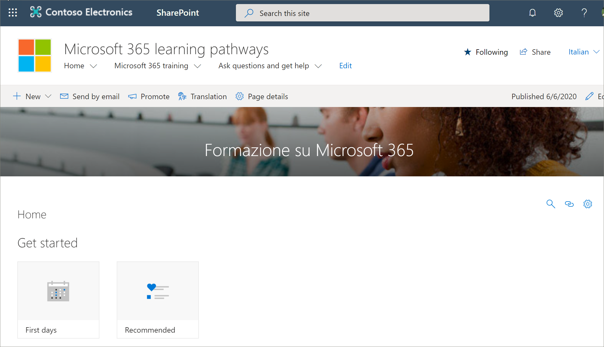

# Перевод страниц сайтаTranslate site pages
Если вы обновили существующую версию путей обучения до версии 4,0 или создали новый сайт, процесс перевода страниц сайта будет одинаковым.Whether you've updated an existing version of learning pathways to version 4.0 or you've provisioned a new site, the process for translating site pages is the same. Однако следует учитывать несколько моментов.However, there are a few things to be aware of. 
- При подготовке новой версии многоязыковой поддержки 4,0 для каждого пользователя страницы сайта переводятся на 9 языков.When a new learning pathways multilingual 4.0 version is provisioned, the site pages are translated for you into 9 languages. 
- При обновлении решения Learnings до многоязыковой версии 4,0 страницы сайта SharePoint остаются неизменными.When the learning pathways solution is updated to the multilingual 4.0 version, the learning pathways SharePoint site pages remain unchanged. Перевод необходимо выполнять вручную.Translations must be done manually. 

По умолчанию сайт путей обучения предоставляет следующие страницы:The learning pathways site, by default, provides the following pages:

- Home. aspxHome.aspx
- Старт-ВИС-Сикс-Симпле-Степс. aspxStart-with-Six-Simple-Steps.aspx
- Get-started-with-Microsoft-365. aspxGet-started-with-Microsoft-365.aspx
- Жет-стартед-ВИС-Микрософт-теамс. aspxGet-started-with-Microsoft-Teams.aspx
- Жет-стартед-ВИС-шарепоинт. aspxGet-started-with-SharePoint.aspx
- Жет-стартед-ВИС-онедрииве. aspxGet-started-with-OneDriive.aspx
- АСК-куестионс-Анд-жет-Хелп. aspxAsk-questions-and-get-help.aspx
- Обучающие события Calendar. aspxTraining events calendar.aspx
- Бекоме-а-Чампион. aspxBecome-a-Champion.aspx
- Рекоммендед-плайлистс. aspxRecommended-Playlists.aspx
- Обучающие материалы — центр успешных административных путейLearning pathways Admin Success Center

## Создание страниц для нужных языковCreate pages for the languages you want
После того как вы включили свой сайт для многоязычных функций и выбрали языки, которые вы хотите сделать доступными, вы можете создать нужные страницы перевода.Once you've enabled your site for multilingual features and you've chosen the languages you want to make available, you can create the translation pages you want. Чтобы продемонстрировать некоторые важные понятия, в качестве примера мы будем использовать учебную страницу Microsoft 365.To help demonstrate some important concepts, we'll use the Microsoft 365 training page as an example. Для этого сделайте следующее:To do this:

1.  На **домашней** странице "пути для обучения" щелкните **Microsoft 365 Training**.From the learning pathways **Home** page, click **Microsoft 365 training**.  
2.  На верхней панели нажмите кнопку **перевод**.On the top bar, select **Translation**.

3. Если вы хотите создать страницу для перевода на всех языках, доступных для сайта, выберите **создать для всех языков**.If you want to create a page for translation in each of all languages available for your site, select **Create for all languages**. В противном случае выберите **создать** только для нужных языков.Otherwise, select **Create** only for the languages you want. В этом примере мы будем выбирать итальянский.In this example, we'll select Italian.
4.  Нажмите кнопку **Просмотр**.Click **View**. Теперь страница готова к преобразованию.The page is now ready for translation. 

### Важная концепция, которую необходимо знатьAn important concept to know
Обратите внимание, что в приведенном ниже примере страница переведена на итальянский язык.Notice that in the following example, the page has been translated to Italian. Но название, Навигация и веб-часть сайта по-прежнему отображаются на английском языке.But the Site title, navigation, and web part, still appear in English. 

 После настройки сайта на английском языке пользователь с испанским языком, например, в качестве предпочтительного личного языка, вручную изменяет и переводит заголовок, навигацию и содержимое нижнего колонтитула на испанский.After the site is set up in English, a user with Spanish, for example, as their preferred personal language, manually edits and translates the title, navigation, and footer content into Spanish. Пользователь с немецким языком в качестве предпочтительного для немецкого языка.A user with German as their preferred personal language does the same for German. После перевода контента он будет отображаться для всех пользователей этих предпочитаемых языков.Once the content is translated, it will display for all users of those preferred languages. Веб-часть выбирает предпочтительный язык пользователя и отображает содержимое, переведенное на этот язык.The Web part picks up the user's preferred language and shows the content translated in that language. 

> [!IMPORTANT]
> Важно! после создания страниц перевода необходимо опубликовать (или повторно опубликовать) страницу с английским языком по умолчанию, чтобы убедиться, что:Important: After you create the translation pages, you must publish (or republish) the default English-language page to ensure that:
- Страницы перевода отображаются на соответствующем сайте языкаTranslation pages are shown in the corresponding language site
- Страницы перевода правильно отображаются в веб-части новостей и выделенных веб-частях контентаTranslation pages display correctly in the News web part and the Highlighted content web parts
- В раскрывающемся меню на языке, расположенном в верхней части сайта, включены все доступные языкиThe language dropdown at the top of the site includes all of the languages you've enabled
- Переводчик получает уведомление о запросе на перевод.Translators are notified of the translation request.

## Возможности переводчикаWhat does a translator do?
Переводчики вручную преобразуют копии языковой страницы по умолчанию в указанные языки.Translators manually translate the copies of the default language page into the language(s) specified. При создании копий страниц переводчики получают уведомления по электронной почте.When the copies of the page(s) are created, translators are notified in email. Сообщение содержит ссылку на страницу языка по умолчанию и созданную страницу перевода.The email includes a link to the default language page and the newly created translation page. Переводчик будет:The translator will:
1. Нажмите кнопку **начать перевод** в сообщении электронной почты.Select the **Start translating** button in the email.
2. В правом верхнем углу страницы нажмите кнопку **изменить** , а затем — перевод контента.Select **Edit** on the top right of the page, and translate the content.
3. После этого выберите **Сохранить как черновик** (если вы не готовы сделать его видимым для читателей) или, если страница готова к отображению всем, кто использует этот язык на сайте, выберите **опубликовать** или опубликовать **Новости**.When done, select **Save as draft** (if you're not ready to make it visible to readers)or, if the page is ready to be visible to everyone who is using that language on the site, select **Publish** or **Post news**.

Дополнительные сведения о процессе перевода можно найти в [статье Создание многоязыковых сайтов для общения, страниц и новостей](https://support.office.com/en-us/article/2bb7d610-5453-41c6-a0e8-6f40b3ed750c).For more information about the translation process, see [Create multilingual communication sites, pages, and news](https://support.office.com/en-us/article/2bb7d610-5453-41c6-a0e8-6f40b3ed750c). 

## Обновление страницы языка по умолчаниюUpdating the default language page
После обновления страницы языка по умолчанию эту страницу необходимо повторно опубликовать.When the default language page is updated, the page must be republished. Затем трансляторы для страниц перевода уведомляются в сообщении электронной почты о том, что обновление выполнено, поэтому обновления можно вносить на отдельные страницы перевода.Then, the translator(s) for the translation pages are notified in email that an update has been made so updates can be made to the individual translation pages.

## Дальнейшие действияNext Steps
- [Перевод настраиваемых списков воспроизведенияTranslate custom playlists](custom_translate_pl_ml.md)
- [Скрытие и отображение содержимого мултилигуалHide and show multiligual content](custom_translate_pl_ml.md)
