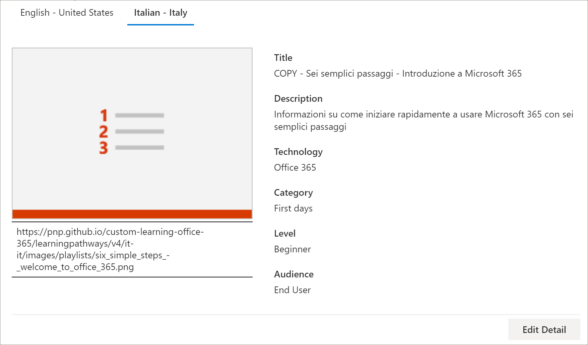
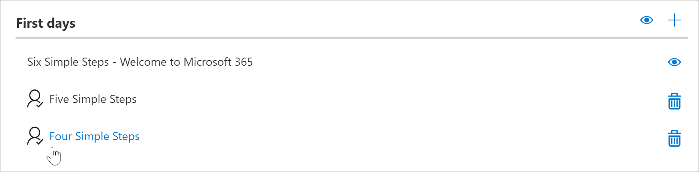

# Перевод пользовательских плейлистов схем обученияTranslate learning pathways custom playlists
С помощью путей обучения работа с настраиваемыми списками воспроизведения зависит от способа настройки путей обучения.With Learning Pathways, the way you work with custom playlists depends on how you set up learning pathways.  

- При подготовке нового многоязычного сайта для обучения вы можете скопировать или создать новый список воспроизведения и преобразовать его в языки, поддерживаемые сайтом.If you provisioned a new learning pathways multilingual site, you can copy or create a new playlist and translate the playlist into the languages that the site supports.
- Если вы обновили существующий сайт путей обучения с уже существующими настраиваемыми списками воспроизведения, вы можете перевести существующие списки воспроизведения в языки, поддерживаемые вашим сайтом.If you upgraded an existing learning pathways site that has pre-existing custom playlists, you can translate the existing playlists into the languages that your site supports. Вы также можете копировать и создавать новые списки воспроизведения.You can also copy and create new playlists. 

> [!IMPORTANT]
> - Списки воспроизведения, предоставленные корпорацией Майкрософт, уже переведены и не могут быть изменены, пока не будет создана копия списка воспроизведения.Microsoft-supplied playlists are already translated and can't be modified unless you create a copy of the playlist. 

## Создание или копирование списка воспроизведения и его переводCreate or copy a playlist and have it translated
Если вы предоставили новый многоязычный сайт для обучения или обновили сайт с помощью многоязычной веб-части, вы можете копировать и создавать настраиваемые списки воспроизведения, а также переводить их в языки, поддерживаемые вашим сайтом.If you've provisioned a new learning pathways multilingual site or upgraded the site with the multilingual web part, you can copy or a create custom playlist and translate the playlist and playlist assets into the languages supported by your site. 

### Копирование списка воспроизведения и его переводCopy a playlist and have it translated
Чтобы продемонстрировать создание нового настраиваемого списка воспроизведения и его перевод, мы будем использовать функцию копирования списка путей для обучения.To demonstrate how to create a new custom playlist and have it translated, we'll use the Copy playlist feature of learning pathways.

1.  В **меню "** пути для обучения" выберите пункт **обучающие пути Администрирование**.From the learning pathways **Home** menu, click **Learning pathways administration**. 
2.  В разделе **пути обучения Microsoft 365**выберите **первые дни**, а затем — **шесть простых шагов: добро пожаловать в Microsoft 365**.Under **Microsoft 365 learning pathways**, select **First Days**, then select **Six Simple Steps - Welcome to Microsoft 365**. 
3. Щелкните **Копировать список воспроизведения**, прокрутите страницу вниз и выберите команду **изменить сведения**.Click **Copy Playlist**, scroll down the page and click **Edit Detail**.   
4. Изменение заголовка списка воспроизведения.Change the title of the playlist. В этом примере мы изменим название списка воспроизведения на **пять простых шагов**.In this example, we'll change the playlist title to to **Five Simple Steps**. Доступные языки будут зависеть от поддерживаемых языков, выбранных для сайта.The languages available will depend on the supported languages selected for the site. Чтобы добавить дополнительные языки, необходимо добавить на сайт дополнительные Поддерживаемые языки.To add additional languages, you need to add additional supported languages to the site.   
5. Нажмите кнопку **сохранить сведения**.Click **Save Detail**. 
6. Выберите язык, расположенный справа от языка по умолчанию (в данном случае — английский), чтобы просмотреть скопированные сведения о списке воспроизведения.Click a language to the right of the default language (in this case English) to view the copied playlist details. Сведения о новом языке соответствуют исходному скопированному списку воспроизведения и требуют преобразования.The details for the new language reflect the original copied playlist and require translation.
7. Запишите, чтобы уведомить транслятор сведений о списке воспроизведения, который требуется преобразовать.Make a note to notify the translator of the playlist details to be translated.  

> [!IMPORTANT]
> Уведомления переводчиков не встроены в настраиваемые списки воспроизведения.Translator notifications are not built into custom playlists. Переводчикам необходимо получать уведомления вручную.Translators will need to be notified manually. Переводчики вручную преобразуют копии сведений о языке по умолчанию в указанные языки.Translators manually translate the copies of the default language details into the language(s) specified. Вам потребуется уведомить переводчика о переводе, который требуется для сведений о списках воспроизведения.You'll need to notify the translator of the translations required for playlist details. Рекомендуется завершить все изменения списка воспроизведения, в том числе добавлять, редактировать и удалять ресурсы списков воспроизведения, а затем уведомлять транслятор необходимых переводов для сведений и ресурсов списка воспроизведения.It's recommended that you finish all playlist changes,including adding, editing, or deleting playlist assets, then notify the translator of the required translations for playlist details and assets.

## Создание многоязычных ресурсов в настраиваемом списке воспроизведенияCreate multilingual assets in a custom playlist
Все ресурсы в списке воспроизведения, предоставляемые корпорацией Майкрософт, не подлежат редактированию и не требуют преобразования.Any assets in a playlist that are supplied by Microsoft are not editable and do not require translation. Ресурсы, предоставляемые корпорацией Майкрософт, будут доступны на языках, поддерживаемых сайтом.Microsoft-supplied assets will be available in the languages supported by the site. Для настраиваемых ресурсов, которые вы создаете, или существующих настраиваемых ресурсов можно добавить языки, поддерживаемые сайтом.For custom assets that you create, or existing custom assets, you can add the languages supported by the site.  Давайте посмотрим, как добавлять языки для новых и существующих настраиваемых ресурсов в списке воспроизведения.Let's take a look at how to add languages for new and existing custom assets in a playlist. 

### Создание нового многоязычного актива для списка воспроизведенияCreate a new multilingual asset for a playlist
В этих инструкциях предполагается, что вы используете список воспроизведения простых шагов в примере, приведенном в этой статье.These instructions assume you're using the Five Simple Steps playlist in the example in this topic. 

**Создание актива****To create the asset**
1. Для списка воспроизведения "простые действия" в разделе **ресурсы**выберите **+ новое ресурс** , а затем заполните сведения об активе.For the Five Simple Steps playlist, under **Assets**, select **+ New Asset** and then fill out the details for the asset. 
- В поле **название**введите "Добро пожаловать в Microsoft 365 в Contoso".For **Title**, enter "Welcome to Microsoft 365 at Contoso". 
- В случае **технологии**выберите **Microsoft 365**.For **Technology**, select **Microsoft 365**.

2. Выберите **создать ресурс**, а затем выберите **сохранить ресурс**.Select **Create Asset**, and then select **Save Asset**.

**Открытие актива****To open the asset**
1. Выберите созданный ресурс и нажмите кнопку **Открыть**.Select the asset you created, and then click **Open**.  
2. Внесите необходимые изменения в страницу.Make the changes to the page as desired. Теперь вы можете изменить название страницы и добавить на страницу некоторый текст, как показано в следующем примере, а затем нажмите кнопку **опубликовать**.For now, you can change the title of the page and add some text to the page as shown in the following example, and then click **Publish**. 
3. Нажмите кнопку **перевод**.Click **Translation**.
4. Выберите **создать** для нужных языков.Select **Create** for the language(s) you want. В этом примере мы будем выбирать итальянский.For this example, we'll select Italian.
5. Выберите **представление**.Select **View**. Теперь должна отобразиться страница, похожая на приведенный ниже пример, в зависимости от поддерживаемых языков.You should now see a page similar to the following example depending on your supported languages.

6. Нажмите кнопку **Опубликовать**.Click **Publish**.
7. Для созданной страницы перевода скопируйте URL-адрес из браузера и вернитесь на страницу администрирования путей для обучения.For the translation page you created, copy the URL from the browser and return to the learning pathways Administration page.

**Добавление языка созданного ресурса для перевода****To add a language for the translation asset you created** 
1. Вернитесь на страницу Администрирование путей обучения и выберите значок редактирования (карандаш) для открытого актива "пять простых шагов".Return to the learning pathways Administration page and select the Edit icon (pencil) for the "Five Simple Steps" asset you opened. 
2. Нажмите кнопку **Добавить язык**, а затем выберите язык.Click **Add language**, and then select a language. В этом примере мы выбрали Итальянский язык.In this example, we've selected Italian. 
3. Введите URL-адрес созданной вами преобразованной страницы.Enter the URL of the translated page you created. Страница должна выглядеть приблизительно так, как показано в следующем примере.You should see a page similar to the following example. 

4. Нажмите кнопку **сохранить ресурс**.Click **Save Asset**.

## Добавление языков для существующих настраиваемых списков воспроизведения и ресурсовAdd languages for existing custom playlists and assets
Если вы обновили пути для изучения многоязычной поддержки и у вас есть настраиваемые списки воспроизведения и ресурсы, вы можете добавить Поддерживаемые языки для списков воспроизведения и ресурсов.If you have upgraded learning pathways for multilingual support and have existing custom playlists and assets, you can add supported languages for the playlists and assets. В этих инструкциях предполагается наличие настраиваемого списка воспроизведения, в который можно добавить языки.These instructions assume you have a custom playlist to which you can add languages. Если у вас нет настраиваемого списка воспроизведения, ознакомьтесь с разделом "Создание или копирование списка воспроизведения" ранее в этой статье.If you don't have a custom playlist, see "Create or Copy a Playlist" earlier in this topic. 

> [!IMPORTANT]
> - Списки воспроизведения, предоставленные корпорацией Майкрософт, уже переведены и не могут быть изменены, пока не будет создана копия списка воспроизведения.Microsoft-supplied playlists are already translated and can't be modified unless you create a copy of the playlist. Вы можете добавлять только языки для настраиваемых списков воспроизведения.You can only add languages for custom playlists. 
> - Чтобы добавить языки для настраиваемых списков воспроизведения и ресурсов, многоязычная поддержка и языки должны быть включены.To add languages for custom playlists and assets, multilingual support and languages must be enabled. Дополнительную информацию можно узнать в статье [Set Language Settings](https://docs.microsoft.com/office365/customlearning/custom_update_ml#set-language-settings).For more information, see [Set Language Settings](https://docs.microsoft.com/office365/customlearning/custom_update_ml#set-language-settings). 

### Добавление языков для существующего списка воспроизведенияTo add languages for an existing playlist
1.  В **меню "** пути для обучения" выберите пункт **обучающие пути Администрирование**.From the learning pathways **Home** menu, click **Learning pathways administration**. 
2.  Выберите настраиваемый список воспроизведения.Select a custom playlist. Настраиваемый список воспроизведения определяется значком "люди" с флажком, как показано в следующем примере.A custom playlist is identified by the people icon with the checkmark, as shown in the following example.
 
3. Нажмите кнопку **изменить сведения**.Select **Edit Detail**. Возможно, вам потребуется прокрутить список вниз, чтобы найти кнопку **изменить сведения** .You may need to scroll down to find the **Edit Detail** button.   
4. Выберите **Добавить язык** , а затем выберите язык.Select **Add language** and then select a language.  
5. Выберите **сохранить сведения**.Select **Save Detail**.
 Доступные языки будут зависеть от поддерживаемых языков, выбранных для сайта.The languages available will depend on the supported languages selected for the site. Чтобы добавить дополнительные языки, необходимо добавить на сайт дополнительные Поддерживаемые языки.To add additional languages, you need to add additional supported languages to the site.   
5. Выберите язык, расположенный справа от языка по умолчанию (в данном случае — английский), чтобы просмотреть скопированные сведения о списке воспроизведения.Click a language to the right of the default language (in this case English) to view the copied playlist details. Сведения о новом языке соответствуют исходному скопированному списку воспроизведения и требуют преобразования.The details for the new language reflect the original copied playlist and require translation.
 
7. Запишите, чтобы уведомить транслятор сведений о списке воспроизведения, который требуется преобразовать.Make a note to notify the translator of the playlist details to be translated.  

**Открытие актива****To open the asset**
1. Выберите созданный ресурс и нажмите кнопку **Открыть**.Select the asset you created, and then click **Open**.  
2. Внесите необходимые изменения в страницу.Make the changes to the page as desired. Теперь вы можете изменить название страницы и добавить на страницу некоторый текст, как показано в следующем примере, а затем нажмите кнопку **опубликовать**.For now, you can change the title of the page and add some text to the page as shown in the following example, and then click **Publish**. 
3. Нажмите кнопку **перевод**.Click **Translation**.
4. Выберите **создать** для нужных языков.Select **Create** for the language(s) you want. В этом примере мы будем выбирать итальянский.For this example, we'll select Italian.
5. Выберите **представление**.Select **View**. Теперь должна отобразиться страница, похожая на приведенный ниже пример, в зависимости от поддерживаемых языков.You should now see a page similar to the following example depending on your supported languages.

6. Нажмите кнопку **Опубликовать**.Click **Publish**.
7. Для созданной страницы перевода скопируйте URL-адрес из браузера и вернитесь на страницу администрирования путей для обучения.For the translation page you created, copy the URL from the browser and return to the learning pathways Administration page.

## Уведомление транслятораNotify the translator
Завершив создание ресурсов для перевода, уведомите транслятор необходимых переводов.When you've finished creating translation assets, notify the translator of the required translations. Переводчик будет:The translator will:
- Перевод сведений о списке воспроизведения.Translate playlist details.
- Перевод сведений о ресурсах.Translate asset details.
- Перевод добавленных языковых страниц для актива.Translate added language pages for an asset.
- Уведомление запрашивающего переводов о том, что переводы готовы для проверкиNotify the requestor of the translations that the translations are ready for review

## Добавление языков для существующего настраиваемого списка воспроизведенияAdd languages for an existing custom playlist
Если вы обновили пути для изучения многоязычной поддержки и у вас есть настраиваемые списки воспроизведения и ресурсы, вы можете добавить Поддерживаемые языки для списков воспроизведения и ресурсов.If you have upgraded learning pathways for multilingual support and have existing custom playlists and assets, you can add supported languages for the playlists and assets. 

> [!IMPORTANT]
> - Списки воспроизведения, предоставленные корпорацией Майкрософт, уже переведены и не могут быть изменены, пока не будет создана копия списка воспроизведения.Microsoft-supplied playlists are already translated and can't be modified unless you create a copy of the playlist. Вы можете добавлять только языки для настраиваемых списков воспроизведения.You can only add languages for custom playlists. 
> - Чтобы добавить языки для настраиваемых списков воспроизведения и ресурсов, многоязычная поддержка и языки должны быть включены.To add languages for custom playlists and assets, multilingual support and languages must be enabled. Дополнительные сведения о включении поддержки многоязычной поддержки и параметров можно найти в разделе [Set Language Settings](https://docs.microsoft.com/office365/customlearning/custom_update_ml#set-language-settings).For more details on enabling multilingual support and options, see [Set Language Settings](https://docs.microsoft.com/office365/customlearning/custom_update_ml#set-language-settings). 

## Инструкции для переводчикаInstructions for the translator
При добавлении языков в списки воспроизведения необходимо уведомить транслятор изменений.When you add languages to playlists, you need to notify the translator of the changes. Вы можете указать транслятору следующиеYou can point the translator to the following 

### Преобразование сведений о списке воспроизведенияTranslate playlist details
В **меню "** пути для обучения" выберите пункт **обучающие пути Администрирование**.From the Learning Pathways **Home** menu, click **Learning pathways administration**. 
1. Щелкните настраиваемый список воспроизведения, для которого требуется перевод, а затем выберите нужные языки.Click the custom playlist that requires translation, then click the languages. 
2. Щелкните **изменить сведения**, сделайте переводы для списка воспроизведения, а затем нажмите кнопкуClick **Edit Detail**, make the translations for the playlist, then click 
3. Нажмите кнопку **сохранить сведения**.Click **Save Detail**. 
4. Уведомите запрос на перевод о завершении перевода.Notify the translation requestor that the translation is complete. 

### Сведения о переводе активаTranslate asset details
В **меню "** пути для обучения" выберите пункт **обучающие пути Администрирование**.From the Learning Pathways **Home** menu, click **Learning pathways administration**. 
1. Щелкните настраиваемый список воспроизведения, для которого требуется перевод.Click the custom playlist that requires translation. 
2. Прокрутите страницу вниз, а затем в разделе ресурсы, выберите Изменить для ресурса, который нужно изменить, а затем выберите язык.Scroll down the page, then under Assets, select edit for the asset you want to edit, then select the language. 
3. Сделайте перевод для ресурса и нажмите кнопку **сохранить ресурс**.Make the translations for the asset, and then click **Save Asset**.  

### Перевод добавленной страницы языка для активаTranslate the added language page for the asset
В **меню "** пути для обучения" выберите пункт **обучающие пути Администрирование**.From the Learning Pathways **Home** menu, click **Learning pathways administration**. 
1. Щелкните настраиваемый список воспроизведения, для которого требуется перевод.Click the custom playlist that requires translation. 
2. Прокрутите страницу вниз, а затем в разделе Ресурсы выберите ресурс, выберите язык и нажмите кнопку Открыть.Scroll down the page, then under Assets, select the asset, select the language, and then click Open. 
3. Сделайте перевод страницы, а затем нажмите кнопку **опубликовать**.Make the translations for the page, and then click **Publish**.   

## Дополнительные сведенияFor more information
- Дополнительные сведения о настройке путей обучения приведены в разделе [Настройка путей обучения](custom_overview.md).For more information about customizing learning pathways, see [Customize Learning Pathways](custom_overview.md). 

