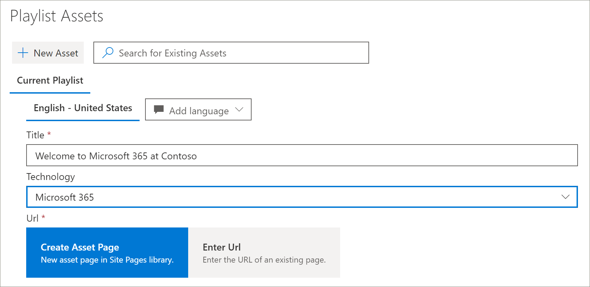

# Преобразование пользовательских списков воспроизведения в обучающие материалы
С помощью путей обучения работа с настраиваемыми списками воспроизведения зависит от способа настройки путей обучения.  

- При подготовке нового многоязычного сайта для обучения вы можете скопировать или создать новый список воспроизведения и преобразовать его в языки, поддерживаемые сайтом.
- Если вы обновили существующий сайт путей обучения с уже существующими настраиваемыми списками воспроизведения, вы можете перевести существующие списки воспроизведения в языки, поддерживаемые вашим сайтом. Вы также можете копировать и создавать новые списки воспроизведения. 

> [!IMPORTANT]
> - Списки воспроизведения, предоставленные корпорацией Майкрософт, уже переведены и не могут быть изменены, пока не будет создана копия списка воспроизведения. 

## Создание или копирование списка воспроизведения и его перевод
Если вы предоставили новый многоязычный сайт для обучения или обновили сайт с помощью многоязычной веб-части, вы можете копировать и создавать настраиваемые списки воспроизведения, а также переводить их в языки, поддерживаемые вашим сайтом. 

### Копирование списка воспроизведения и его перевод
Чтобы продемонстрировать создание нового настраиваемого списка воспроизведения и его перевод, мы будем использовать функцию копирования списка путей для обучения.

1.  В **меню "** пути для обучения" выберите пункт **обучающие пути Администрирование**. 
2.  В разделе **пути обучения Microsoft 365**выберите **первые дни**, а затем — **шесть простых шагов: добро пожаловать в Microsoft 365**. 
3. Щелкните **Копировать список воспроизведения**, прокрутите страницу вниз и выберите команду **изменить сведения**.   
4. Изменение заголовка списка воспроизведения. В этом примере мы изменим название списка воспроизведения на **пять простых шагов**. Доступные языки будут зависеть от поддерживаемых языков, выбранных для сайта. Чтобы добавить дополнительные языки, необходимо добавить на сайт дополнительные Поддерживаемые языки.   
5. Нажмите кнопку **сохранить сведения**. 
6. Выберите язык, расположенный справа от языка по умолчанию (в данном случае — английский), чтобы просмотреть скопированные сведения о списке воспроизведения. Сведения о новом языке соответствуют исходному скопированному списку воспроизведения и требуют преобразования.
7. Запишите, чтобы уведомить транслятор сведений о списке воспроизведения, который требуется преобразовать.  

> [!IMPORTANT]
> Уведомления переводчиков не встроены в настраиваемые списки воспроизведения. Переводчикам необходимо получать уведомления вручную. Переводчики вручную преобразуют копии сведений о языке по умолчанию в указанные языки. Вам потребуется уведомить переводчика о переводе, который требуется для сведений о списках воспроизведения. Рекомендуется завершить все изменения списка воспроизведения, в том числе добавлять, редактировать и удалять ресурсы списков воспроизведения, а затем уведомлять транслятор необходимых переводов для сведений и ресурсов списка воспроизведения.

## Создание многоязычных ресурсов в настраиваемом списке воспроизведения
Все ресурсы в списке воспроизведения, предоставляемые корпорацией Майкрософт, не подлежат редактированию и не требуют преобразования. Ресурсы, предоставляемые корпорацией Майкрософт, будут доступны на языках, поддерживаемых сайтом. Для настраиваемых ресурсов, которые вы создаете, или существующих настраиваемых ресурсов можно добавить языки, поддерживаемые сайтом.  Давайте посмотрим, как добавлять языки для новых и существующих настраиваемых ресурсов в списке воспроизведения. 

### Создание нового многоязычного актива для списка воспроизведения
В этих инструкциях предполагается, что вы используете список воспроизведения простых шагов в примере, приведенном в этой статье. 

**Создание актива**
1. Для списка воспроизведения "простые действия" в разделе **ресурсы**выберите **+ новое ресурс** , а затем заполните сведения об активе. 
- В поле **название**введите "Добро пожаловать в Microsoft 365 в Contoso". 
- В случае **технологии**выберите **Microsoft 365**.

2. Выберите **создать ресурс**, а затем выберите **сохранить ресурс**.

**Открытие актива**
1. Выберите созданный ресурс и нажмите кнопку **Открыть**.  
2. Внесите необходимые изменения в страницу. Теперь вы можете изменить название страницы и добавить на страницу некоторый текст, как показано в следующем примере, а затем нажмите кнопку **опубликовать**. 
3. Нажмите кнопку **перевод**.
4. Выберите **создать** для нужных языков. В этом примере мы будем выбирать итальянский.
5. Выберите **представление**. Теперь должна отобразиться страница, похожая на приведенный ниже пример, в зависимости от поддерживаемых языков.

6. Нажмите кнопку **Опубликовать**.
7. Для созданной страницы перевода скопируйте URL-адрес из браузера и вернитесь на страницу администрирования путей для обучения.

**Добавление языка созданного ресурса для перевода** 
1. Вернитесь на страницу Администрирование путей обучения и выберите значок редактирования (карандаш) для открытого актива "пять простых шагов". 
2. Нажмите кнопку **Добавить язык**, а затем выберите язык. В этом примере мы выбрали Итальянский язык. 
3. Введите URL-адрес созданной вами преобразованной страницы. Страница должна выглядеть приблизительно так, как показано в следующем примере. 

4. Нажмите кнопку **сохранить ресурс**.

## Добавление языков для существующих настраиваемых списков воспроизведения и ресурсов
Если вы обновили пути для изучения многоязычной поддержки и у вас есть настраиваемые списки воспроизведения и ресурсы, вы можете добавить Поддерживаемые языки для списков воспроизведения и ресурсов. В этих инструкциях предполагается наличие настраиваемого списка воспроизведения, в который можно добавить языки. Если у вас нет настраиваемого списка воспроизведения, ознакомьтесь с разделом "Создание или копирование списка воспроизведения" ранее в этой статье. 

> [!IMPORTANT]
> - Списки воспроизведения, предоставленные корпорацией Майкрософт, уже переведены и не могут быть изменены, пока не будет создана копия списка воспроизведения. Вы можете добавлять только языки для настраиваемых списков воспроизведения. 
> - Чтобы добавить языки для настраиваемых списков воспроизведения и ресурсов, многоязычная поддержка и языки должны быть включены. Дополнительную информацию можно узнать в статье [Set Language Settings](https://docs.microsoft.com/office365/customlearning/custom_update_ml#set-language-settings). 

### Добавление языков для существующего списка воспроизведения
1.  В **меню "** пути для обучения" выберите пункт **обучающие пути Администрирование**. 
2.  Выберите настраиваемый список воспроизведения. Настраиваемый список воспроизведения определяется значком "люди" с флажком, как показано в следующем примере.
 
3. Нажмите кнопку **изменить сведения**. Возможно, вам потребуется прокрутить список вниз, чтобы найти кнопку **изменить сведения** .   
4. Выберите **Добавить язык** , а затем выберите язык.  
5. Выберите **сохранить сведения**.
 Доступные языки будут зависеть от поддерживаемых языков, выбранных для сайта. Чтобы добавить дополнительные языки, необходимо добавить на сайт дополнительные Поддерживаемые языки.   
5. Выберите язык, расположенный справа от языка по умолчанию (в данном случае — английский), чтобы просмотреть скопированные сведения о списке воспроизведения. Сведения о новом языке соответствуют исходному скопированному списку воспроизведения и требуют преобразования.
 
7. Запишите, чтобы уведомить транслятор сведений о списке воспроизведения, который требуется преобразовать.  

**Открытие актива**
1. Выберите созданный ресурс и нажмите кнопку **Открыть**.  
2. Внесите необходимые изменения в страницу. Теперь вы можете изменить название страницы и добавить на страницу некоторый текст, как показано в следующем примере, а затем нажмите кнопку **опубликовать**. 
3. Нажмите кнопку **перевод**.
4. Выберите **создать** для нужных языков. В этом примере мы будем выбирать итальянский.
5. Выберите **представление**. Теперь должна отобразиться страница, похожая на приведенный ниже пример, в зависимости от поддерживаемых языков.

6. Нажмите кнопку **Опубликовать**.
7. Для созданной страницы перевода скопируйте URL-адрес из браузера и вернитесь на страницу администрирования путей для обучения.

## Уведомление транслятора
Завершив создание ресурсов для перевода, уведомите транслятор необходимых переводов. Переводчик будет:
- Перевод сведений о списке воспроизведения.
- Перевод сведений о ресурсах.
- Перевод добавленных языковых страниц для актива.
- Уведомление запрашивающего переводов о том, что переводы готовы для проверки

## Добавление языков для существующего настраиваемого списка воспроизведения
Если вы обновили пути для изучения многоязычной поддержки и у вас есть настраиваемые списки воспроизведения и ресурсы, вы можете добавить Поддерживаемые языки для списков воспроизведения и ресурсов. 

> [!IMPORTANT]
> - Списки воспроизведения, предоставленные корпорацией Майкрософт, уже переведены и не могут быть изменены, пока не будет создана копия списка воспроизведения. Вы можете добавлять только языки для настраиваемых списков воспроизведения. 
> - Чтобы добавить языки для настраиваемых списков воспроизведения и ресурсов, многоязычная поддержка и языки должны быть включены. Дополнительные сведения о включении поддержки многоязычной поддержки и параметров можно найти в разделе [Set Language Settings](https://docs.microsoft.com/office365/customlearning/custom_update_ml#set-language-settings). 

## Инструкции для переводчика
При добавлении языков в списки воспроизведения необходимо уведомить транслятор изменений. Вы можете указать транслятору следующие 

### Преобразование сведений о списке воспроизведения
В **меню "** пути для обучения" выберите пункт **обучающие пути Администрирование**. 
1. Щелкните настраиваемый список воспроизведения, для которого требуется перевод, а затем выберите нужные языки. 
2. Щелкните **изменить сведения**, сделайте переводы для списка воспроизведения, а затем нажмите кнопку 
3. Нажмите кнопку **сохранить сведения**. 
4. Уведомите запрос на перевод о завершении перевода. 

### Сведения о переводе актива
В **меню "** пути для обучения" выберите пункт **обучающие пути Администрирование**. 
1. Щелкните настраиваемый список воспроизведения, для которого требуется перевод. 
2. Прокрутите страницу вниз, а затем в разделе ресурсы, выберите Изменить для ресурса, который нужно изменить, а затем выберите язык. 
3. Сделайте перевод для ресурса и нажмите кнопку **сохранить ресурс**.  

### Перевод добавленной страницы языка для актива
В **меню "** пути для обучения" выберите пункт **обучающие пути Администрирование**. 
1. Щелкните настраиваемый список воспроизведения, для которого требуется перевод. 
2. Прокрутите страницу вниз, а затем в разделе Ресурсы выберите ресурс, выберите язык и нажмите кнопку Открыть. 
3. Сделайте перевод страницы, а затем нажмите кнопку **опубликовать**.   

## Дополнительные сведения
- Дополнительные сведения о настройке путей обучения приведены в разделе [Настройка путей обучения](custom_overview.md).  

