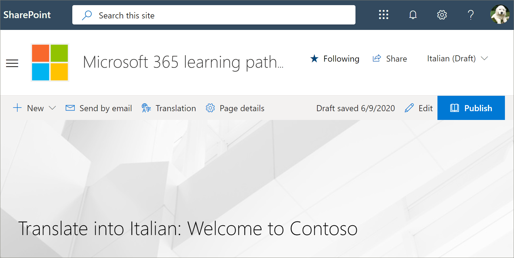

# Преобразование настраиваемого списка воспроизведения для путей обученияTranslate a learning pathways custom playlist
Если вы создали настраиваемые списки воспроизведения для вашего сайта, вы можете перевести списки воспроизведения на языки, включенные для этого сайта.If you've created learning pathways custom playlists for your site, you can translate the playlists into the languages enabled for this site.

1.  В **меню "** пути для обучения" выберите пункт **обучающие пути Администрирование**.From the learning pathways **Home** menu, click **Learning pathways administration**. 
2.  Щелкните настраиваемый список воспроизведения.Click the custom playlist. В этом примере мы будем использовать **пять простых шагов: Добро пожаловать в Contoso**.In this example, we'll use **Five Simple Steps - Welcome to Contoso**. 
3.  Нажмите кнопку **изменить сведения**, а затем в поле **Добавить язык** выберите язык.Click **Edit Detail**, then in the **Add language** box, select a language. В этом примере мы будем использовать **итальянский – Италия**.In this example, we'll use **Italian – Italy**. 
5.  Нажмите кнопку **сохранить сведения**.Click **Save Detail**. 

> [!IMPORTANT]
> Уведомления переводчиков не встроены в настраиваемые списки воспроизведения.Translator notifications are not built into custom playlists. Переводчикам необходимо получать уведомления вручную.Translators will need to be notified manually. 

## Возможности переводчикаWhat does a translator do?
Переводчики вручную преобразуют копии языковой страницы по умолчанию в указанные языки.Translators manually translate the copies of the default language page into the language(s) specified. Вам потребуется уведомить переводчика о переводе, который требуется для сведений о списках воспроизведения.You will need to notify the translator of the translations required for playlist details. Рекомендуется завершить все изменения списка воспроизведения, в том числе добавлять, редактировать и удалять ресурсы списков воспроизведения, а затем уведомлять транслятор необходимых переводов.It's recommended that you finish all playlist changes,including adding, editing, or deleting playlist assets, then notify the translator of the required translations.

## Перевод ресурсов в настраиваемый список воспроизведенияTranslate the assets in the custom playlist
Все ресурсы в списке воспроизведения, предоставляемые корпорацией Майкрософт, не подлежат редактированию и не требуют преобразования.Any assets in a playlist that are supplied by Microsoft are not editable and do not require translation. Если вы добавили настраиваемые ресурсы с сайта SharePoint вашего клиента, эти ресурсы потребуют преобразования.If you’ve added custom assets from your tenant's SharePoint site, those assets will require translation. Давайте рассмотрим, как перевести настраиваемый ресурс в список воспроизведения.Let's take a look at how to translate a custom asset in a playlist.

### Добавление языка для существующего активаAdd a language for an existing asset
1. В разделе **ресурсы**нажмите значок " **изменить** " рядом с настраиваемым активом.Under **Assets**, select the **Edit** icon next to the custom asset. 
2. Выберите язык в поле **Добавить язык** , а затем выберите **сохранить ресурс**.Select a language from the **Add language** box, and then select **Save Asset**.

### Добавление страницы языка для существующего активаAdd a language page for an existing asset
1. В списке ресурс выберите основное средство, а затем нажмите кнопку **Открыть**.In the asset list, click the English asset, and then click **Open**.
2. На верхней панели нажмите кнопку **перевод**.On the top bar, select **Translation**.
3. В раскрывающемся списке язык выберите язык для актива, выберите **создать**, а затем **Просмотреть**.From the language dropdown, select the language for the asset, select **Create**, and then **View**. Теперь страница должна выглядеть примерно так, как показано ниже.Your page should now look something like this. 

4. Нажмите кнопку **опубликовать**, а затем скопируйте URL-адрес страницы.Click **Publish**, and then copy the URL for the page. Он должен выглядеть примерно так, как код языка в URL-адресе.It should look something like this, with the language code in the URL.
https://tenantname.sharepoint.com/sites/M365LP/SitePages/it/Welcome-to-Contoso.aspx.https://tenantname.sharepoint.com/sites/M365LP/SitePages/it/Welcome-to-Contoso.aspx.
5. Вернитесь на страницу администрирования SharePoint, добавьте URL-адрес для языка актива, а затем нажмите кнопку **сохранить**.Return to the SharePoint Administration page, add the URL for the language for the asset, and then click **Save**. 

6.  Прокрутите страницу вверх и выберите команду **Закрыть список воспроизведения**.Scroll up the page and click **Close Playlist**.

## Что делает переводчик?What the translator does?
Переводчик будет:The translator will:
- Перевод сведений о списке воспроизведения.Translate playlist details.
- Перевод сведений о ресурсах.Translate asset details.
- Перевод добавленных языковых страниц для актива.Translate added language pages for asset.
- Уведомление запрашивающего переводов о том, что переводы готовы для проверкиNotify the requestor of the translations that the translations are ready for review

### Преобразование сведений о списке воспроизведенияTranslate playlist details
В **меню "** пути для обучения" выберите пункт **обучающие пути Администрирование**.From the Learning Pathways **Home** menu, click **Learning pathways administration**. 
1. Щелкните настраиваемый список воспроизведения, для которого требуется перевод, а затем выберите нужные языки.Click the custom playlist that requires translation, then click the languages. 
2. Щелкните **изменить сведения**, сделайте переводы для списка воспроизведения, а затем нажмите кнопкуClick **Edit Detail**, make the translations for the playlist, then click 
3. Нажмите кнопку **сохранить сведения**.Click **Save Detail**. 
4. Уведомите запрос на перевод о завершении перевода.Notify the translation requestor that the translation is complete. 

### Сведения о переводе активаTranslate asset details
В **меню "** пути для обучения" выберите пункт **обучающие пути Администрирование**.From the Learning Pathways **Home** menu, click **Learning pathways administration**. 
1. Щелкните настраиваемый список воспроизведения, для которого требуется перевод.Click the custom playlist that requires translation. 
2. Прокрутите страницу вниз, а затем в разделе ресурсы, выберите Изменить для ресурса, который нужно изменить, а затем выберите язык.Scroll down the page, then under Assets, select edit for the asset you want to edit, then select the language. 
3. Сделайте перевод для ресурса и нажмите кнопку **сохранить ресурс**.Make the translations for the asset, and then click **Save Asset**.  

## Перевод добавленной страницы языка для активаTranslate the added language page for the asset
В **меню "** пути для обучения" выберите пункт **обучающие пути Администрирование**.From the Learning Pathways **Home** menu, click **Learning pathways administration**. 
1. Щелкните настраиваемый список воспроизведения, для которого требуется перевод.Click the custom playlist that requires translation. 
2. Прокрутите страницу вниз, а затем в разделе Ресурсы выберите ресурс, выберите язык и нажмите кнопку Открыть.Scroll down the page, then under Assets, select the asset, select the language, and then click Open. 
3. Сделайте перевод страницы, а затем нажмите кнопку **опубликовать**.Make the translations for the page, and then click **Publish**.  

## Создание нового списка воспроизведения мултилангуалCreate a new multilangual playlist
Инструкции по созданию нового списка воспроизведения для сайта приведены в разделе [Создание настраиваемого списка воспроизведения](custom_createnewplaylist.md).For instructions on how to create a new playlist for a site, see [Create a Custom Playlist](custom_createnewplaylist.md). После создания списка воспроизведения и активов ознакомьтесь с этой документацией, чтобы получить инструкции по преобразованию списка воспроизведения и активов.After you've created the playlist and assets, refer back to this documentation for instruction on how to translate the playlist and assets. 