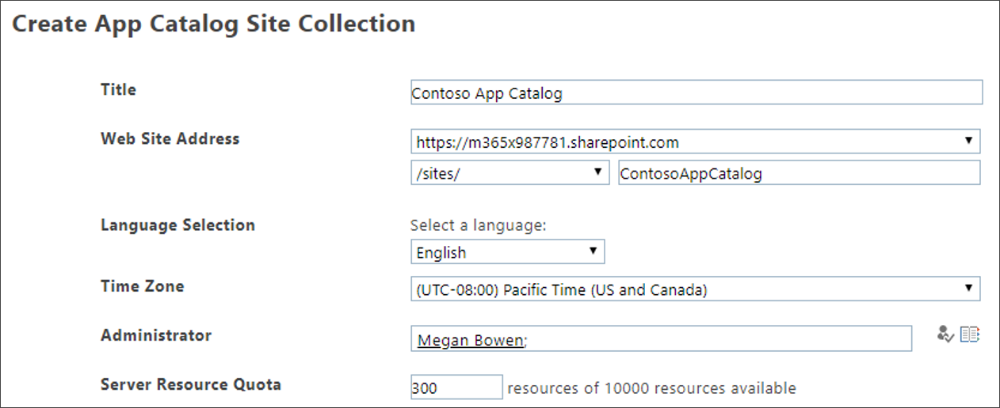

# Устранение неполадок настраиваемого обученияTroubleshoot Custom Learning

Ниже приведены советы по устранению неполадок, которые могут возникнуть при работе с пользовательским обучением Office 365 или службы подготовки SharePoint Online.Here are troubleshooting tips for problems that may occur with Custom Learning for Office 365 or the SharePoint Online Provisioning Service.

## Как узнать, есть ли у вас разрешения администратора клиентаHow to know if you have Tenant Admin permissions

Для входа в службу подготовки SharePoint Online и подготовки настраиваемого обучения требуются разрешения администратора клиента.Sign in to the SharePoint Online Provisioning Service and provisioning Custom Learning requires Tenant Admin permissions. Если у вас возникли проблемы с входом в службу подготовки SharePoint Online, убедитесь, что ей назначена роль глобального администратора.If you are experiencing sign in issues with the SharePoint Online Provisioning Service, make sure that you have been assigned the Global administrator role. Для настраиваемого решения по обУчению требуются разрешения администратора клиента, которые также называются ролью глобального администратора Office 365.The Custom Learning solution requires Tenant Admin permissions, otherwise known as Office 365 Global Administrator role. Ниже описано, как определить, назначена ли роль глобального администратора.Here’s how to determine if you have been assigned the Global Administrator role.

1.  Войдите в Office.com.Sign in to Office.com.
2.  Щелкните элемент **Администратор**Click **Admin**
3.  В разделе **Пользователи**выберите **Активные пользователи**Under **Users**, select **Active Users**
4.  Поиск имениSearch for your name
5.  Щелкните свое имя в списке результатов поиска.Click your name in Search results. Для своей роли должен отображаться глобальный администратор.You should see Global administrator for your role.

### Если у вас нет роли глобального администратораIf you don’t have the Global administrator role
- Найдите глобального администратора в Организации и попросите этого пользователя войти в службу или назначить им роль глобального администратора.Find a Global Administrator in your organization and have that person sign into the service or have them assign the Global administrator role to you.

## Устранение неполадок в каталоге приложений клиентаTenant App Catalog Troubleshooting
Для настраиваемого обучения необходимо, чтобы каталог приложений был подготовлен в целевом клиенте.Custom Learning requires an App Catalog to be provisioned in the target tenant. Для создания каталога приложений требуются разрешения глобального администратора.Creating an app catalog requires Global Administrator permissions. Ниже приведены действия по устранению распространенных проблем с каталогом приложений.Here’s are troubleshooting steps for common App Catalog issues:

### Как узнать, есть ли у вас Каталог приложений клиентаHow to know if you have a Tenant app catalog 
Для начала убедитесь, что у вас есть разрешения глобального администратора.For starters, ensure that you have Global administrator permissions. Выполните действия, описанные выше в разделе разрешения администратора клиента.See the steps for Tenant Admin permissions above.

1. в Office 365 щелкните элемент **администратор**, щелкните стрелку раскрытия _гт_, а затем щелкните **показать все** > **центры** > администрирования**SharePoint**.From Office 365, click **Admin**, click the expand arrow >, click **Show all** > **Admin centers** > **SharePoint**.
2. Щелкните\*\*\*\* > **Каталог приложений** **классического администрирования SharePoint Center** > .Click **Classic Admin SharePoint Center** > **apps** > **App Catalog**.
3. В разделе **приложения**вы увидите плитку с названием " **распространение приложений для SharePoint**".Under **Apps**, you should see a tile titled **Distribute apps for SharePoint**. Если вы видите плитку, у вас есть каталог приложений клиента.If you see the tile, you have a Tenant App Catalog. Сведения о том, **как убедиться в том, что это веб-сайт колллектион...**See the **How to ensure your are a Site Colllection...** section below. Если вы не видите плитку, вам потребуется создать каталог приложений клиента для вашего клиента.If you don’t see the tile you will need to create a tenant app catalog for your tenant. В разделе **как создать каталог приложений клиента** .See the **How to create a Tenant App Catalog** section below .

### Как убедиться в том, что вы являетесь владельцем семейства веб-сайтов в каталоге приложений клиентаHow to ensure you are a Site Collection Owner on the Tenant App Catalog 
Чтобы подготовить пользовательское обучение для Office 365, необходимо быть владельцем семейства веб-сайтов в каталоге приложений клиента.To provision Custom Learning for Office 365, you will need to be a Site Collection Owner on the Tenant App Catalog. Вот как можно обдетерминировано, является ли вы владельцем.Here’s how to determin if you are an Owner.

1. в Office 365 щелкните элемент **администратор**, щелкните стрелку раскрытия _гт_, а затем щелкните **показать все** > **центры** > администрирования**SharePoint**.From Office 365, click **Admin**, click the expand arrow >, click **Show all** > **Admin centers** > **SharePoint**.
2. Щелкните **классический центр администрирования SharePoint Center**, а затем выберите **Каталог приложений**.Click **Classic Admin SharePoint Center**, and then select the **app catalog**.
3. Выберите **владелец**, а затем убедитесь, что вы являетесь владельцем семейства веб-сайтов.Select **Owner**, and then ensure you are a Site Collection Owner. Он должен выглядеть примерно так, как показано ниже.It should look something like this.
 

### Создание каталога приложений клиента, если он не существуетHow to create a Tenant App Catalog if one doesn’t exists 
1. Войдите в Office 365 с помощью учетной записи администратора SharePoint Online.Sign in to Office 365 with your SharePoint Online admin account.
2. Выберите **Администратор**.Click **Admin**.
3. В разделе **центры администрирования**щелкните **SharePoint**.Under **Admin centers**, click **SharePoint**. 
4. Выберите пункт**Каталог приложений**для **приложений** > .Click **Apps** > **App Catalog**.
5. Щелкните **создать новый сайт каталога приложений**, а затем нажмите кнопку **ОК**.Click **Create a new app catalog site**, and then click **OK**. 
6.  Введите сведения о каталоге приложений.Enter the information for the App Catalog. Возможно, вы захотите включить более одного администратора.You may want to include more than one Administrator. Ниже приведен пример.The following shows an example.  

7.  Вот и все.That’s it. Все готово.You’re done. Но перед переходом к подготовке настраиваемого обучения необходимо подождать не менее 30 минут, чтобы убедиться, что создание каталога приложений завершено.But before you move to provisioning Custom Learning, you need to wait at least 30 minutes to make sure the App Catalog creation is complete. 

> [!IMPORTANT]
> Подождите не менее 30 минут после создания каталога приложений клиента, прежде чем приступать к подготовке.Wait at least 30 minutes after creating the Tenant App Catalog before provisioning Custom Learning. Это гарантирует завершение процесса подготовки каталога приложений в SharePoint.This ensures that the App Catalog provisioning process is complete within SharePoint. 