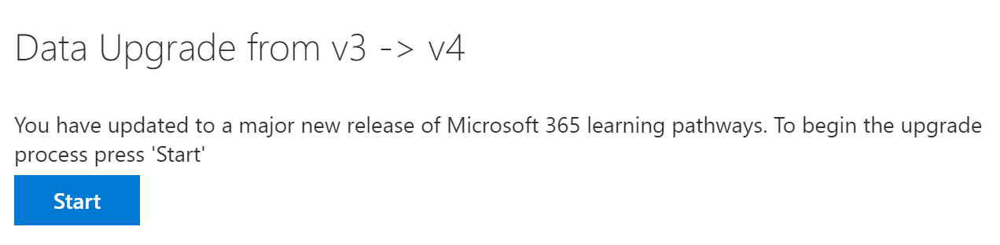

# Обновление путей обучения для поддержки многоязычной поддержкиUpdate learning pathways for multilingual support
Если у вас уже есть сайт путей обучения, вы можете обновить его для поддержки многоязычной поддержки.If you have an existing Learning Pathways site, you can update it for multilingual support. Чтобы обновить пути для обучения в многоязыковой версии 4,0, необходимо отправить пакет веб-части кустомлеарнинг. sppkg в каталог приложений клиента SharePoint.To update learning pathways to the multilingual 4.0 version, you upload the web part package, customlearning.sppkg, to the SharePoint tenant App Catalog. При обновлении путей обучения:When you update learning pathways:  

- Поддерживаются все ранее созданные настраиваемые списки воспроизведения и активыAny previously created custom playlists and assets are maintained
- Параметры для скрытия или отображения контентаSettings to hide or show content are maintained
- Шаблон SharePoint "пути для обучения" остается неизменнымThe learning pathways SharePoint template is left unchanged
- Курсы обучения не переводятся на страницы сайта.The learning pathways site pages aren't translated. Эту работу необходимо выполнять вручнуюThis work must be done manually

## Обзор многоязычных путей обученияRead the learning pathways multilingual overview
Чтобы узнать, как работает многоязычная поддержка для обучающих путей, ознакомьтесь со статьей [Обзор многоязычных путей обучения](custom_overview_ml.md).To learn about how multilingual support works for learning pathways, read the [Learning pathways multilingual overview](custom_overview_ml.md)). 

## Необходимые условия для обновленияPrerequisites to update
Перед обновлением путей обучения необходимо соблюдение следующих требований:Before updating learning pathways, the following prerequisite must be met:
- Пользователь, выполняющий обновление путей обучения, должен быть владельцем семейства веб-сайтов в каталоге приложений клиента.The person updating learning pathways must be a site collection owner of the tenant App Catalog. Если учетные данные подготовки пользователей, не являющиеся владельцами семейства веб-сайтов, не являются владельцами каталога приложений, [выполните эти инструкции](addappadmin.md) и продолжайте.If the person provisioning learning pathways isn't a site collection owner of the App Catalog, [complete these instructions](addappadmin.md) and continue. 

## Настройка языковых параметровSet language settings 
Перед обновлением путей обучения задайте языковые параметры сайта.Before updating learning pathways, set the site language settings. Чтобы включить многоязычную поддержку на сайте путей для обучения, можно настроить поддержку многоязыковой поддержки **страниц и новостей на нескольких языках** **, а**затем добавить языки, которые будут поддерживаться для сайта.To enable multilingual support for the learning pathways site, you can set the **Enable pages and news to be translated into multiple languages** to **On**, and then add the languages you want to support for the site.
1.  На сайте пути для обучения выберите **Параметры** в правом верхнем углу, а затем выберите **сведения о сайте**.From the Learning Pathways site, select **Settings** from the top right, and then select **Site information**.
2.  В нижней части области сведений о сайте выберите **Просмотреть все параметры сайта**.At the bottom of the site information pane, select **View all site settings**.
3.  В разделе **Администрирование сайта**выберите **Параметры языка**.Under **Site Administration**, select **Language settings**.
4.  В разделе **разрешить перевод страниц и новостей на несколько языков**задайте выключатель.Under **Enable pages and news to be translated into multiple languages**, set the toggle switch. 
- Для сайта мултилигуал на слайде установите переключатель в значение **вкл**., а затем перейдите к разделу Add Languages (добавить языки).For a multiligual site, slide the toggle to **On**, and then proceed to the Add Languages section. 
- Для сайта, поддерживающего только английский, выберите переключатель в значение **выключен**.For an English-only site, slide the toggle to **Off**.

### Добавление языковAdd languages
Обучающие пути поддерживают девять языков, поэтому необходимо добавить только необходимые языки.Learning pathways supports nine languages, you should add only the languages you need. В примерах, использованных в этой документации, будет добавлен итальянский язык.In the examples used in this documentation, Italian will be added. 
- В разделе **Добавление или удаление языков сайта**начните ввод названия языка в поле **Выбор или введите язык**или выберите язык из раскрывающегося списка.Under **Add or remove site languages**, start typing a language name in **Select or type a language**, or choose a language from the dropdown. Вы можете повторить этот шаг, чтобы добавить несколько языков.You can repeat this step to add multiple languages. На эту страницу вы можете добавить или удалить языки на сайте в любое время.You can add or remove languages from your site at any time by going back to this page.
 
### Назначение переводчиковAssign translators
При определении языковых параметров для путей обучения можно назначить переводчиков.When defining Language settings for learning pathways, you can assign translators. Для переводчиков должен быть настроен профиль иностранного языка.Translators should have a foreign language profile set up. Дополнительные сведения о профилях иностранных языков приведены в [статье Создание многоязыковых сайтов для общения, страниц и новостей](https://support.office.com/article/2bb7d610-5453-41c6-a0e8-6f40b3ed750c).For more information about foreign language profiles, see [Create multilingual communication sites, pages, and news](https://support.office.com/article/2bb7d610-5453-41c6-a0e8-6f40b3ed750c).  
- Для поддерживаемого языка нажмите кнопку **выбрать или введите транслятор** , а затем выберите транслятор.For a supported language, click **Select or type a translator** and then select a translator. 

## Обновление пакета веб-части "пути для обучения"Update the learning pathways web part package
На этом этапе вы отправляете веб-часть "пути для обучения" 4,0 в каталог приложений SharePoint, а затем переходите к странице "Администрирование путей обучения", чтобы начать процесс обновления.In this step, you upload the learning pathways 4.0 web part to the SharePoint App Catalog, and then navigate to the learning pathways Administration page to start the update process.

### Отправка пакета веб-частиUpload the web part package
1.  Перейдите к расположению многоязычного общего ресурса в Teams и скачайте **кустомлеарнинг. sppkg** на локальный диск на компьютере.Go to the multilingual share location in Teams and download **customlearning.sppkg** to a local drive on your PC. 
2.  Если вы еще не выполнили вход, войдите в свой клиент с помощью учетной записи администратора клиента или администратора семейства веб-сайтов.If you’re not already signed in, sign into your tenant with a Tenant Admin or Site Collection Admin account. 
3.  Нажмите **Администратор**  >  , чтобы**Показать все**  >  **SharePoint**  >  **Дополнительные функции**SharePoint.Click **Admin** > **Show All** > **SharePoint** > **More Features**. 
4.  В разделе **приложения**нажмите кнопку **Открыть**.Under **Apps**, click **Open**. 
5.  Выберите пункт **Каталог приложений**  >  :**распределить приложения для SharePoint**.Click **App Catalog** > **Distribute Apps for SharePoint**. 
6.  Нажмите кнопку **Отправить**  >  **выберите файлы**.Click **Upload** > **Choose Files**. 
7.  Выберите загруженный файл **кустомлеарнинг. sppkg** и нажмите кнопку **ОК**  >  **Deploy**.Select the **customlearning.sppkg** file you downloaded, click **OK** > **Deploy**. 

### Завершение обновленияComplete the update
1.  На сайте пути для обучения выберите пункт **обучающие пути Администрирование** в меню **Главная** .From the Learning Pathways site, select **Learning pathways administration** from the **Home** menu. 
2.  Отобразится запрос на обновление.You’ll see a prompt asking if you want to update. 

3.  Нажмите кнопку **Начало**.Click **Start**. 
4. По завершении обновления нажмите кнопку **Закрыть**.When the update is complete, click **Close**. 

### Дальнейшие действияNext Steps
- Изучите [контент по умолчанию](custom_exploresite.md) , указанный на сайте и веб-части.Explore the [default content](custom_exploresite.md) provided in the site and web part.
- Дополнительные сведения о переводе страниц сайта можно найти в разделе [перевод страниц сайта](custom_translate_page_ml.md).For more information about translating site pages, see [Translate site pages](custom_translate_page_ml.md). 

