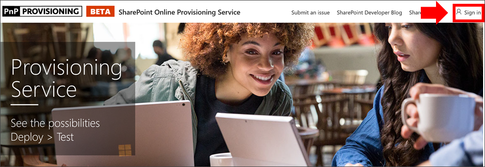

# Подготовка настраиваемого обучения

С помощью службы подготовки SharePoint Online администратор клиента Office 365 может начать процесс подготовки с помощью нескольких простых щелчков мыши. Служба подготовки является рекомендуемым способом подготовки настраиваемого обучения. Она быстро, легко и занимает несколько минут, чтобы начать процесс. Тем не менее, прежде чем приступить к работе со службой подготовки, убедитесь, что выполнены необходимые условия для подготовки.

## Необходимые компоненты
 
Для успешной настройки настраиваемого обучения с помощью [службы подготовки SharePoint Online](https://provisioning.sharepointpnp.com)необходимо, чтобы пользователь, выполняющий подготовку, соответствовал следующим предварительным требованиям: 
 
- Пользователь, который подготавливает обучение, должен быть клиентом, Администратороф клиент, на котором будет подготовлено пользовательское обучение.  
- Каталог приложений клиента должен быть доступен в параметрах приложений центра администрирования SharePoint. Если в вашей организации нет каталога приложений клиента SharePoint, обратитесь к [документации SharePoint Online](https://docs.microsoft.com/sharepoint/use-app-catalog) , чтобы создать ее.  
- Настраиваемый обучающий пользователь должен быть владельцем семейства веб-сайтов в каталоге приложений клиента. Если пользователь, который подготавливает обучение, не является владельцем семейства веб-сайтов каталога приложений, [выполните приведенные ниже инструкции](addappadmin.md) и продолжайте. 

### Подготовка настраиваемого обучения

1. Перейдите к http://provisioning.sharepointpnp.com верхнему правому углу домашней страницы и **Войдите в** него.  Войдите с учетными данными целевого клиента, на котором планируется установить шаблон сайта.

2. Отмените **согласие от имени вашей организации** и нажмите кнопку **принять**.

3. В коллекции решений выберите **пользовательское обучение для Office 365** .

4. На домашней странице решения выберите **Добавить в клиент**

5. Заполните поля на странице информации о подготовке в соответствии с выполняемой установкой. Как минимум введите адрес электронной почты, на который вы хотите получать уведомления о процессе подготовки, и конечный URL-адрес сайта, на который будет выполняться подготовка.  
> [!NOTE]
> Сделайте конечный URL-адрес сайта понятным для ваших сотрудников, например "/СИТЕС/митраининг" или "/teams/LearnOffice365".

6. Выберите **подготовить** , когда вы будете готовы к установке настраиваемого обучения в клиентской среде.  Процесс подготовки займет до 15 минут. Когда сайт будет готов для доступа, вы получите уведомление по электронной почте (по адресу электронной почты, указанному на странице подготовки).

> [!IMPORTANT]
> Администратор клиента, который подготавливает настраиваемый сайт обучения, должен перейти на сайт, а затем открыть Кустомлеарнингадмин. aspx для инициализации настраиваемых свойств администратора обучения. В настоящее время Администратор клиента также должен назначить владельцами сайт. 

## Проверка успешности подготовки

По завершении подготовки администратор клиента получает электронное письмо от службы подготовки PnP. Администратор может скопировать ссылку на сайт, указанный в сообщении электронной почты, а затем следуйте инструкциям по переходу на сайт. Кроме того, администратор клиента может перейти к <URL-адрес семейства сайтов>/Ситепажес/кустомлеарнингадмин.аспкс. Это приведет к инициализации элемента списка Кустомконфиг, который настраивает пользовательское обучение для его первого использования. Пользователь, который впервые открыл эту страницу, должен быть администратором клиента, администратором семейства веб-сайтов или владельцем сайта. Должна отобразиться страница, которая выглядит следующим образом: 

## Добавление владельцев для сайта
Администратор клиента вряд ли будет участником настройки сайта, поэтому вам потребуется назначить владельцам сайт. Владельцы имеют административные права на сайте, чтобы они могли изменять страницы сайта и изменять фирменный стиль сайта. Они также могут скрывать и показывать контент, доставленный через пользовательскую веб-часть обучения. Они также смогут создавать настраиваемые списки воспроизведения и назначать их настраиваемым подкатегориям.  

1. В меню **Параметры** SharePoint выберите разрешения для **сайта**.
2. Нажмите кнопку **Дополнительные параметры разрешений**.
3. Щелкните **пользовательское обучение для владельцев Office 365**.
4. Нажмите кнопку **создать**  >  ,**чтобы добавить пользователей в эту группу**, добавьте пользователей, которых вы хотите добавить в группу, а затем нажмите кнопку **общий доступ**.

8. Щелкните **следующий** параметр в правом верхнем углу страницы, чтобы подписаться на сайт.  

### Дальнейшие действия
- Изучите [контент по умолчанию](sitecontent.md) , включенный в веб-часть.
