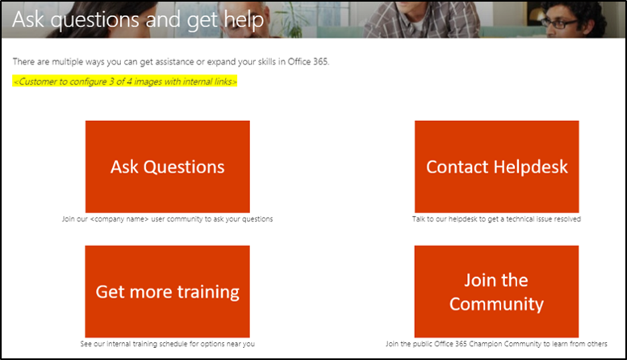

# Настройка обучающих интерфейсов

Это тест 4. По умолчанию в интерфейсе сайта и веб-части есть контент для всех служб Office 365 и Windows 10.  Если в вашей компании доступны только все или некоторые из этих служб, вы можете настроить содержимое, доступное пользователям.  

Владельцам этого сайта доступно несколько видов настроек. 

- [Настройка веб-страниц](#customizing-web-pages)
- [Настройка доступных служб](#customize-available-services)
- [Настройка и общий доступ к спискам воспроизведения](customplaylist.md)

Некоторые или все настройки можно выполнить перед запуском сайта в сообществе пользователей.  

> [!TIP]
> Соберите отзывы от сотрудников и периодически заполните дополнительные настройки.  Добавление списков воспроизведения, конечных веб-страниц к определенным ролям или включение нового обучающих материалов при запуске новых служб. 

## Настройка веб-страниц

Вы можете полностью настроить пользовательский веб-сайт обучения. Если вы не знакомы с созданием страниц на современных сайтах SharePoint Online, мы рекомендуем ознакомиться со статьей [Настройка сайта SharePoint](https://support.office.com/en-us/article/customize-your-sharepoint-site-320b43e5-b047-4fda-8381-f61e8ac7f59b) в support.Office.com. 

### Настройка страницы " **задать вопросы" и "получение справки** "

В качестве отправной точки для настройки сайта выберите Задать вопросы и получите помощь в строке меню, а затем нажмите кнопку изменить в SharePoint, а затем измените изображения и ссылки. 

## Настройка доступных служб

1.  Перейдите на страницу настраиваемого администрирования обучения на веб- 
1. Выберите " **технология** ", чтобы просмотреть полный список служб, включенных в решение.
1. Выберите технологию и **щелкните символ глаза** , чтобы скрыть это содержимое.  Чтобы показать содержимое в интерфейсе, щелкните символ глаза еще раз. 

Один и тот же процесс можно повторять для категорий списков воспроизведения в интерфейсе.  Просто выберите параметр Категория, чтобы показать или скрыть списки воспроизведения. 

### Дальнейшие действия

- [Настройка и общий доступ к спискам воспроизведения](customplaylist.md)
- [Внедрение](driveadoption.md) 