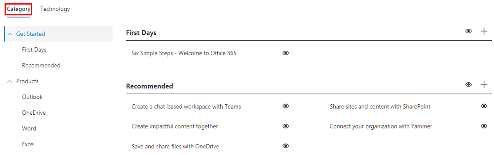

# Настройка учебного опытаCustomize the training experience

Это тестовый 4.This is a test four. По умолчанию и опыт сайта, и веб-сайт включают контент для всех служб Office 365 и Windows 10.By default both the site experience and the webpart include content for all Office 365 and Windows 10 services.  Если в вашей компании доступны только все или некоторые из этих служб, вы можете настроить содержимое, доступное пользователям.If only all or some of these services are available in your company you can adjust what content is available to your users.  

Существует несколько видов настроек, доступных владельцам этого сайта.There are several kinds of customizations that are available to the owners of this site. 

- [Настройка веб-страницCustomize web pages](#customizing-web-pages)
- [Настройка доступных службCustomize available services](#customize-available-services)
- [Настройка и совместное делиться списками воспроизведенияCustomize and share playlists](customplaylist.md)

Некоторые или все эти настройки можно завершить перед запуском сайта в сообщество пользователей.Some or all of these customizations can be completed before you launch the site to your user community.  

> [!TIP]
> Сбор отзывов от сотрудников и периодические дополнительные настройки.Gather feedback from your employees and periodically complete additional customizations.  Добавьте списки воспроизведения, целевые веб-страницы к определенным ролям или включив новый учебный контент при запуске новых служб.Add playlists, target webpages to specific roles or turn on new training content when launching new services. 

## Настройка веб-страницCustomizing web pages

Вы можете полностью настроить веб-сайт Custom Learning.You can fully customize the Custom Learning web site. Если вы не знакомы с созданием страниц на современных сайтах SharePoint Online, предлагаем ознакомиться с статьей Настройка сайта [SharePoint](https://support.office.com/article/customize-your-sharepoint-site-320b43e5-b047-4fda-8381-f61e8ac7f59b) на support.office.com.If you are not familiar with creating pages within modern SharePoint Online sites we suggest you review [Customize your SharePoint site](https://support.office.com/article/customize-your-sharepoint-site-320b43e5-b047-4fda-8381-f61e8ac7f59b) article on support.office.com. 

### Настройка страницы **"Задайте вопросы и получите справку"**Customize the **Ask Questions and Get Help** page

В качестве отправной точки для настройки сайта выберите Задать вопросы и получить помощь в панели меню, а затем нажмите кнопку Изменить SharePoint и измените изображения и ссылки.As a starting point for customizing the site, select Ask questions and get help from the menu bar, then click the SharePoint Edit button and change the images and the links. 

## Настройка доступных службCustomize available services

1.  Перейдите на страницу Администрирование настраиваемой обучения на веб-сайте Navigate to the Custom Learning Administration page within the website 
1. Выберите **технологию,** чтобы увидеть полный список служб, включенных в решениеSelect **Technology** to see the full list of services that are included in the solution
1. Выберите технологию и **щелкните символ глаз,** чтобы скрыть это содержимое.Select a technology and **click the eye symbol** to hide this content.  Щелкните символ глаза еще раз, чтобы показать содержимое в этом опыте.Click the eye symbol again to show the content within the experience. 

Один и тот же процесс можно повторить для категорий списков воспроизведения в этом опыте.The same process can be repeated for categories of playlists within the experience.  Просто выберите параметр Category, чтобы показать или скрыть списки воспроизведения.Simply select the Category option to show/hide playlists. 

### Дальнейшие действияNext steps

- [Настройка и совместное делиться списками воспроизведенияCustomize and Share Playlists](customplaylist.md)
- [ВнедрениеDrive Adoption](driveadoption.md) 
