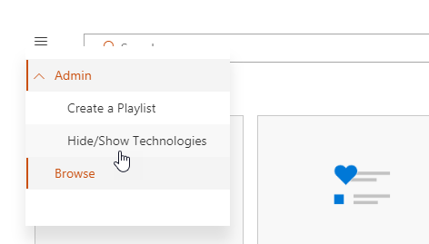

# Настройка служб и спискиCustomize the Services and Playlists

По умолчанию на взаимодействие с сайта и веб-части включать контент для всех служб Office 365.  Если только для всех или некоторых из этих служб, доступные в вашей компании можно скорректировать, какой контент доступными для пользователей.  В этой статье мы будет настраивать контент веб-части.By default both the site experience and the webpart include content for all Office 365 services.  If only all or some of these services are available in your company you can adjust what content is available to your users.  In this article we will customize the webpart content.  

## Настройка веб-части содержимогоCustomizing the webpart content

Learning настраиваемые веб-части содержит две основные возможности:The Custom Learning webpart provides two key features:
- Показать/скрыть технологийHide/Show Technologies
- Создать список воспроизведенияCreate a Playlist

### Скрытие или отображение технологии категорийHide or Show Technology Categories

Скрытие и отображение содержимого в веб-части:To hide and show content in the Web part: 
1.  Выберите в раскрывающемся меню на веб-части, а затем нажмите кнопку Показать/скрыть технологийClick the dropdown menu on the webpart, then click Hide/Show Technologies

2. Выберите checkox, чтобы скрыть или отобразить технологии и выберите **Применить**.Select a checkox to hide or show a technology and select **Apply**.

### Создать список воспроизведенияCreate a Playlist

Список воспроизведения-это compliation «ресурсов». «Актив» — это страницы SharePoint или существующий элемент Microsoft учебные материалы. При создании списка воспроизведения выбрать средства, которые используются вместе для создания план обучения для пользователей.A playlist is a compliation of "assets". An "asset" is a SharePoint page or existing item of Microsoft training content. When you create a playlist you select assets that go together to create a learning path for your user.  

— Это преимущество Добавление страниц SharePoint, что можно создавать страницы SharePoint с YouTube видео или видео, размещенного в вашей организации. Также можно создавать страницы с формами или другое содержимое Office 365.The benefit of adding SharePoint pages is that you can create SharePoint pages with a YouTube videos or videos hosted in your organization. You can also create pages with Forms or other Office 365 content.  

#### Шаг 1: Создание страницу SharePoint для списка воспроизведенияStep 1: Create a SharePoint page for your playlist
В этом примере мы сначала создайте страницу SharePoint, чтобы добавить в список воспроизведения. Мы создадим страницу с YouTube видео веб-части и текст веб-части.  Эти инструкции предполагают, что вы используете службу SharePoint Online.In this example, we’ll first create a SharePoint page to add to the playlist. We’ll create a page with a YouTube video web part and Text web part.  These instructions assume you are using the SharePoint Online service. 

#### Создание новой страницыCreate a new page
1.  Выберите параметры меню > контент сайта > страниц сайта > новой > страница сайта.Select the Settings menu > Site Contents > Site Pages > New > Site Page.
2.  В области заголовка типа используйте поле Команда группIn the title area, type Use the Teams command box
3.  Выберите Добавить новый раздел и выберите два столбца.Select the Add a new section, and then select Two Columns.

4.  В левом окне выберите Добавить новый веб-части и выберите Embed.In the left-hand box, select Add a new web part, and then select Embed. 
5.  В веб-браузере перейдите на этот URL-адрес https://youtu.be/wYrRCRphrp0 и получить код внедрения для видео.In a Web browser, go to this URL https://youtu.be/wYrRCRphrp0 and get the embed code for the video. 
6.  В веб-части SharePoint выберите Добавить внедрить код и вставьте его в поле Embed.In the SharePoint Web part, select Add Embed code and then paste it into the Embed box. 
7.  В правом поле выберите Добавить новый веб-части и затем выберите текст.In the right-hand box, select Add a new web part, and then select Text. 
8.  В веб-браузере перейдите на этот URL-адрес: https://support.office.com/en-us/article/13c4e429-7324-4886-b377-5dbed539193b и скопируйте Try его! Инструкции по со страницы и вставьте их в текст веб-части. Страница должна выглядеть следующим образом.In a Web browser, go to this URL: https://support.office.com/en-us/article/13c4e429-7324-4886-b377-5dbed539193b and copy the Try it! Instructions from the page and paste them into the Text Web part. Your page should look like the following. 

9.  Нажмите кнопку Опубликовать и затем скопируйте URL-адрес страницы и вставьте его в "Блокнот"Click Publish, and then copy the URL of the page and paste it in Notepad

#### Шаг 2: Создание списка воспроизведенияStep 2: Create the Playlist
1.  Перейдите к установленному обучения настраиваемые веб-части. Весь сайт сайтами размещены на страницу обучение для Office 365.Navigate to where you have installed the Custom Learning webpart. In the full site experience it is hosted on the Office 365 training page. 
2.  В раскрывающемся меню выберите создать новый список воспроизведения.From the dropdown menu select Create New Playlist. 

3.  Введите значения, как показано в следующем примере и выберите команду **Создать**.Fill in the values as shown in the example below and select **Create**. 

#### Шаг 3: Добавление средств в список воспроизведенияStep 3: Add assets to the playlist
На этом этапе вы добавите существующие ресурсы от корпорации Майкрософт и страницы SharePoint, которую вы создали в список воспроизведения.In this step, you’ll add existing assets from Microsoft and the SharePoint page you created to the playlist. 

1.  Нажмите кнопку меню, а затем нажмите кнопку Добавить существующий активов.Click the menu button, then click Add Existing Asset.

2.  Фильтрация на обучение группами Майкрософт > приложений Office 365Filter on Office 365 Apps > Microsoft Teams Training
3.  Добавление Добро пожаловать в Microsoft группы, получение ваша группа запущено и работает и запустите чаты и совершать звонки.Add Welcome to Microsoft Teams, Get your team up and running, and Start chats and make calls.
4.  Выберите > кнопки меню Создать активов.Select the menu button > Create Asset.
5.  Поле Команда групп используется тип в поле Название активов.Type Use the Teams command box in the Asset title box. 
6.  Вставьте SharePoint использование команды командной поле URL-адрес страницы копируются в поле содержимого активов.Paste the SharePoint Use the Teams command box page URL you copied in the Asset content field. 
7.  Теперь перейдите обратно в > настраиваемые списки > домашнюю страницу вашего первого дней с группами > используйте поле Команда группами. Страница должна выглядеть следующим образом.Now navigate back to the Home Page > Custom Playlists > Your first days with Teams > Use the Teams command box. Your page should look like the following. 

Список воспроизведения с помощью этого контента теперь будут доступны в любом месте установлены / внедренные обучения настраиваемые веб-части.Your playlist with this content will now be available anywhere you have installed / embedded the Custom Learning webpart. 

#### Вещей для обдумыванияThings to Think About

Настраиваемые списки можно использовать для помощи конечных пользователей при vareity задач.  У вас есть время выключить форма запроса?  Форма для запроса оборудования оборудование?  Любые существующие ресурсы обучения можно запрограммировать в качества.Custom playlists can be used to assist your end users in a vareity of tasks.  Do you have a time off request form?  A form to request hardware equipment?  Any existing training assets can be programmed into the experience.  
