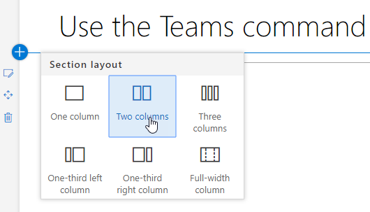

# Настройка и совместное делиться списками воспроизведенияCustomize and share playlists

## Создание списка воспроизведенияCreate a Playlist

Список воспроизведения — это соответствие "активам".A playlist is a compliation of "assets". "Актив" — это страница SharePoint или существующий элемент обучающего контента Майкрософт.An "asset" is a SharePoint page or existing item of Microsoft training content. При создании списка воспроизведения вы выбираете ресурсы, которые вместе создают путь к обучению для пользователя.When you create a playlist you select assets that go together to create a learning path for your user.  

Преимущество добавления страниц SharePoint состоит в том, что вы можете создавать страницы SharePoint с помощью видео или видео на YouTube, которые будут организованы в вашей организации.The benefit of adding SharePoint pages is that you can create SharePoint pages with a YouTube videos or videos hosted in your organization. Вы также можете создавать страницы с формами или другим контентом Office 365.You can also create pages with Forms or other Office 365 content.  

#### Шаг 1. Создание страницы SharePoint для списка воспроизведенияStep 1: Create a SharePoint page for your playlist
В этом примере сначала создадим страницу SharePoint, которая будет добавлена в список воспроизведения.In this example, we’ll first create a SharePoint page to add to the playlist. Мы создадим страницу с веб-частью видео YouTube и веб-частью Text.We’ll create a page with a YouTube video web part and Text web part.  Эти инструкции предполагают, что вы используете службу SharePoint Online.These instructions assume you are using the SharePoint Online service. 

#### Создайте новую страницуCreate a new page
1.  Выберите меню Параметры > содержимого сайта > страниц сайта > страницу > сайта.Select the Settings menu > Site Contents > Site Pages > New > Site Page.
2.  В области заголовка введите Использование командного окна TeamsIn the title area, type Use the Teams command box
3.  Выберите добавить новый раздел, а затем выберите два столбца.Select the Add a new section, and then select Two Columns.

4.  В левом окне выберите Добавить новую веб-часть, а затем выберите Embed.In the left-hand box, select Add a new web part, and then select Embed. 
5.  В веб-браузере перейдите к этому URL-адресу https://youtu.be/wYrRCRphrp0 и получите встраив код для видео.In a Web browser, go to this URL https://youtu.be/wYrRCRphrp0 and get the embed code for the video. 
6.  В веб-части SharePoint выберите Добавить код встраить, а затем вложить его в поле Embed.In the SharePoint Web part, select Add Embed code and then paste it into the Embed box. 
7.  В правом окне выберите Добавить новую веб-часть, а затем выберите Текст.In the right-hand box, select Add a new web part, and then select Text. 
8.  В веб-браузере перейдите к этому URL-адресу и https://support.office.com/article/13c4e429-7324-4886-b377-5dbed539193b скопируйте try it!In a Web browser, go to this URL: https://support.office.com/article/13c4e429-7324-4886-b377-5dbed539193b and copy the Try it! Инструкции со страницы и вклейте их в текстовую веб-часть.Instructions from the page and paste them into the Text Web part. Ваша страница должна выглядеть следующим образом.Your page should look like the following. 

9.  Нажмите **кнопку Опубликовать,** а затем скопируйте URL-адрес страницы и вклеите ее в БлокнотClick **Publish**, and then copy the URL of the page and paste it in Notepad

#### Шаг 2. Создание списка воспроизведенияStep 2: Create the Playlist

1. Перейдите на **страницу Администрирование пользовательского** обучения в вашем опыте работы с сайтом.Navigate to the **Custom Learning Administration** page in your site experience.

1. **Убедитесь, что выбрана** категорияMake sure **Category** is selected 
1. Щелкните категорию, в которой должен появиться новый плейлистClick on the category where you'd like your new playlist to appear
1. Рядом с именем категории щелкните окно плюс символ с параметром Next to the category name, click on the plus symbol 

1. Заполните значения, как показано в примере ниже, и выберите **Создать**.Fill in the values as shown in the example below and select **Create**. 

- **Название** — отображение имени списка воспроизведения**Title** - Display name of the playlist
- **Описание** . Сведения о том, что будет известно**Description** - Information about what will be learned
- **Категория** — предварительно отбираемая в зависимости от первоначального выбора**Category** - Preselected based on your initial selection
- **Sub Category** - Preselected based on your intial selection**Sub Category** - Preselected based on your intial selection
- **Технология** — выберите применимое**Technology** - Select as applicable
- **Уровень** - Beginner, Intermidate или Advanced**Level** - Beginner, Intermidate or Advanced
- **Аудитория** . Это позволяет нацелить контент на основе предварительно определенного списка ролей, предоставляемых Корпорацией Майкрософт.**Audience** - This allows you to target content based on a pre-defined list of roles provided by Microsoft.

6. Щелкните **сохранить деталь**Click **Save Detail**

> [!TIP]
> Вы можете настроить образ значка для списка воспроизведения.You can customize the icon image for your playlist.  Щелкните значок изображения и вставьте URL-адрес ранее загруженного изображения.Click the image icon and insert an URL of a previously uploaded image.  Убедитесь, что изображение находится в коллекции настраиваемого сайта обучения или в другом расположении, чтобы все пользователи получили доступ к файлу.Make sure the image is located within the Custom Learning site collection or in another location that all users will have access to the file.  

#### Шаг 3. Добавление активов в список воспроизведенияStep 3: Add assets to the playlist
На этом этапе в список воспроизведения будут добавлены существующие активы из Microsoft и страница SharePoint, созданная вами.In this step, you’ll add existing assets from Microsoft and the SharePoint page you created to the playlist. 

1. После сэкономленных сведений для списка воспроизведения можно использовать поиск существующих активов.Once you have saved the details for your Playlist you can use the Search for Existing Assets.
1. **Введите в любом термине** поиска список предопределяемых активов, доступных из других списков воспроизведения.**Enter in any search term** to see a list of predefined assets that are available from other playlists. **Щелкните имя актива,** чтобы включить его в новый плейлист.**Click on the name** of an asset to include it in your new playlist. 

Вы также можете добавить страницу SharePoint, созданную ранее, или создать ее с нуля в этом опыте.You can also add the SharePoint page you created earlier or create one from scratch in the experience.

1. Щелкните параметр **New Asset** в диалоговом окте "Активы playlist".Click on the **New Asset** option in the Playlist Assets dialog.
1. Дайте вашему активу **название**.Give your asset a **Title**. После вступив, будут отображаться дополнительные параметры.Once entered, additional options will display.

1. Теперь вы можете создать новую страницу активов в SharePoint Online или ввести URL-адрес существующей страницы, чтобы добавить ее в пользовательский список воспроизведения.You can now create a new asset page in SharePoint Online or enter in the URL of an existing page to add it to your custom playlist. 
1. **Поля категории,** **sub Category** и **Technology** будут предварительно заполнены в зависимости от предыдущих выборов для этого списка воспроизведения.**Category**, **Sub Category** and **Technology** fields will be pre-populated based on your previous selections for this playlist.
1. Сделайте соответствующие выборки для уровня и аудитории для этого отдельного актива.Make the appropriate selections for Level and Audience for this individual asset.  
1. Нажмите **кнопку Сохранить актив,** чтобы добавить его в настраиваемый список воспроизведенияClick **Save Asset** to add it to the custom playlist
1. Повторите эти действия, поиск или добавление отдельных страниц до завершения списка воспроизведения.Repeat these steps, either searching or adding individual pages, until your playlist is complete. 
1. Нажмите **кнопку Закрыть список воспроизведения,** чтобы сохранитьClick **Close Playlist** to save

Ваш плейлист с этим содержимым теперь будет доступен в любом месте, где вы установили или встроите веб-часть настраиваемой учебной системы.Your playlist with this content will now be available anywhere you have installed / embedded the Custom Learning webpart. 

> [!NOTE]
> Если вы допустили ошибку после закрытия списка воспроизведения, вы можете удалить его из категории, щелкнув X рядом с именем плейлиста.If you make a mistake once you have closed the playlist, you can delete it from the category by clicking the X next to the playlist name.  

#### Что нужно думатьThings to Think About

Настраиваемые списки воспроизведения можно использовать для оказания помощи конечным пользователям в различных задачах.Custom playlists can be used to assist your end users in a variety of tasks.  У вас есть форма запроса на время?Do you have a time off request form?  Форма для запроса оборудования?A form to request hardware equipment?  Все существующие средства подготовки можно запрограммированы на опыт.Any existing training assets can be programmed into the experience.  

## Share PlaylistsShare Playlists

1. Перейдите к любому списку воспроизведения в веб-части или на сайте.Navigate to any playlist within the webpart or site experience
1. В верхнем левом углу вы увидите три значкаIn the upper left hand corner you will see three icons
1. Щелкните значок, представляющий ссылкуClick on the icon representing a link
1. Скопируйте URL-адрес на экран плейлиста, на Copy the URL to the playlist 
Этот URL-адрес теперь можно вставить в навигацию по сайту или использовать в других сообщениях, чтобы вывести сотрудников непосредственно в этот плейлист.This URL can now be inserted in your site navigation or utilized in other communications to take your employees directly to that playlist. 

### Дальнейшие действия — [принятие диска](driveadoption.md)Next Steps - [Drive Adoption](driveadoption.md)
