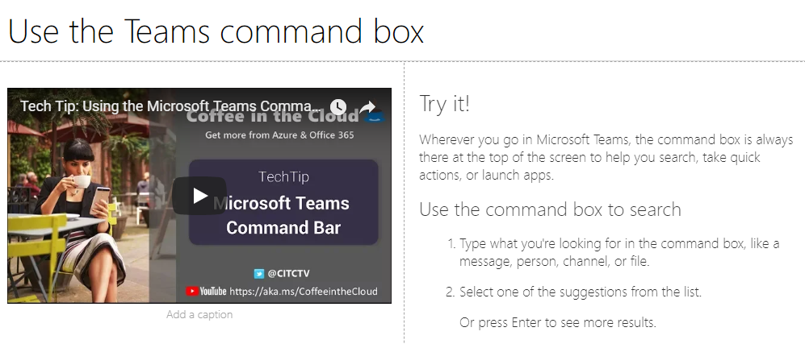

# Настройка и общий доступ к спискам воспроизведенияCustomize and Share Playlists

## Создание списка воспроизведенияCreate a Playlist

Список воспроизведения — это "ресурсы". "Актив" — это страница SharePoint или существующий элемент обучающих материалов Майкрософт. При создании списка ресурсов выберите ресурсы, которые объединяются, чтобы создать учебный путь для пользователя.A playlist is a compliation of "assets". An "asset" is a SharePoint page or existing item of Microsoft training content. When you create a playlist you select assets that go together to create a learning path for your user.  

Преимущество добавления страниц SharePoint состоит в том, что вы можете создавать страницы SharePoint с помощью видеороликов YouTube или видеороликов, размещенных в вашей организации. Кроме того, можно создавать страницы с помощью форм или другого контента Office 365.The benefit of adding SharePoint pages is that you can create SharePoint pages with a YouTube videos or videos hosted in your organization. You can also create pages with Forms or other Office 365 content.  

#### Шаг 1: Создание страницы SharePoint для списка воспроизведенияStep 1: Create a SharePoint page for your playlist
В этом примере мы сначала создадим страницу SharePoint для добавления в список воспроизведения. Мы создадим страницу с видеовеб-частью YouTube Video и текстовой веб-частью.  В этих инструкциях предполагается, что вы используете службу SharePoint Online.In this example, we’ll first create a SharePoint page to add to the playlist. We’ll create a page with a YouTube video web part and Text web part.  These instructions assume you are using the SharePoint Online service. 

#### Создание новой страницыCreate a new page
1.  Выберите меню Параметры _Гт_ контент сайта _Гт_ страницы сайта _Гт_ новая страница _Гт_ сайта.Select the Settings menu > Site Contents > Site Pages > New > Site Page.
2.  В области Заголовок введите команду использовать командное поле TeamsIn the title area, type Use the Teams command box
3.  Выберите раздел Добавить новый, а затем выберите два столбца.Select the Add a new section, and then select Two Columns.

4.  В левом поле выберите Добавить новую веб-часть, а затем нажмите кнопку внедрить.In the left-hand box, select Add a new web part, and then select Embed. 
5.  В веб-браузере перейдите по этому URL- https://youtu.be/wYrRCRphrp0 адресу и получите код внедрения для видеоролика.In a Web browser, go to this URL https://youtu.be/wYrRCRphrp0 and get the embed code for the video. 
6.  В веб-части SharePoint выберите добавить код внедрения и вставьте его в поле внедрить.In the SharePoint Web part, select Add Embed code and then paste it into the Embed box. 
7.  В правом поле выберите Добавить новую веб-часть, а затем выберите текст.In the right-hand box, select Add a new web part, and then select Text. 
8.  В веб-браузере перейдите по указанному ниже https://support.office.com/en-us/article/13c4e429-7324-4886-b377-5dbed539193b URL-адресу и скопируйте его в try! Инструкции со страницы и вставьте их в текстовую веб-часть. Страница должна выглядеть так, как показано ниже.In a Web browser, go to this URL: https://support.office.com/en-us/article/13c4e429-7324-4886-b377-5dbed539193b and copy the Try it! Instructions from the page and paste them into the Text Web part. Your page should look like the following. 

9.  Нажмите кнопку **опубликовать**, а затем СКОПИРУЙТЕ URL-адрес страницы и вставьте его в блокноте.Click **Publish**, and then copy the URL of the page and paste it in Notepad

#### Шаг 2: Создание списка воспроизведенияStep 2: Create the Playlist

1. Перейдите на страницу **настраиваемОго администрирования обучения** в интерфейсе сайта. Navigate to the **Custom Learning Administration** page in your site experience. 
1. Убедитесь, что выбран пункт **Категория**Make sure **Category** is selected 
1. Щелкните категорию, в которой будет отображаться новый список воспроизведения.Click on the category where you'd like your new playlist to appear
1. Рядом с именем категории щелкните символ Next to the category name, click on the plus symbol 

1. ЗаПолните значения, как показано в примере ниже, и выберите **создать**. Fill in the values as shown in the example below and select **Create**. 
- **Заголовок** — отображаемое имя списка воспроизведения**Title** - Display name of the playlist
- **Description (описание** ) — сведения о том, что будет изучено**Description** - Information about what will be learned
- **Категория** — предварительно выбрано в зависимости от первоначального выбора**Category** - Preselected based on your initial selection
- \*\*\*\* ПодвыбранНая Подкатегория — предварительно выбрана в зависимости от выбранного интиал**Sub Category** - Preselected based on your intial selection
- **Технология** — выберите в качестве применимым**Technology** - Select as applicable
- **Уровень** — новичок, Интермидате или Advanced**Level** - Beginner, Intermidate or Advanced
- **Аудитория** — это позволяет запланировать контент, основанный на предварительно определенном списке ролей, предоставляемых корпорацией Майкрософт.**Audience** - This allows you to target content based on a pre-defined list of roles provided by Microsoft.

6. Нажмите кнопку **сохранить сведения**Click **Save Detail**

> [!TIP]
> Вы можете настроить изображение значка для списка воспроизведения.  Щелкните значок изображения и вставьте URL-адрес ранее загруженного изображения.  Убедитесь, что изображение находится в пользовательском семействе веб-сайтов обучения или в другом расположении, доступном для всех пользователей.You can customize the icon image for your playlist.  Click the image icon and insert an URL of a previously uploaded image.  Make sure the image is located within the Custom Learning site collection or in another location that all users will have access to the file.  

#### Шаг 3: Добавление ресурсов в список воспроизведенияStep 3: Add assets to the playlist
На этом этапе вы добавите существующие ресурсы Майкрософт и страницу SharePoint, которую вы создали в списке воспроизведения.In this step, you’ll add existing assets from Microsoft and the SharePoint page you created to the playlist. 

1. После сохранения сведений для списка воспроизведения можно использовать поиск существующих ресурсов.Once you have saved the details for your Playlist you can use the Search for Existing Assets.
1. **Введите в любом** поисковом поле, чтобы просмотреть список предварительно определенных ресурсов, доступных из других списков воспроизведения. **Щелкните имя** актива, чтобы включить его в новый список воспроизведения. **Enter in any search term** to see a list of predefined assets that are available from other playlists. **Click on the name** of an asset to include it in your new playlist. 

Вы также можете добавить созданную ранее страницу SharePoint или создать ее с нуля.You can also add the SharePoint page you created earlier or create one from scratch in the experience.

1. Выберите **новый ресурс** в диалоговом окне ресурсы списка воспроизведения.Click on the **New Asset** option in the Playlist Assets dialog
1. Дайте своему ресурсу **название**. После ввода дополнительные параметры будут отображать Give your asset a **Title**. Once entered, additional options will display 
1. Теперь вы можете создать новую страницу актива в SharePoint Online или ввести URL-адрес существующей страницы, чтобы добавить ее в пользовательский список воспроизведения.You can now create a new asset page in SharePoint Online or enter in the URL of an existing page to add it to your custom playlist. 
1. Поля **Category**, **Sub Category** и **Technology** будут предварительно заполнены в соответствии с предыдущими параметрами этого списка.**Category**, **Sub Category** and **Technology** fields will be pre-populated based on your previous selections for this playlist.
1. Сделайте соответствующий выбор для уровня и аудитории для отдельного ресурса.Make the appropriate selections for Level and Audience for this individual asset.  
1. Нажмите кнопку **сохранить ресурс** , чтобы добавить его в настраиваемый список воспроизведения.Click **Save Asset** to add it to the custom playlist
1. Повторите эти действия, как поиск, так и Добавление отдельных страниц до завершения списка воспроизведения.Repeat these steps, either searching or adding individual pages, until your playlist is complete. 
1. Нажмите кнопку **Закрыть список воспроизведения** , чтобы сохранитьClick **Close Playlist** to save

Теперь список воспроизведения с этим содержимым будет доступен в любой точке, где установлена или встроена пользовательская веб-часть Learning.Your playlist with this content will now be available anywhere you have installed / embedded the Custom Learning webpart. 

> [!NOTE]
> Если вы закрыли список воспроизведения, вы можете удалить его из категории, щелкнув значок X рядом с именем списка воспроизведения.If you make a mistake once you have closed the playlist, you can delete it from the category by clicking the X next to the playlist name.  

#### Вопросы, которые следует учитыватьThings to Think About

Настраиваемые списки воспроизведения можно использовать, чтобы помочь конечным пользователям выполнять различные задачи.  У вас есть форма запроса времени отсутствия?  Форма для запроса аппаратного оборудования?  Все имеющиеся учебные ресурсы могут программироваться в интерфейсе.Custom playlists can be used to assist your end users in a variety of tasks.  Do you have a time off request form?  A form to request hardware equipment?  Any existing training assets can be programmed into the experience.  

## Общий доступ к спискам воспроизведенияShare Playlists

1. Переход к любому списку воспроизведения в веб-части или интерфейсе сайтаNavigate to any playlist within the webpart or site experience
1. В верхнем левом углу отображаются три значка.In the upper left hand corner you will see three icons
1. Щелкните значок, представляющий ссылкуClick on the icon representing a link
1. Копирование URL-адреса в список воспроизведенияCopy the URL to the playlist

 PNG теперь этот URL-адрес можно вставить в навигацию по сайту или использовать в других сообщениях, чтобы перевести сотрудников прямо в этот список. This URL can now be inserted in your site navigation or utilized in other communications to take your employees directly to that playlist. 

### Дальнейшие действия — [внедрение диска](driveadoption.md)Next Steps - [Drive Adoption](driveadoption.md)
