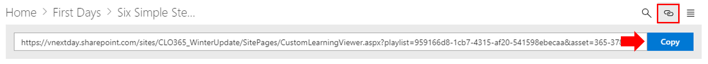

# Настройка и общий доступ к спискам воспроизведения

## Создание списка воспроизведения

Список воспроизведения — это "ресурсы". "Актив" — это страница SharePoint или существующий элемент обучающих материалов Майкрософт. При создании списка ресурсов выберите ресурсы, которые объединяются, чтобы создать учебный путь для пользователя.  

Преимущество добавления страниц SharePoint состоит в том, что вы можете создавать страницы SharePoint с помощью видеороликов YouTube или видеороликов, размещенных в вашей организации. Кроме того, можно создавать страницы с помощью форм или другого контента Office 365.  

#### Шаг 1: Создание страницы SharePoint для списка воспроизведения
В этом примере мы сначала создадим страницу SharePoint для добавления в список воспроизведения. Мы создадим страницу с видеовеб-частью YouTube Video и текстовой веб-частью.  В этих инструкциях предполагается, что вы используете службу SharePoint Online. 

#### Создайте новую страницу
1.  Выберите меню Параметры > контент сайта > страницах сайта > новая страница > сайта.
2.  В области Заголовок введите команду использовать командное поле Teams
3.  Выберите раздел Добавить новый, а затем выберите два столбца.

4.  В левом поле выберите Добавить новую веб-часть, а затем нажмите кнопку внедрить. 
5.  В веб-браузере перейдите по этому URL-адресу https://youtu.be/wYrRCRphrp0 и получите код внедрения для видеоролика. 
6.  В веб-части SharePoint выберите добавить код внедрения и вставьте его в поле внедрить. 
7.  В правом поле выберите Добавить новую веб-часть, а затем выберите текст. 
8.  В веб-браузере перейдите по указанному ниже URL-адресу https://support.office.com/article/13c4e429-7324-4886-b377-5dbed539193b и скопируйте его в try! Инструкции со страницы и вставьте их в текстовую веб-часть. Страница должна выглядеть так, как показано ниже. 

9.  Нажмите кнопку **опубликовать**, а затем скопируйте URL-адрес страницы и вставьте его в блокноте.

#### Шаг 2: Создание списка воспроизведения

1. Перейдите на страницу **настраиваемого администрирования обучения** в интерфейсе сайта.

1. Убедитесь, что выбран пункт **Категория** 
1. Щелкните категорию, в которой будет отображаться новый список воспроизведения.
1. Рядом с именем категории щелкните символ "плюс" 

1. Заполните значения, как показано в примере ниже, и выберите **создать**. 

- **Заголовок** — отображаемое имя списка воспроизведения
- **Description (описание** ) — сведения о том, что будет изучено
- **Категория** — предварительно выбрано в зависимости от первоначального выбора
- Подвыбранная **Подкатегория** — предварительно выбрана в зависимости от выбранного интиал
- **Технология** — выберите в качестве применимым
- **Уровень** — новичок, Интермидате или Advanced
- **Аудитория** — это позволяет запланировать контент, основанный на предварительно определенном списке ролей, предоставляемых корпорацией Майкрософт.

6. Нажмите кнопку **сохранить сведения**

> [!TIP]
> Вы можете настроить изображение значка для списка воспроизведения.  Щелкните значок изображения и вставьте URL-адрес ранее загруженного изображения.  Убедитесь, что изображение находится в пользовательском семействе веб-сайтов обучения или в другом расположении, доступном для всех пользователей.  

#### Шаг 3: Добавление ресурсов в список воспроизведения
На этом этапе вы добавите существующие ресурсы Майкрософт и страницу SharePoint, которую вы создали в списке воспроизведения. 

1. После сохранения сведений для списка воспроизведения можно использовать поиск существующих ресурсов.
1. **Введите в любом** поисковом поле, чтобы просмотреть список предварительно определенных ресурсов, доступных из других списков воспроизведения. **Щелкните имя** актива, чтобы включить его в новый список воспроизведения.

Вы также можете добавить созданную ранее страницу SharePoint или создать ее с нуля.

1. Выберите **новый ресурс** в диалоговом окне ресурсы списка воспроизведения.
1. Дайте своему ресурсу **название**. После ввода дополнительные параметры будут отображаться 
1. Теперь вы можете создать новую страницу актива в SharePoint Online или ввести URL-адрес существующей страницы, чтобы добавить ее в пользовательский список воспроизведения. 
1. Поля **Category**, **Sub Category** и **Technology** будут предварительно заполнены в соответствии с предыдущими параметрами этого списка.
1. Сделайте соответствующий выбор для уровня и аудитории для отдельного ресурса.  
1. Нажмите кнопку **сохранить ресурс** , чтобы добавить его в настраиваемый список воспроизведения.
1. Повторите эти действия, как поиск, так и Добавление отдельных страниц до завершения списка воспроизведения. 
1. Нажмите кнопку **Закрыть список воспроизведения** , чтобы сохранить

Теперь список воспроизведения с этим содержимым будет доступен в любой точке, где установлена или встроена пользовательская веб-часть Learning. 

> [!NOTE]
> Если вы закрыли список воспроизведения, вы можете удалить его из категории, щелкнув значок X рядом с именем списка воспроизведения.  

#### Вопросы, которые следует учитывать

Настраиваемые списки воспроизведения можно использовать, чтобы помочь конечным пользователям выполнять различные задачи.  У вас есть форма запроса времени отсутствия?  Форма для запроса аппаратного оборудования?  Все имеющиеся учебные ресурсы могут программироваться в интерфейсе.  

## Общий доступ к спискам воспроизведения

1. Переход к любому списку воспроизведения в веб-части или интерфейсе сайта
1. В верхнем левом углу отображаются три значка.
1. Щелкните значок, представляющий ссылку
1. Копирование URL-адреса в список воспроизведения

 этот URL-адрес теперь можно вставить в навигацию по сайту или использовать в других сообщениях, чтобы перевести сотрудников прямо в этот список. 

### Дальнейшие действия — [внедрение диска](driveadoption.md)
