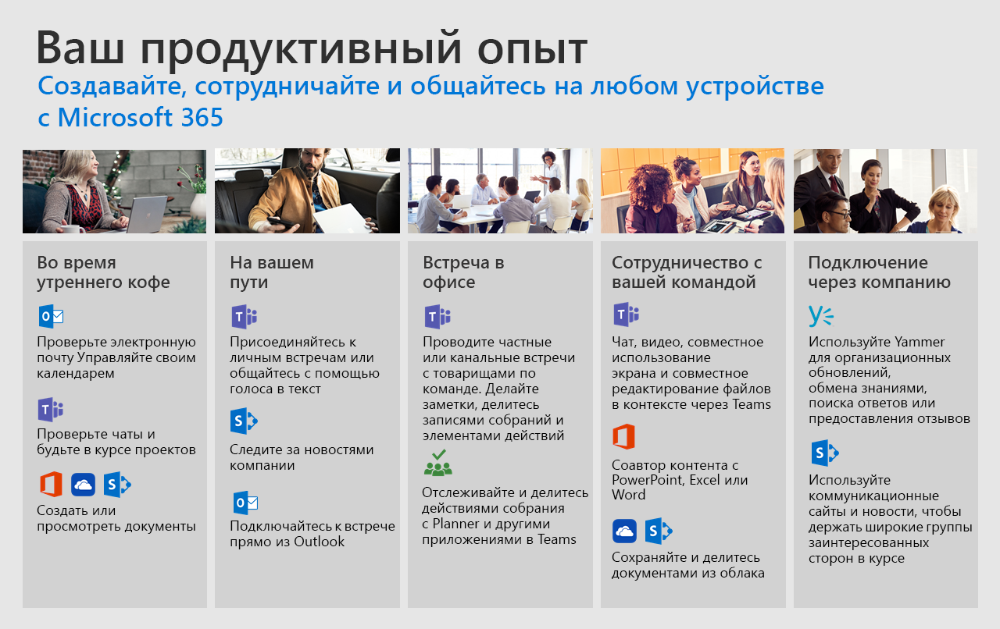

# День жизни в Office 365Day in the Life with Office 365

Используйте облачные службы Office 365 для усовершенствования своей работы на любом устройстве.Use Office 365 cloud services to improve your teamwork on any device.  ПроСледите за этими распространенными сценариями, чтобы узнать, как вы можете упростить процесс совместной работы, общения и создания контента, когда вы просматриваете свой день.Follow us through these common scenarios to see how you can streamline your collaboration, communication, and content creation as you go through your day.  

