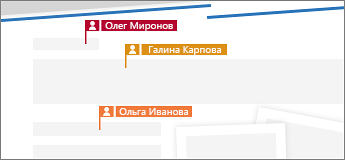
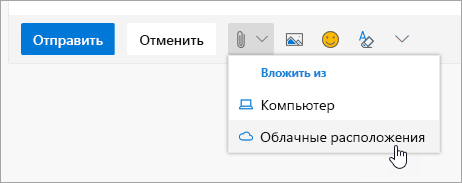

# Совместная работа с коллегамиCollaborating with Colleagues

Это 2:00 PM и времени для совместной работы с коллегами. Office 365 предоставляет лучшие в своем классе возможности для совместной работы, позволяя группам для совместной работы в следующих случаях.It's 2:00 PM and time to collaborate with colleagues. Office 365 provides best-in-class opportunities for collaboration, enabling teams to work together in a number of ways. 

## СредстваTools
- Microsoft TeamsMicrosoft Teams
- Office OnlineOffice Online
- OneNoteOneNote
- SharePoint & OneDriveSharePoint & OneDrive
- 
## Контрольный список для совместной работы с коллегамиChecklist for collaborating with colleagues
- Создание или присоединение к ней группы разработчиков Microsoft для совместной работыCreate or join a Microsoft Team to collaborate
- Создание и совместное использование файлов из службы OneDriveCreate and share files from OneDrive 
- Совместное создание в Office 365Co-create in Office 365 
- Используйте облачных вложенияUse cloud attachments

## Создание или присоединение к ней группы разработчиков Microsoft для совместной работыCreate or join a Microsoft Team for collaboration

Группами Майкрософт и каналы являются местах, где пользователи могут сотрудничать, общий доступ к файлам, отслеживание действий группы и многое другое. Каждые группами Майкрософт имеет интеграции в сайт SharePoint, записной книжки OneNote и других ресурсов. Эта служба Office 365 лучше всего использовать для пользователей, которые часто совместной работы над общих проектов или результатов.Microsoft Teams and channels are places where people can collaborate by sharing files, tracking team action items and much more. Every Microsoft Teams has an integration into a SharePoint site, a OneNote notebook and other assets. This service of Office 365 is best used for people who work together frequently on shared projects or outcomes. 

## Совместное использование файлов из вашего OneDriveShare Files from your OneDrive
Файлы, сохраненные на OneDrive для бизнеса могут совместно с кем-либо из браузера или приложения для настольных компьютеров Office 365 как Word или Excel. Можно использовать совместно с отдельных пользователей, используя свои имя, псевдоним или адрес электронной почты организации.Files that have been saved on OneDrive for Business can be shared with anyone either from the browser or Office 365 desktop applications like Word or Excel. It is possible to share with individuals using their name, alias, or company email address. 

## Совместное создание в Office 365Co-create in Office 365
Совместного создания — при работе одновременно с коллегах на тот же файл. Это возможно в версии веб-приложений Office 365 основных и рабочему столу версиях этих приложений из Office 2016 и далее.  Сохранить время и трудозатраты на ту же документа и Office будет выполнять синхронизацию изменений, даже в том случае, если один из вы находится в автономном режиме.Co-creation is when we work simultaneously with colleagues on the same file. This is possible in the web-based versions of the core Office 365 apps and in the desktop versions of those applications from Office 2016 onward.  Save time and work together on the same document and Office will synchronize those changes for you, even if one of you is offline. 

## Используйте вложения Cloud - остановить отправка по электронной почте, электронных таблиц!Use Cloud Attachments - Stop Emailing that Spreadsheet!
Сколько раз были применены значительных правом версий документа при присоединении сообщения электронной почты? Теперь в Office 365 можно передать ссылку на файл с именем вложения в облаке, чтобы все редактирует той же версии.  Можно выбрать, либо отправить ссылку и ли людей можно просматривать или изменять файл.How many times have you had to hunt for the right version of a document when it was attached to an email? Now in Office 365 you can share a link to the file, called a cloud attachment, so that everyone is editing the same version.  You can chose to either send a link and whether or not people can view or edit the file. 

