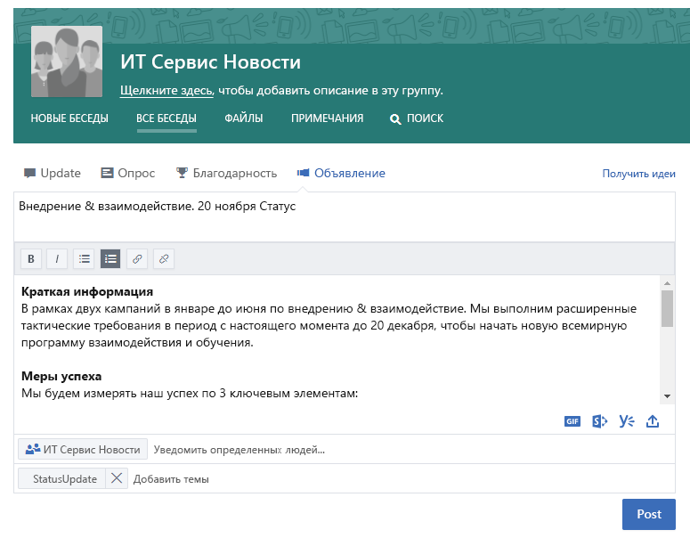
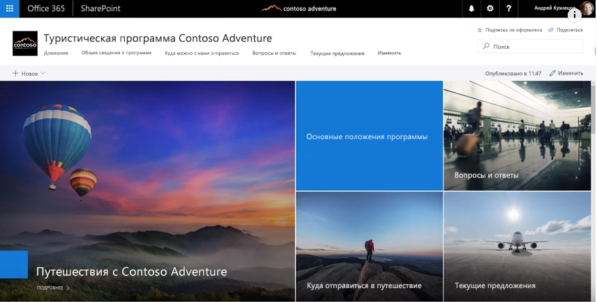
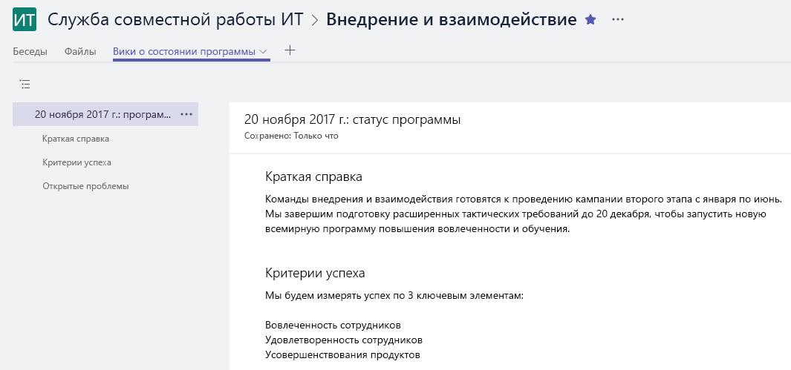

# Подключение через компанию

Это был напряженный день, но прежде чем покинуть офис, вы хотите, чтобы все люди, заинтересованные в вашей работе, были проинформированы о происходящем. Убедиться в том, что все ваши заинтересованные стороны - как внутри вашей команды, так и за ее пределами - понимают ваши цели, прогресс и результаты, являются важной частью того, что вы делаете.  

## Инструменты
- SharePoint
- Yammer
- Outlook
- Microsoft Teams 

## Контрольный список для общения по всей компании
- Понять вашу аудиторию и их существующие методы общения
- Ориентируйте свои ключевые сообщения на персону, например, участника проекта, члена команды или сотрудника
- Выберите средства коммуникации, которые дополняют друг друга, например, создайте сообщение в своем сообществе Yammer и отправьте уведомление по электронной почте 
- Соавтор вашей информации с другими членами вашей команды
- Опубликуйте свою информацию и отправьте уведомление всем заинтересованным сторонам. 
 
## Выберите способ связи
Используйте информацию ниже, чтобы решить, как лучше общаться с вашей командой. Баланс с использованием новых технологий с традиционными объявлениями по электронной почте, в то время как люди переходят на новые методы связи. Наличие последовательного коммуникационного подхода является эффективным способом повышения осведомленности и организационных изменений. 

**Yammer**: С помощью Yammer вы можете обмениваться сообщениями с широкой группой людей. Опубликуйте стандартное обновление или используйте функцию объявления, чтобы копия вашего обновления отправлялась в почтовый ящик каждого участника. 

**SharePoint**: Если вы хотите привлечь людей за пределами вашей рабочей группы, рассмотрите возможность написания краткой новостной статьи о вашем уставе и прогрессе, которая легко доступна и поддерживается в течение всего жизненного цикла вашего проекта в SharePoint в Интернете. Используйте современную страницу на сайте группы SharePoint или для более крупных программ рассмотрите возможность создания сайта связи SharePoint. 

Коммуникационные сайты SharePoint предоставляют наглядные и гибкие новостные статьи, которые позволяют объединять изображения, информационные панели и текст. Затем информация доступна через любой браузер или мобильное приложение SharePoint. В этом видео представлен краткий обзор возможностей этих мощных сайтов. Чтобы обеспечить лучшую видимость, закрепите сайт связи как вкладку для вашей рабочей группы в Microsoft Teams.

**Microsoft Teams**: Если эта широкая группа людей уже является частью вашей рабочей группы в командах Microsoft, почему бы не опубликовать заметку в вашем общем канале с ключевыми фактами и ссылкой на вики-страницу для вашего более позднего обновления.  Вики-страницы могут быть соавторами нескольких человек и сохраняться в течение всей жизни этой команды. 

## Совет модернизировать ваше общение

**Для ваших коллег, ориентированных на электронную почту**: подпишитесь на оповещения из вашей группы Yammer или из вашей ленты новостей SharePoint.  Таким образом, они получат в своем электронном письме уведомление о том, что вы опубликовали новую информацию, и затем смогут перейти к вашей исходной информации без необходимости создавать отдельное электронное письмо.  Хотите стать шикарным?  Настройте уведомление с помощью Microsoft Flow или PowerApps. Подумайте о том, чтобы иметь коричневую сумку, чтобы показать этим пользователям, как использовать Microsoft Teams, SharePoint или Yammer на своих мобильных устройствах. 

**Заставьте людей говорить!** Поощряйте участие, включив комментарии для своих страниц сайта общения SharePoint.  Если вы используете Yammer, убедитесь, что люди участвуют в вашем сообществе, регулярно следя за его вопросами, на которые вы можете ответить. 

**Общий внешний доступ**: Microsoft Teams, SharePoint и Yammer поддерживают внешний общий доступ, если ваш администратор разрешает это в вашем экземпляре Office 365.  Используя внешний обмен, вы можете делиться своими обновлениями с людьми, которые работают на партнеров, поставщиков и, конечно, ваших клиентов.