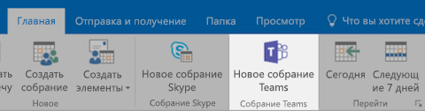
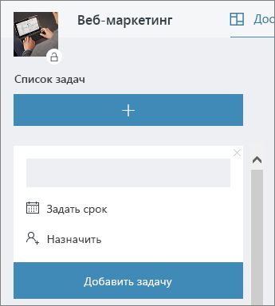

# Встреча в офисе

Сейчас 10:00 и время вашей встречи. В этом разделе мы покажем вам, как сделать ваши встречи более продуктивными.  Это включает в себя передовые практики для подготовки к собраниям и инструменты Office 365.  

## Инструменты
- Outlook
- Microsoft Teams
- Skype для бизнеса
- OneNote

## Контрольный список для вашей встречи
- Планируйте и бронируйте свою встречу
- Присоединение к собранию
- Предоставить информацию на встрече
- Используйте OneNote на собрании для совместного создания и заметок
- Используйте Планировщик на собрании, чтобы отслеживать элементы действий для этого проекта
- Завершить встречу
 
## Планируйте и бронируйте свою встречу
Есть несколько вещей, которые вы можете сделать, чтобы ваша встреча была максимально продуктивной:

1. **Вам нужна встреча?** Вначале рассмотрите возможность обмена файлом в чате с необходимыми утверждающими.  
1. **Имейте четкую повестку дня.**  Включите вашу повестку дня в раздел заметок вашего онлайн приглашения на собрание, чтобы участники могли быть готовы.
1. **Записывайте ваши встречи**  Используйте функции записи встречи в Microsoft Teams, чтобы делиться встречей с людьми, которые не могли присутствовать, или записывать записи позже.  

Теперь вы готовы зарезервировать это собрание: забронируйте собрание с помощью Microsoft Teams или Skype для бизнеса в Outlook. Это позволяет вам включать членов команды из разных мест, записывать собрание и использовать видео (при наличии) для улучшения связи. 

## Присоединение к собранию
Присоединяйтесь откуда угодно. Присоединиться к встрече Microsoft Teams или Skype для бизнеса можно из любого места, используя мобильное устройство, либо позвонив по номеру телефона, указанному в сведениях о встрече, либо с помощью мобильных приложений. При использовании мобильных приложений учитывайте ограничения на использование мобильных данных, применимые к вам или вашей стране.

> [!TIP]
> **Используйте гарнитуру.** Если вы подключаетесь со своего компьютера за столом, используйте гарнитуру, а не встроенный микрофон и динамики компьютера, чтобы обеспечить лучшее качество связи.

> [!TIP]
> Включите видео. Когда камеры доступны, их стоит использовать, так как общение лицом к лицу дает невербальные сигналы, которые можно пропустить при использовании только голоса. Не волнуйтесь, ваши волосы выглядят великолепно. 

## Предоставить информацию на встрече
Обмен контентом с вашего устройства - отличный способ сфокусировать ваше собрание и предоставить контекст для обсуждения. В общем, совместное использование всего экрана может быть плохой идеей. Это означает, что все, что появляется на вашем экране, будет отображаться на экранах всех присутствующих на собрании. Чтобы избежать этого, просто выберите контент, которым вы хотите поделиться в Microsoft Teams. 

## Используйте OneNote на собрании
OneNote может обеспечить совместную работу и совместное создание в режиме реального времени, что делает его идеальным инструментом для мозгового штурма и ведения заметок на собраниях. Если у всех есть доступ к месту, где размещен OneNote, вы можете опубликовать ссылку на блокнот и сразу же приступить к мозговому штурму.

Вы можете создать специальный раздел для заметок о встрече в записной книжке группы. Вы также можете использовать функцию «Сведения о собрании» в OneNote для создания страниц со сводкой сведений о собрании.

## Использовать Планировщик на встрече
Непосредственное добавление элементов действий в план вашего проекта избавляет вас от необходимости транскрибировать их по факту. На больших совещаниях проекта рекомендуется назначать кого-то для отслеживания действий и ведения заметок. Обычно это лицо, отличное от человека, на котором выполняется собрание. Напоминания об элементе действия отправляются непосредственно тому лицу, которому он назначен, а также напоминания, если элемент проходит срок выполнения. 

## Завершить встречу
Когда все в повестке дня будет обсуждено, закончите собрание, независимо от времени. Назначьте и отправьте элементы действий всем участникам. Если вы сотрудничаете в Microsoft Teams, вы можете легко обмениваться элементами действий в соответствующем канале. Элементы действий также можно вводить и назначать в Планировщике во время собрания, обеспечивая быстрый способ отслеживания выполнения, к которому также можно получить [доступ в Microsoft Teams](https://support.office.com/article/use-planner-in-microsoft-teams-62798a9f-e8f7-4722-a700-27dd28a06ee0). 