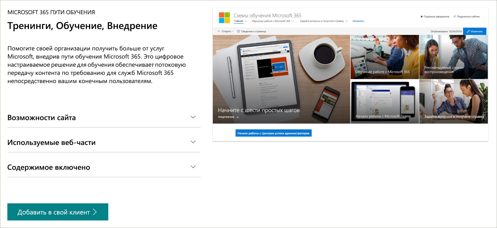

# Пути для обучения Microsoft 365Microsoft 365 learning pathways 
Microsoft 365 Learning путей это настраиваемое решение для обучения по запросу, разработанное для улучшения использования и внедрения служб Microsoft 365 в вашей организации.Microsoft 365 learning pathways is a customizable, on-demand learning solution designed to increase usage and adoption of Microsoft 365 services in your organization.   

## Пользовательское обучение по требованию от корпорации МайкрософтOn-demand, custom training from Microsoft

Microsoft 365 Learning путей предлагает:Microsoft 365 learning pathways offers:

- **Полностью настраиваемый сайт для общения в SharePoint Online** — учебный портал "пути для обучения" можно настроить для добавления справки, поддержки и контента сообщества в Организации.**A fully customizable SharePoint Online communication site** - The learning pathways training portal can be customized to add your organization's help, support, and community content
- **Простота подготовки** — подготовка путей обучения от службы подготовки SharePoint Online с помощью всего лишь нескольких простых действий**Easy provisioning** - Provision learning pathways from the SharePoint Online Provisioning Service with just a few easy steps
- **Возможность создавать собственные списки воспроизведения для обучения** с помощью путей обучения позволяет создавать целевые списки воспроизведения для удовлетворения уникальных потребностей в среде.**The ability to create your own training playlists** - with learning pathways, you can create targeted training playlists to meet the unique needs of your environment
- **Актуальные** пути обучения контента предоставляют контент через каталог содержимого Microsoft Online, поэтому контент сайта регулярно обновляется.**Up-to-date content** - Learning pathways provides content through a Microsoft online content catalog, so the content at your site is regularly updated

> [!VIDEO https://www.microsoft.com/videoplayer/embed/RE42hMy]

## Служба подготовки SharePoint OnlineSharePoint Online Provisioning Service 
Пути для обучения можно подготовить из службы подготовки SharePoint Online.Learning pathways can be provisioned from the SharePoint Online Provisioning Service. Когда подготовка путей обучения Microsoft 365 выполнена, организациям предоставляется сайт для обмена данными в SharePoint Online, разработанный как готовый обучающий портал, а также веб-часть "пути для обучения", подключенную к интерактивному каталогу обучающих материалов.When Microsoft 365 learning pathways is provisioned, organizations get a SharePoint Online communication site designed to be an out-of-the box training portal, along with a learning pathways Web part connected to an online catalog of training content. 

## 3 простых действия3 Easy Steps
Давайте приступим к созданию интерфейса обучающих путей для вашей среды.Let's get started creating a learning pathways experience for your environment.
1. Выберите [параметр установки](custom_setupoptions.md) и предоставьте Microsoft 365 обучающие пути.Choose a [setup option](custom_setupoptions.md) and provision Microsoft 365 learning pathways.  
2. Адаптация путей обучения для вашей среды.Tailor learning pathways for your environment.
3. Совместное использование обучающих путей с пользователями с помощью наших [средств внедрения](driveadoption.md).Share learning pathways with your users using our [adoption tools](driveadoption.md).

## Отзывы и поддержкаFeedback and Support

Microsoft 365 Learning путей это проект с открытым кодом, поддерживаемый в нашем [списке проблем в Интернете](https://aka.ms/CustomLearningHelp) на сайте GitHub.Microsoft 365 learning pathways is an open source project supported through our [online issues list](https://aka.ms/CustomLearningHelp) on GitHub. Решение в отношении обучающих путей и компонентов не распространяется на любой существующий контракт службы поддержки Майкрософт.The learning pathways solution and it's components are not covered by any existing Microsoft support contract.  

## Дополнительные ресурсыAdditional Resources
Вы можете использовать сайт путей обучения Microsoft 365, чтобы предоставить ссылки на любые новые или существующие форумы сообщества пользователей.You can use the Microsoft 365 learning pathways site to provide links to any new or existing user community forums. Рекомендуется запустить внутреннюю группу пользователей, если у вас ее еще нет, чтобы предоставить пользователям доступ к успехам и изучению.Consider starting an internal user group, if you don't have one already, to enable people to share their success and learn from each other.  Если у вас нет времени помогайте внутреннюю группу пользователей, вы и ваши сотрудники могут присоединиться к [сообществу Microsoft Office 365 лидера по](https://aka.ms/O365Champions) для проведения ежемесячного обучения, участия в Интернет-сообществах и раннего доступа к средствам и ресурсам для Office 365.If you don't have time to nurture an internal user group, you and your employees can join the [Microsoft Office 365 Champion community](https://aka.ms/O365Champions) for monthly training, membership in the online community, and early access to tools and resources for Office 365.