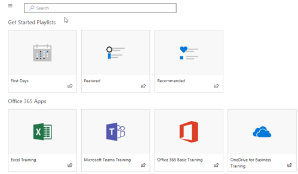

# Установка настраиваемого обучения решения веб-частиInstalling the Custom Learning Solution Webpart

## Необходимые условия для установки клиента всейPrerequisites for a tenant-wide installation

- Установка обучения настраиваемые веб-части для всей клиента необходимо иметь права администратора Office 365.  Если эти разрешения можно вместе с администратором Office 365 или установить веб-части для отдельного семейства узлов.To install the Custom Learning webpart for your entire tenant you will need to have Office 365 Administrative permissions.  If you do not have these permissions you can either work with your Office 365 Administrator or install the webpart for an individual site collection.
- Пользователь или администратор Office 365 должны иметь программы установки и настройки клиента всей [Каталога приложений](https://docs.microsoft.com/en-us/sharepoint/dev/spfx/set-up-your-developer-tenant) или [Каталоге приложений семейства сайтов](https://docs.microsoft.com/en-us/sharepoint/dev/general-development/site-collection-app-catalog)для получения веб-части.]You or your Office 365 Administrator must have setup and configured a tenant-wide [App Catalog](https://docs.microsoft.com/en-us/sharepoint/dev/spfx/set-up-your-developer-tenant) or a [Site Collection App Catalog](https://docs.microsoft.com/en-us/sharepoint/dev/general-development/site-collection-app-catalog)to receive the webpart.]
- Мы только поддерживает SharePoint Online. Веб-часть не поддерживается для установки на любой версии SharePoint локально.We support SharePoint Online only. The web part is not support for installation on any version of SharePoint on premises.

## Добавление обучения настраиваемые веб-части к клиентуAdd the Custom Learning webpart to your tenant 

1. Загрузите обучения настраиваемые веб-части и сохраните его на локальный диск.  Этот файл называется «ms-custom-learning.sppkg».  Не изменяйте имя или суффикс файла.Download the Custom Learning webpart and save it to your local drive.  This file is named "ms-custom-learning.sppkg".  Do not change the name or suffix of the file. 
2. Перейдите на [портал администрирования Office 365](https://admin.microsoft.com/AdminPortal/Home#/homepage) для клиентаNavigate to the [Office 365 Admin portal](https://admin.microsoft.com/AdminPortal/Home#/homepage) for your tenant
3. В левой панели навигации выберите центры администрирования SharePoint. Откроется в новой вкладке, выберите приложения в центр администрирования SharePoint, каталог приложений, приложений для SharePointFrom the left navigation select Admin Centers, SharePoint. This will open in a new tab. , In the SharePoint Admin Center select Apps, App Catalog, Apps for SharePoint 
4. Выбор Отправка веб-части и выберите загруженный файл «ms-custom-learning.sppkg»Select upload the webpart and choose the "ms-custom-learning.sppkg" file you downloaded
5. Для установки клиента всей установите флажок рядом с пунктом «Сделать это решение, доступное для всех документа в организации».For this tenant-wide installation check the box next to "Make this solution available to all sits in the organization."  

## Добавление веб-части клиента обучения на страницу SharePoint OnlineAdd the Customer Learning webpart to a SharePoint Online Page

После установки настраиваемых обучения клиента можно добавить веб-части на страницу SharePoint. В этом случае внезапно обучения Office 365 доступен.After Custom Learning is installed in your tenant you can add the Web part to a SharePoint page. When you do, suddenly Office 365 training is available to you. 

1. Добавьте обучения настраиваемые веб-части в макете полной ширины столбца:Add the Custom Learning webpart in a full width column layout:

2. На странице SharePoint выберите Добавить раздел, а затем выберите полной ширины столбца.  Вы увидите следующее сообщение:In the SharePoint page, select Add section and then select full width column.  You'll see the following prompt:

3. Выберите Microsoft Learning.  Должна появиться следующее:Select Microsoft Learning.  You should now see the following: 

 Теперь можно щелкнуть заголовков для изучения содержимого по умолчанию, входящие в состав решения.You can now click on the tiles to explore the default content included in the solution.  

## Дальнейшие действияNext Steps
- Обзор [содержимого по умолчанию](webpartcontent.md) , включенные в веб-части.Explore the [default content](webpartcontent.md) included in the webpart.
- [Настройка](customization.md) качества обучения для вашей организации.[Customize](customization.md) the training experience for your organization.
- [Внедрения](driveadoption.md) решения для обучения.[Drive adoption](driveadoption.md) of your training solution.

