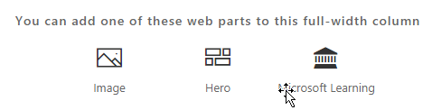

# Установка настраиваемого обучения решения веб-части

## Необходимые условия для установки клиента всей

- Установка обучения настраиваемые веб-части для всей клиента необходимо иметь права администратора Office 365.  Если эти разрешения можно вместе с администратором Office 365 или установить веб-части для отдельного семейства узлов.
- Пользователь или администратор Office 365 должны иметь программы установки и настройки клиента всей [Каталога приложений](https://docs.microsoft.com/en-us/sharepoint/dev/spfx/set-up-your-developer-tenant) или [Каталоге приложений семейства сайтов](https://docs.microsoft.com/en-us/sharepoint/dev/general-development/site-collection-app-catalog)для получения веб-части.]
- Мы только поддерживает SharePoint Online. Веб-часть не поддерживается для установки на любой версии SharePoint локально.

## Добавление обучения настраиваемые веб-части к клиенту 

1. Загрузите обучения настраиваемые веб-части и сохраните его на локальный диск.  Этот файл называется «ms-custom-learning.sppkg».  Не изменяйте имя или суффикс файла. 
2. Перейдите на [портал администрирования Office 365](https://admin.microsoft.com/AdminPortal/Home#/homepage) для клиента
3. В левой панели навигации выберите центры администрирования SharePoint. Откроется в новой вкладке, выберите приложения в центр администрирования SharePoint, каталог приложений, приложений для SharePoint 
4. Выбор Отправка веб-части и выберите загруженный файл «ms-custom-learning.sppkg»
5. Для установки клиента всей установите флажок рядом с пунктом «Сделать это решение, доступное для всех документа в организации».  

## Добавление веб-части клиента обучения на страницу SharePoint Online

После установки настраиваемых обучения клиента можно добавить веб-части на страницу SharePoint. В этом случае внезапно обучения Office 365 доступен. 

1. Добавьте обучения настраиваемые веб-части в макете полной ширины столбца:

2. На странице SharePoint выберите Добавить раздел, а затем выберите полной ширины столбца.  Вы увидите следующее сообщение:

3. Выберите Microsoft Learning.  Должна появиться следующее: 

 Теперь можно щелкнуть заголовков для изучения содержимого по умолчанию, входящие в состав решения.  

## Дальнейшие действия
- Обзор [содержимого по умолчанию](webpartcontent.md) , включенные в веб-части.
- [Настройка](customization.md) качества обучения для вашей организации.
- [Внедрения](driveadoption.md) решения для обучения.

