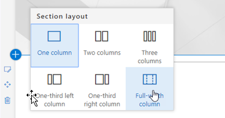

# Установка настраиваемой веб-части решения для обучения

## Необходимые условия для установки на уровне клиента

- Чтобы установить настраиваемую веб-часть обучения для всего клиента, необходимо иметь административные разрешения Office 365.  Если у вас нет этих разрешений, вы можете работать с администратором Office 365 или установить веб-часть для отдельного семейства веб-сайтов.
- Для получения веб-части необходимо, чтобы администратор Office 365 выполнил настройку и настроила [Каталог приложений](https://docs.microsoft.com/en-us/sharepoint/dev/spfx/set-up-your-developer-tenant) на уровне клиента или [Каталог приложений для семейства веб-сайтов](https://docs.microsoft.com/en-us/sharepoint/dev/general-development/site-collection-app-catalog).]
- Мы поддерживаем только SharePoint Online. Веб-часть не поддерживает установку в локальной версии SharePoint.

## Добавление настраиваемой веб-части обучения в клиент 

1. Скачайте настраиваемую веб-часть обучения и сохраните ее на локальном диске.  Этот файл называется "MS-Custom-Learning. sppkg".  Не изменяйте имя или суффикс файла. 
2. Перейдите на [портал администрирования Office 365](https://admin.microsoft.com/AdminPortal/Home#/homepage) для своего клиента.
3. В области навигации слева выберите пункт центры администрирования SharePoint. Откроется новая вкладка. в центре администрирования SharePoint выберите приложения, Каталог приложений, приложения для SharePoint. 
4. Выберите отправить веб-часть и выберите загруженный файл MS-Custom-Learning. sppkg
5. Для этой установки на уровне клиента установите флажок рядом с пунктом "сделать это решение доступным для всех почтовых организаций".  
 
> [!NOTE]
> После установки веб-части ее можно будет найти в коллекции веб-частей в SharePoint Online.  **В коллекции веб-часть называется "обучение Майкрософт"**

## Добавление веб-части "обучение Майкрософт" на страницу SharePoint Online

После установки в клиенте настраиваемого обучения можно добавить веб-часть на страницу SharePoint. Если вы выполняете обучение по Office 365 и Windows 10, вы можете использовать сайт.

1. Добавьте пользовательскую веб-часть Learning в макет столбца "полная ширина":

2. На странице SharePoint выберите Добавить раздел, а затем выберите столбец "полная ширина".  Появится следующее сообщение:

3. Выберите пункт обучение Майкрософт.  Теперь должны отобразиться следующие компоненты: 

 Теперь вы можете щелкнуть плитку, чтобы просмотреть контент по умолчанию, включенный в решение.  

### Дальнейшие действия
- ИзУчите [контент по умолчанию](webpartcontent.md) , включенный в веб-часть.
- [Настройка](customization.md) обучающих интерфейсов для Организации.
- [Внедрение](driveadoption.md) вашего учебного решения.

