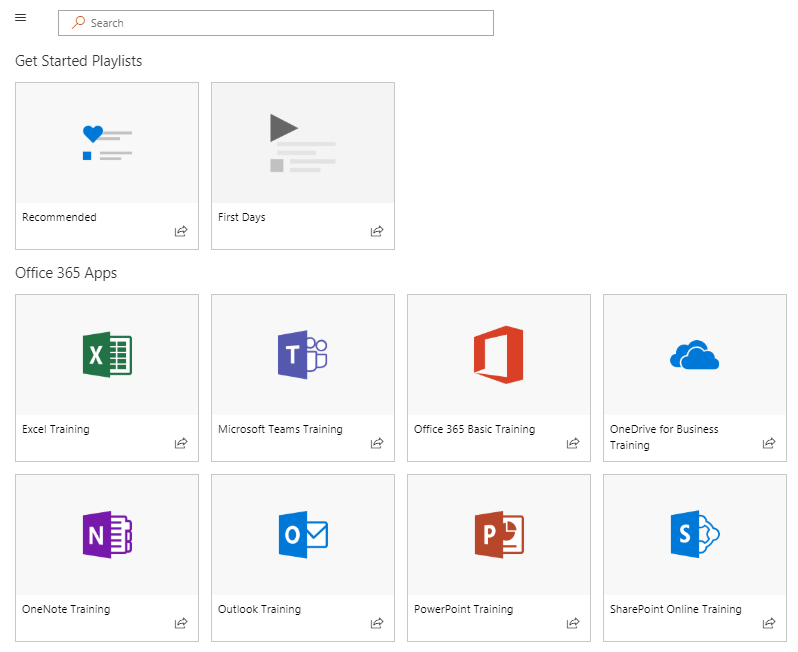
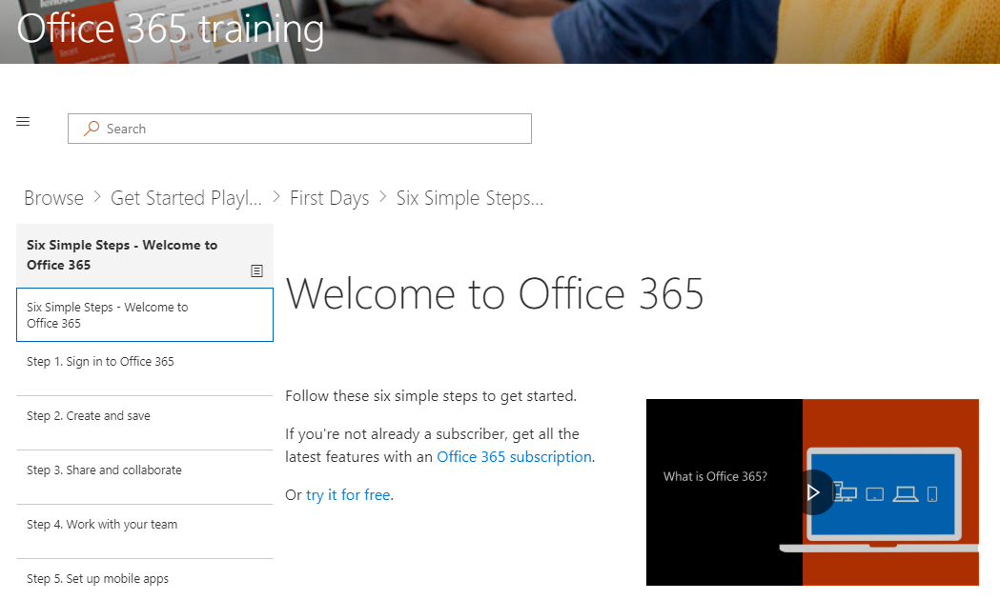
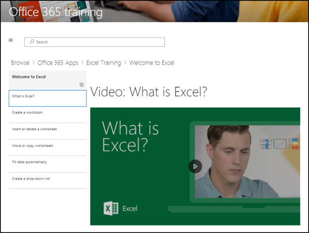

# Просмотр сайта и контента по умолчанию

### Обзор сайта 

Перейдите на домашнюю страницу и выберите Office 365 Training. Каждая страница на сайте SharePoint Online настроена для размещения веб-части обучения Майкрософт. Это позволяет странице отображать все содержимое, доступное в веб-части.

В строке меню выберите элемент Навигация **Office 365 Training** , а затем выберите **начать работу с OneDrive**. В этом случае веб-часть фильтрует контент для отображения только содержимого OneDrive.

Повторите эти действия для остальных двух вариантов меню, приступайте к **работе с Teams** и приступИм к **работе с SharePoint Online** , чтобы проверить содержимое и проверить навигацию.

Вернитесь на домашнюю страницу и выберите **начать с шести простых шагов**. Откроется список "шесть простых шагов".

> [!TIP]
> Шесть простых действий производятся из группы Microsoft Research. Ниже приведены действия, которые могут быть обнаружены с учетом наиболее подходящих действий корпорации Майкрософт, что означает, что если пользователи проводят эти действия, их использование Office 365 увеличится и станет более продуктивным работникам. И это хорошо для всех.

### Начните с шести простых шагов
- На домашней странице щелкните начать с шести простых шагов. 
- Вы видите страницу учебного заработка Office с настраиваемой веб-частью "обучение", которая направляется в список воспроизведения "начать с шести простых шагов".  

### Просмотр списка списков воспроизведения для категории

На странице учебное по Office 365 выберите учебное руководство по Excel, чтобы перейти к списку списков воспроизведения учебных списков Excel.

### Просмотр списка воспроизведения

Нажмите кнопку **Добро пожаловать в Excel** , чтобы просмотреть список воспроизведения.

Теперь на сайте настроено правильное отображение контента на каждой странице. 

## Дальнейшие действия
- [Настройка контента сайта](customization.md)
- [Внедрение диска](driveadoption.md) 
