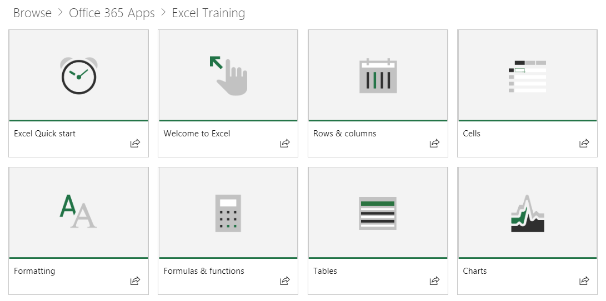

# Контент веб-части по умолчанию

## Модель список воспроизведения

Наш веб-части используется модель знакомых воспроизведения для организации контента.  Эта модель простой для конечных пользователей для понимания и для настройки следует выбрать для.  Настройка не требуется.  Выход из установки и настройки предоставляет эффективный обучающими материалами на основании нашего обширного исследования.

Эти списки воспроизведения призваны помочь организациям варьировать работы обучения пользователей и представить их с помощью простых в использовании списки для изучения их поведение новых и более производительными. Служебной содержимого из Support.Office.com и активов — это короткий и приятный, с peppy, привлекательными видео. 

Каждой из них представляет отдельные основные воспроизведения или категория содержимого. Нажатие на любой список воспроизведения или категории плитку быстро переходит в эту область. На следующем графике показано оба рекомендуемые списка в разделе «Начало работы список» и приложения Office 365 категории, например Excel, группами Майкрософт и другими пользователями. 

Нажав кнопку категории Excel для экземпляра перемещает их в коллекцию списков воспроизведения.  Они могут просмотрите содержимое в порядке, или выберите интересующих их на основании их потребности обучения. 

Выбранное представление списка воспроизведения

## Дальнейшие действия

- Обзор и ознакомьтесь с существующего контента
- Перейти к [настройке списков воспроизведения](customplaylists.md)